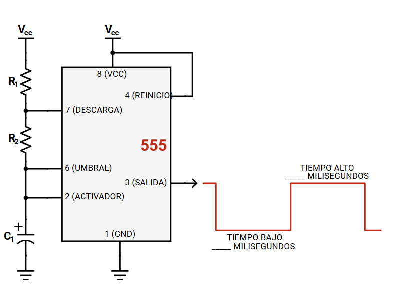

# Capítulo 1 · Fundamentos de Electrónica para Robótica y Domótica

> Objetivo: Comprender los conceptos base de electricidad y electrónica (V, I, R, P, AC/DC), conocer componentes y equipos de medición, evitar errores típicos de montaje y construir un primer circuito funcional con el temporizador 555.

---

## 1. ¿Por qué electrónica en robótica/domótica?

La robótica y la domótica integran **sensores**, **actuadores** y **controladores**. La electrónica es el lenguaje físico que permite que la información (señales) se convierta en acciones (movimiento, luz, sonido, comunicación). Dominar los fundamentos te permitirá diagnosticar fallas y construir soluciones fiables.

{loading=lazy width="50%"}

---

## 2. Conceptos eléctricos esenciales

{loading=lazy}

### 2.1 Voltaje (V)
- **Definición:** Diferencia de potencial eléctrico. Es la “presión” que empuja a los electrones.
- **Unidad:** Volt (V).
- **Analogía hidráulica:** Presión del agua en una tubería.

### 2.2 Corriente (I)
- **Definición:** Flujo de carga por unidad de tiempo.
- **Unidad:** Ampere (A).
- **Analogía hidráulica:** Caudal de agua (litros/segundo) en una tubería.

### 2.3 Resistencia (R)
- **Definición:** Oposición al paso de la corriente.
- **Unidad:** Ohm (Ω).
- **Ejemplo:** Un resistor “estrecha” la tubería, limitando el caudal (corriente).

### 2.4 Ley de Ohm
\[
V = I \cdot R \quad\Rightarrow\quad I = \frac{V}{R},\quad R = \frac{V}{I}
\]

**Ejemplo numérico:** LED rojo (≈2.0 V) con fuente de 5 V a 10 mA deseados:

\[
R = \frac{5 - 2.0}{0.010} = 300~\Omega \;\; \Rightarrow \;\; \text{usar } 330~\Omega \text{ (comercial)}
\]

### 2.5 Potencia (P)
- **Definición:** Tasa de transferencia de energía.
- **Fórmulas:**

\[
P = V \cdot I = I^2 \cdot R = \frac{V^2}{R}
\]

- **Unidad:** Watt (W).
- **Implicación práctica:** Verifica la **potencia del resistor** (¼ W, ½ W, etc.) para evitar sobrecalentamientos.

**RESUMEN RÁPIDO:**

{loading=lazy}

### 2.6 Corriente continua (DC) vs. alterna (AC)
- **DC:** La polaridad no cambia con el tiempo (baterías, fuentes reguladas 5 V/12 V).
    - Las baterías, pilas y paneles solares generan corriente continua (DC) porque los electrones fluyen naturalmente en un solo sentido.
    - Problema: si quieres mandar energía a muchos kilómetros, las pérdidas son grandes.
- **AC:** La polaridad cambia periódicamente (red eléctrica; 60 Hz en México).
- **Cuándo usar:**
  - **DC:** Electrónica, microcontroladores, sensores, la mayoría de robots.
  - **AC:** Alimentación de alta potencia y larga distancia (⚠️ No trabajar AC de red en protoboard).

{ loading=lazy style="display:block; margin:auto;" width="50%"}

{loading=lazy style="display:block; margin:auto;" width="50%"}

---

## 3. ¿Qué es un circuito?

{loading=lazy}

Un **circuito** es un **camino cerrado** para que la corriente fluya desde la fuente (V+) y regrese a su referencia (GND). Si el camino no se cierra, **no hay corriente**; si hay un atajo directo V+→GND, hay un **corto**.

- **Circuito en serie:** La corriente es la misma por todos los elementos.
- **Circuito en paralelo:** El voltaje es el mismo en todas las ramas.

---

## 4. Errores comunes (y cómo evitarlos)

1. **Cortos:** Puentes directos entre V+ y GND por cables mal puestos → usa el multímetro en **continuidad** antes de energizar.

{loading=lazy}

2. **Circuito abierto:** Falta cerrar el lazo (olvidar la conexión a GND común).

{loading=lazy}

3. **LED sin resistor:** El LED se quema → siempre limita corriente con un resistor calculado.

{loading=lazy}

4. **Polaridad invertida:** Diodos/LEDs/capacitores electrolíticos/IC con orientación incorrecta → ubica **pin 1** y marcas de cátodo/anodo.
5. **Protoboard mal usada:** Rails de alimentación **rotos a mitad** o no comunes → verifica continuidad de rieles.
6. **No compartir tierra:** Varios módulos o fuentes sin **GND común** → el sistema “no se ve”.
7. **Resistencia mal elegida:** Confundir **kΩ** con **Ω** → revisa el código de colores o el multímetro.
8. **Medir corriente como voltaje:** Colocar el multímetro en A **en paralelo** causa cortos. Para corriente: **en serie** y con cable al borne de A.

---

## 5. Componentes básicos

### 5.1 Protoboard (breadboard)
- Permite prototipado sin soldadura.
- **Conexiones internas:** Columnas/filas internas y rieles de V+/GND (a veces interrumpidos).
- **Buenas prácticas:** Cables cortos, colores consistentes (rojo=V+, negro=GND).

{loading=lazy}

{loading=lazy}

### 5.2 Resistores
- Limitan corriente, fijan tensiones, forman redes temporizadoras.
- **Código de colores** y **tolerancia** (±1 %, ±5 %, etc.).
- **Potencia:** ¼ W típico en prototipos.

{loading=lazy}

[Calculadora de resistencias](https://www.digikey.com.mx/es/resources/conversion-calculators/conversion-calculator-resistor-color-code)

### 5.3 LEDs (diodos emisores de luz)
- **Polaridad:** Ánodo (+) y cátodo (−, patita más corta o lado plano).
- **Vf típica:** Rojo (1.8–2.2 V), verde/azul/blanco (2.0–3.3 V).
- **Siempre** con resistor en serie.

{loading=lazy}

### 5.4 Capacitores
- **Función:** Almacenan energía. Filtrado, temporización, acoplo.
- **Tipos:** Cerámicos (no polarizados), electrolíticos (polarizados).
- **Parámetros:** Capacitancia (µF, nF), tensión máxima (Vmax). **Nunca** exceder Vmax.

{loading=lazy}

### 5.5 Circuitos integrados (IC)
- Paquetes DIP/SOIC/QFN, etc. **Pin 1** marcado con punto o muesca.
- Alimentación: Vcc y GND en pines específicos (lee la hoja de datos).

{loading=lazy}

### 5.6 Fuentes de energía
- **Baterías** (9 V, 18650, LiPo—con cuidado).
- **Fuentes de banco** reguladas.
- **Convertidores DC-DC** (buck/boost).
- **Regla de oro:** **GND común** entre todos los módulos.

---

## 6. Equipos de medición

### 6.1 Multímetro digital (DMM)
- **Voltaje DC/AC:** Medir en **paralelo** al elemento (configurar V, puntas en VΩ y COM).
- **Corriente DC:** Medir en **serie** (mover punta roja al borne de A/mA, rango adecuado).
- **Resistencia:** Medir con circuito **desenergizado**.
- **Continuidad/diode test:** Verifica cortos y orientación de diodos.

{loading=lazy}

1. **Pantalla**: Donde se muestran las lecturas de las mediciones.
2. **Dial de selección**: Se utiliza para seleccionar el tipo de medición. Las opciones incluyen:
    - Voltaje de CC (V-)
    - Voltaje de CA (V~)
    - Voltaje de CC (mV-)
    - Continuidad (simbolizada por una onda sonora)
    - Resistencia (Ω)
    - Capacitancia (-||-)
    - Probador de diodos (―⯈⊢)
    - Corriente continua (A-)
    - Corriente alterna (A~)
2. **Puertos para cables de prueba:**
    - COM (Común): Donde se conecta el cable negro.
    - VΩ: Se utiliza para voltaje, resistencia y otras opciones sin corriente. El cable rojo se conecta aquí para estas funciones.
    - 10 A: Se utiliza exclusivamente para mediciones de alta corriente (hasta 10 amperios). El cable rojo se conecta aquí para estas funciones.
4. **Cables de prueba**: rojo para positivo, negro para negativo, se utilizan para conectar el multímetro al objeto que se está midiendo.
5. **Rango**: Permite que el multímetro seleccione el rango adecuado para la medición. De lo contrario, intenta seleccionar automáticamente el correcto.
6. **Botón HOLD**: Congela la lectura actual en la pantalla para facilitar la visualización.
7. **Botón Max/Min**: se utiliza para mantener leído el valor máximo o mínimo.

### 6.2 Osciloscopio
- **Sonda x1/x10:** Usar **x10** reduce carga sobre el circuito.
- **Clip de tierra:** Conectar a GND del circuito (⚠️ los osciloscopios de banco suelen tener tierra referida a chasis; evita conectar a red AC sin aislamiento).
- **Qué observar:** Forma de onda, frecuencia, amplitud, duty cycle.

{loading=lazy}

1. **Pantalla**: Muestra las formas de onda. La cuadrícula muestra el voltaje (vertical) y el tiempo (horizontal).
2. **Botón de encendido**: enciende o apaga el osciloscopio.
3. **Entradas de canal (CH1 y CH2)**: Terminales de entrada para conectar señales a medir.
4. **Controles verticales**: Ajusta la escala del voltaje en la pantalla. La opción "Posición" mueve las formas de onda verticalmente.
5. **Controles horizontales**: Ajusta la escala de tiempo. La opción "Posición" mueve las formas de onda horizontalmente.
6. **Controles de disparo**: Establece las condiciones para el inicio de la captura de forma de onda. El nivel establece el voltaje de disparo.
7. **Botón Ejecutar/Detener**: inicia o detiene la captura de forma de onda.
8. **Botón de medición**: herramientas para medir las características de la forma de onda.
9. **Botón del cursor**: Herramientas para medir características de forma de onda.

---

## 7. El temporizador 555

### 7.1 ¿Qué es el 555?
Un IC clásico con dos comparadores, un **flip-flop SR** y un transistor de descarga. Permite crear **temporizadores** y **osciladores** con muy pocos componentes.

- **Modos de operación:**
  - **Astable:** Oscilador libre (parpadeos, PWM simple).
  - **Monostable:** Pulso único temporizado (retardos, anti-rebote).
  - **Biestable:** Conmutación tipo flip-flop.

### 7.2 Pinout del 555 (DIP-8)

1. **GND**  
2. **TRIG** (disparo, umbral 1/3 Vcc)  
3. **OUT** (salida)  
4. **RESET** (activo en bajo; normalmente a Vcc)  
5. **CTRL** (control; típicamente con **10 nF** a GND)  
6. **THRES** (umbral, 2/3 Vcc)  
7. **DISCH** (descarga del capacitor)  
8. **Vcc** (alimentación 5–15 V típicamente)

{loading=lazy width="60%"}

---

## 8. Ejercicio guiado: 555 en astable (LED parpadeante)

### 8.1 Objetivo
Construir un oscilador que haga parpadear un LED y **medir** su frecuencia/duty con multímetro (si tiene frecuencia) u osciloscopio.

{loading=lazy}

### 8.2 Materiales
- 1 × **NE555** (DIP-8)
- 1 × **LED** 
- 1 × **Resistor** para LED (330 Ω o 470 Ω)
- 2 × **Resistores temporizadores** (ver diseño)
- 1 × **Capacitor** de temporización (ver diseño)
- 1 × **Capacitor** 10 nF para pin 5 (CTRL) → estabilidad
- **Protoboard**, **cables**, **fuente** 5 V regulada

### 8.3 Diseño (frecuencia y ciclo de trabajo)

{loading=lazy}

[Calculadora 555 astable](https://www.digikey.com.mx/es/resources/conversion-calculators/conversion-calculator-555-timer?srsltid=AfmBOoo14ScFP-mHQo60bwhC7biB1sec_qN__TEnDhrBqFStxNub1KGD)

### 8.4 Conexión (paso a paso)
1. Coloca el **NE555** en la protoboard, centrado en el canal. Identifica **pin 1 (GND)** y **pin 8 (Vcc)** por la muesca/punto.
2. **Alimentación:** Pin 8 a **+5 V** y pin 1 a **GND**.
3. **Reset:** Pin 4 a **+5 V**.
4. **Control:** Pin 5 a GND mediante **10 nF**.
5. **Temporización:**
   - Conecta \( R_A \) entre **Vcc (5 V)** y **pin 7 (DISCH)**.
   - Conecta \( R_B \) entre **pin 7 (DISCH)** y **pin 2/6** (TRIG/THRES unidos).
   - Conecta el **capacitor C** entre **pin 2/6** y **GND** (si es electrolítico, lado **−** a GND).
6. **Salida:** Pin 3 → **resistor 330 Ω** → **LED** → **GND** (cátodo a GND).
7. Revisa todo con **continuidad** antes de energizar.

### 8.5 Lista de verificación (debug)
- [ ] LED está al revés.  
- [ ] Falta resistor en LED.  
- [ ] Capacitor electrolítico invertido.  
- [ ] Pin 4 (RESET) flotante (debe ir a Vcc).  
- [ ] Falta unión **2–6** (TRIG y THRES).  
- [ ] \( R_A \) o \( R_B \) con valor equivocado (Ω vs kΩ).  
- [ ] Rieles de la protoboard no están realmente conectados.  
- [ ] No hay **GND común**.

---

## 9. Seguridad básica

- **Nunca** conectes **AC de red** a protoboard.  
- Desenergiza antes de cambiar conexiones.  
- Verifica continuidad para evitar cortos.  
- En osciloscopios de banco, el clip de tierra suele ir a tierra física: evita medir directamente la red eléctrica.

---

### Glosario rápido
- **V (voltaje):** “presión” eléctrica.  
- **I (corriente):** flujo de carga.  
- **R (resistencia):** oposición al flujo.  
- **P (potencia):** energía por unidad de tiempo.  
- **DC/AC:** corriente continua/alterna.  
- **555:** temporizador/oscila­dor versátil.

