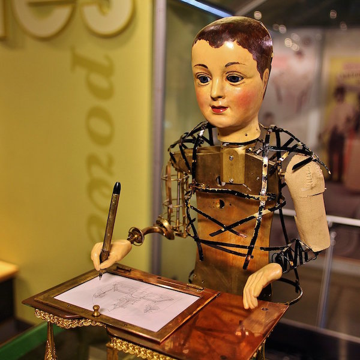
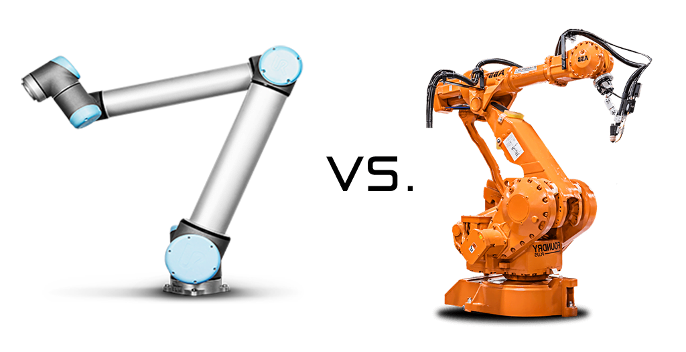
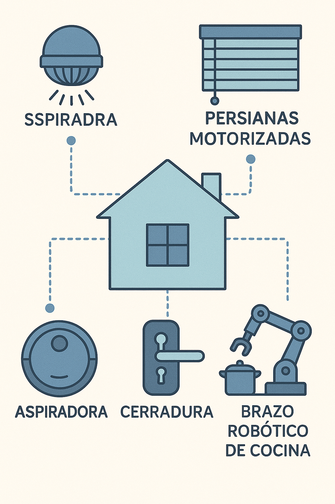

# Capítulo 2 · Historia y Evolución de la Robótica y su Relación con la Domótica

---

## 1. Primeros pasos: autómatas y mecanismos antiguos

La idea de construir máquinas que imiten la vida humana o animal es tan antigua como la civilización.  
- En la **Grecia clásica**, Herón de Alejandría describió en su libro *Automata* mecanismos que abrían puertas o movían figuras mediante poleas y vapor.  
- En el **mundo árabe medieval**, Al-Jazari diseñó relojes de agua y autómatas músicos en el siglo XIII.  
- En el **Renacimiento europeo**, relojeros como Leonardo da Vinci crearon caballeros mecánicos con engranajes y resortes.

{loading=lazy width="50%"}

---

## 2. Revolución industrial y robótica moderna

Con la llegada de la electricidad y los motores, los autómatas dieron paso a la automatización industrial:
- **Siglo XVIII–XIX:** Tejedores mecánicos como el telar de Jacquard (1801), que usaba tarjetas perforadas → precursor de la programación.  
- **Siglo XX:** Primeros robots industriales:
  - **Unimate (1961):** brazo robótico para General Motors.  
  - Uso en soldadura y manejo de piezas repetitivas.  
- Décadas siguientes: Japón lidera la producción con robots en fábricas de automóviles.

---

## 3. Robots de servicio y colaborativos

- **Años 80–90:** Robots empiezan a salir de la industria hacia la investigación y la educación.  
- **Siglo XXI:** Surge el concepto de **cobots** (robots colaborativos), diseñados para trabajar junto a humanos sin jaulas de seguridad.  
- Ejemplos: Universal Robots (UR), Baxter, Franka Emika.  
- En paralelo, nacen los **robots de servicio**: aspiradoras autónomas, drones de consumo, robots de asistencia médica.

{loading=lazy}

---

## 4. El puente hacia la domótica

La domótica busca **automatizar el entorno doméstico**: iluminación, seguridad, clima, entretenimiento. La robótica amplía esas capacidades al incorporar **movimiento y manipulación física**.

### Ejemplos de integración:
- **Robots móviles** (Roomba, aspiradoras con mapeo láser).  
- **Manipuladores en casa** (brazos de cocina, asistentes para movilidad reducida).  
- **Robots sociales** (asistentes con voz, robots de compañía para adultos mayores).  
- **Sistemas distribuidos** (sensores de movimiento, cerraduras inteligentes, control centralizado).  

{loading=lazy width="60%"}

---

## 5. Tendencias actuales

1. **Internet de las Cosas (IoT):** Conexión de electrodomésticos y robots a la nube.  
2. **Inteligencia artificial:** Reconocimiento de voz, visión computacional, aprendizaje de hábitos.  
3. **Energía eficiente:** Domótica integrada con paneles solares y almacenamiento en baterías (DC → AC inversores).  
4. **Robots sociales y de asistencia:** Envejecimiento poblacional impulsa la robótica en el hogar.  
5. **Interoperabilidad:** Protocolos como Matter, Zigbee y Wi-Fi permiten que robots y dispositivos de distintas marcas trabajen juntos.

<iframe width="560" height="315" src="https://www.youtube.com/embed/1aSrP9dUc5E?si=glvub7bgKcnAlabZ" title="YouTube video player" frameborder="0" allow="accelerometer; autoplay; clipboard-write; encrypted-media; gyroscope; picture-in-picture; web-share" referrerpolicy="strict-origin-when-cross-origin" allowfullscreen></iframe>
---

## 6. Actividad de reflexión

**Pregunta:**  
Piensa en tu casa o espacio cotidiano: ¿qué tarea robótica o domótica te gustaría automatizar y por qué?  

