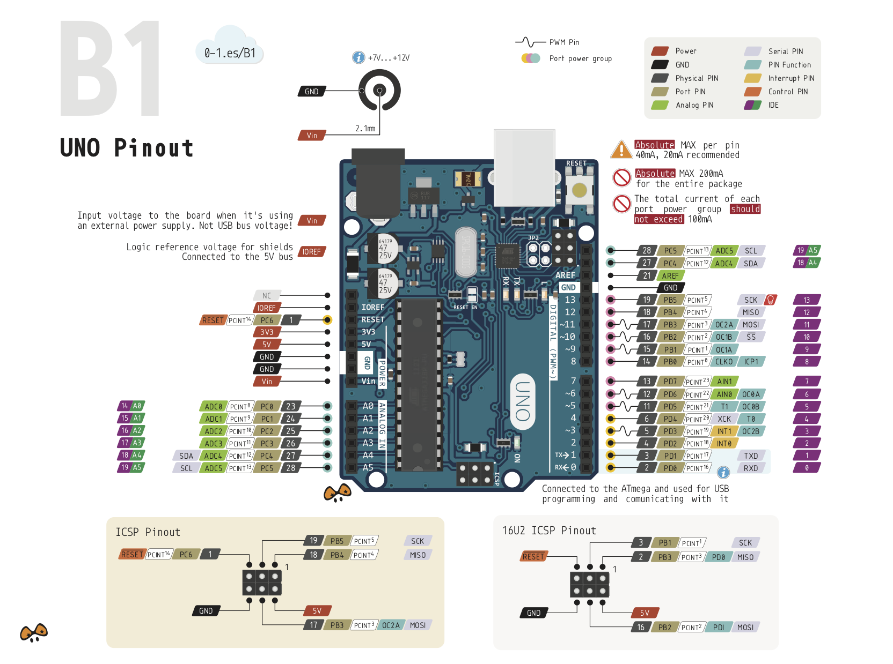
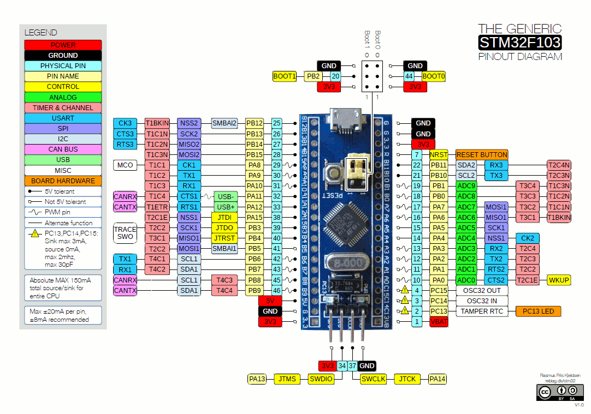
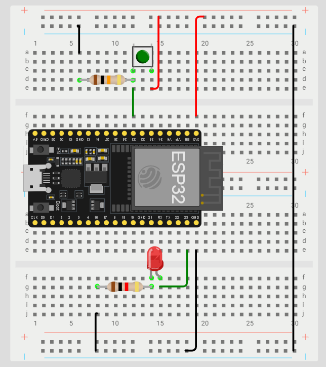

# MCU 101

**Materiales y software**

- **Tarjeta**: ESP32 (ideal ESP32-S3 DevKit).
- **Cable**: USB de datos.
- **Breadboard**: + jumpers.
- **LED**: 1 + 1 resistor 220 Ω.
- **Botón**: 1 (push button).
- **Resistor**: (Opcional) 1 10 kΩ si no usamos pull-up interno.

**Software**:

- Arduino IDE + Paquete de tarjetas ESP32.
- (Opcional) VS Code + Extensión Arduino.

## Introducción a los Microcontroladores

Los microcontroladores (MCU) son pequeños ordenadores en un solo chip que contienen un procesador, memoria y periféricos de entrada/salida. 

Ejemplos comunes de microcontroladores incluyen:


- **Arduino Uno**: Basado en el microcontrolador ATmega328P.

{ style="display:block; margin:auto;" width="80%"}

- **ESP32**: Un microcontrolador potente con conectividad Wi-Fi y Bluetooth.

{ style="display:block; margin:auto;" width="80%"}

- **Raspberry Pi Pico**: Basado en el microcontrolador RP2040.

{ style="display:block; margin:auto;" width="80%"}

- **STM32**: Una familia de microcontroladores basados en ARM Cortex-M.

{ style="display:block; margin:auto;" width="80%"}

## IDEs y Herramientas

Un IDE (Integrated Development Environment) es una “app todo-en-uno” para escribir, compilar y cargar programas al microcontrolador. Reúne:

- **Editor** de código (colores, autocompletado).
- **Compilador y toolchain** (traduce C/C++ a binario para ESP32).
- **Build system** (botón “Compilar/Subir”, manejo de dependencias).
- **Depuración** (mensajes en consola, a veces depurador paso a paso).
- **Monitor Serial** (ver/mandar texto por el puerto del ESP32).
- **Gestor** de placas y librerías (instalar soporte ESP32 y paquetes).

Opciones populares:

- **Arduino IDE**: Muy sencillo, ideal para principiantes. Soporta muchas placas.
- **VS Code + Extensión**: Más avanzado, con muchas funciones adicionales.
    - **PlatformIO**: Extensión para VS Code, potente y flexible, ideal para proyectos complejos.
    - **Extensión Arduino**: Permite usar VS Code como IDE de Arduino.
- **Espressif IDE**: IDE oficial de Espressif para ESP32, más complejo pero muy completo.

## Configuración del Entorno de Desarrollo

1. **Instalar Arduino IDE**:
    - Descargar desde [arduino.cc](https://www.arduino.cc/en/software).
    - Instalar siguiendo las instrucciones del sitio.
2. **Agregar soporte para ESP32**:
    - Abrir Arduino IDE.
    - dar clic en administrar placas (Herramientas > Placa > Gestor de tarjetas).
    - Buscar "esp32" e instalar el paquete de Espressif Systems.
    { style="display:block; margin:auto;" width="100%"}

3. **Seleccionar la placa ESP32**:
    - Ir a Herramientas > Placa y seleccionar "DOIT ESP32 DEVKIT V1"
    - Configurar el puerto COM correcto (Herramientas > Puerto).


## Programación Básica en Arduino IDE

**Funciones principales de control de hardware**:

- `void setup(){}`: Se ejecuta una vez al inicio. Aquí se configuran pines, inicializa librerías, etc.
- `void loop(){}`: Se ejecuta repetidamente después de `setup()`. Aquí va el código principal.
- `pinMode(pin, mode)`: Configura un pin como entrada (`INPUT`) o salida (`OUTPUT`).
- `digitalWrite(pin, value)`: Escribe un valor alto (`HIGH`) o bajo (`LOW`) en un pin de salida.
- `digitalRead(pin)`: Lee el valor de un pin de entrada (retorna `HIGH` o `LOW`).
- `delay(ms)`: Pausa la ejecución por un número de milisegundos.
- `Serial.begin(baudrate)`: Inicia la comunicación serial a una velocidad dada (baudrate).
- `Serial.print(data)`: Envía datos al monitor serial.
- `Serial.println(data)`: Envía datos al monitor serial y añade un salto de línea

**Funciones Basicas de C/C++**:

- `int`, `float`, `char`, `bool`, `void`, `String`: Tipos de datos para variables basicos.
    - Ejemplos variables:
    ```cpp
    int numero = 10;          // Entero
    float decimal = 3.14;    // Número con decimales
    char letra = 'A';        // Carácter
    bool esVerdadero = true;  // Booleano (true/false)
    String texto = "Hola";    // Cadena de texto
    ```
- `==`, `!=`, `<`, `>`, `<=`, `>=`: Operadores de comparación.
- `+`, `-`, `*`, `/`, `%`: Operadores aritméticos
- `if`, `else`, `switch`: Estructuras de control de flujo.
    - Ejemplo `if`
    ```cpp
    if (condition) {
        // código a ejecutar si la condición es verdadera
    } else {
        // código a ejecutar si la condición es falsa
    }
    ```
    - Ejemplo `switch`
    ```cpp
    switch (variable) {
        case valor1:
            // código a ejecutar si variable == valor1
            break;
        case valor2:
            // código a ejecutar si variable == valor2
            break;
        default:
            // código a ejecutar si variable no coincide con ningún valor
    }
    ```
- `for`, `while`: Bucles de repetición.
    - Ejemplo `for`
    ```cpp
    for(int i=0; i<10; i++){
        Serial.println(i);
    }
    ```
    - Ejemplo `while`
    ```cpp 
    int i = 0;
    while(i < 10){
        Serial.println(i);
        i++;
    }
    ```

- `functionName()`: Llamada a funciones.
- `#define`: Definición de macros.
- `#include`: Inclusión de librerías.

## Estructura Básica de un Programa en Arduino

```cpp title="Estructura Básica"
void setup() {
    // Inicialización se ejecuta una vez
}

void loop() {
    // Código principal se ejecuta repetidamente
}
```

```cpp title="Blink"
//Revisar donde esta cableado el LED
#define LED 23

void setup() {
    pinMode(LED, OUTPUT); // Configura el pin del LED como salida
}

void loop() {
    digitalWrite(LED, HIGH); // Enciende el LED
    delay(1000); // Espera 1 segundo
    digitalWrite(LED, LOW); // Apaga el LED
    delay(1000); // Espera 1 segundo
}

```

{ style="display:block; margin:auto;" width="50%"}

**Blink con botón**

```cpp title="Blink con botón"

//Revisar donde esta cableado el botón y el LED
#define LED 23
#define BUTTON 33

void setup() {
    pinMode(LED, OUTPUT);
    pinMode(BUTTON, INPUT);
}

void loop() {
    if (digitalRead(BUTTON) == HIGH) {
        digitalWrite(LED, HIGH);
    } else {
        digitalWrite(LED, LOW);
    }
}
```

{ style="display:block; margin:auto;" width="50%"}

**Imprimir en el Monitor Serial**

```cpp title="Monitor Serial"
void setup() {
    Serial.begin(115200);
}

void loop() {
    Serial.println("Hola, mundo!");
    delay(1000);
}
```
Para probar la comunicacion BT, es necesario emparejar el dispositivo con una app de terminal Bluetooth en el celular (por ejemplo, "Serial Bluetooth Terminal" en Android). Liga: [Serial Bluetooth Terminal](https://play.google.com/store/apps/details?id=de.kai_morich.serial_bluetooth_terminal&pcampaignid=web_share)

!!! note "Nota"
    El iphone no soporta la comunicacion serial por bluetooth, por lo que es necesario usar un dispositivo Android o una computadora con bluetooth.


**Comunicacion BT**

```cpp title="Bluetooth Serial"
#include "BluetoothSerial.h"
BluetoothSerial SerialBT;

void setup() {
    Serial.begin(115200);
    SerialBT.begin("ESP32"); // Nombre del dispositivo Bluetooth
}

void loop() {
    if (SerialBT.available()) {
        String mensaje = SerialBT.readString();
        Serial.println("Recibido: " + mensaje);
    }
    delay(1000);
}
```

**Led con Bluetooth**

```cpp title="LED con Bluetooth"    
#include "BluetoothSerial.h"
BluetoothSerial SerialBT;

#define LED 23

void setup() {
    Serial.begin(115200);
    SerialBT.begin("ESP32");
    pinMode(LED, OUTPUT);
}

void loop() {
    if (SerialBT.available()) {
        String mensaje = SerialBT.readString();
        Serial.println("Recibido: " + mensaje);
        if (mensaje == "ON") {
            digitalWrite(LED, HIGH);
        } else if (mensaje == "OFF") {
            digitalWrite(LED, LOW);
        }
    }
    delay(1000);
}
```
