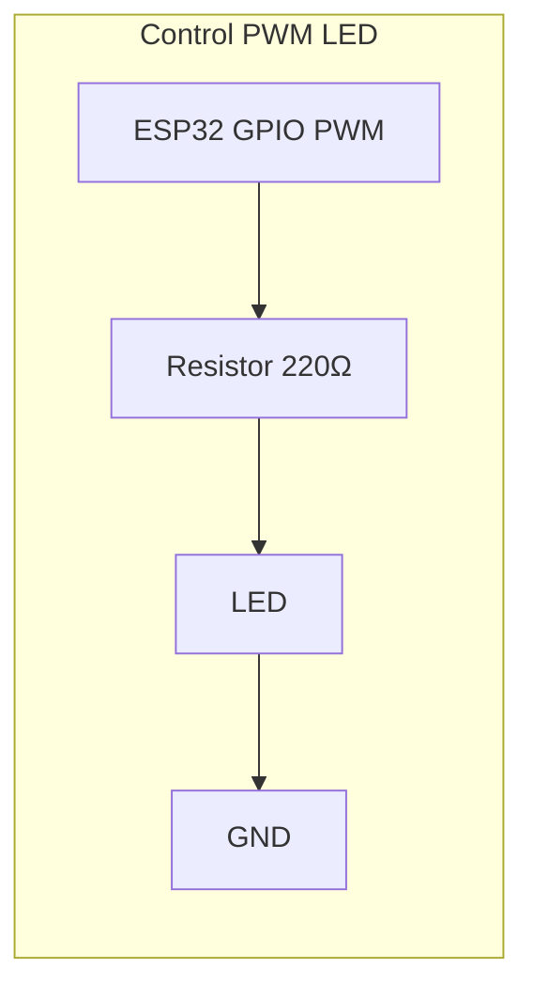

# Actuadores
Conceptos clave

- **Frecuencia (Hz)**: cuántas veces por segundo se repite el ciclo.
- **Ciclo de trabajo (duty, %)**: porcentaje del tiempo en ALTO dentro del periodo.
- **Resolución (bits)**: número de pasos posibles del duty: pasos = 2^bits.
- **Percepción**: el actuador ve un promedio de energía → brillo, velocidad, fuerza, etc.


| Actuador            | Frecuencia típica | Notas                                        |
| ------------------- | ----------------: | -------------------------------------------- |
| LED visible         |      500–2,000 Hz | Evita parpadeo y “banding” en video.         |
| Motor DC + puente H |         15–25 kHz | Fuera de lo audible; menor zumbido.          |
| Buzzer **pasivo**   |   Tonos musicales | Ajusta a la nota deseada (p. ej., 440 Hz).   |
| **Servo** RC        |             50 Hz | Pulsos de 1–2 ms dentro de 20 ms.            |
| Solenoide/Válvula   |      200 Hz–2 kHz | Revisa datasheet; siempre con diodo flyback. |


Seguridad eléctrica y protección (laboratorio)

- **GND común**: une la tierra del ESP32 con la de la fuente del actuador (motores/servos).
- **Diodo flyback** en cargas inductivas (relevadores, solenoides, motores con MOSFETs discretos).
- **Alimentación separada**: no alimentes motores desde 3V3 del ESP32.
- **Freno vs libre** (puente H): el freno disipa energía en el motor; cuidado con picos térmicos.
- **Cableado corto** y capacitores cerca de la carga para mitigar ruido (100 nF + 47–220 µF).

##  PWM




```cpp title="PWM LED"
/*
  PWM básico en ESP32 usando LEDC (Arduino)
  - Configura un temporizador PWM (frecuencia + resolución).
  - Usa un canal LEDC para modular el ciclo de trabajo (duty).
  - Varía el duty para subir y bajar el brillo de un LED.

  Conexión:
  - LED + resistencia de 220 Ω en el pin GPIO 2 (cátodo a GND).
  - Si deseas otro pin, cambia PIN_LED.
*/

#include <Arduino.h>

// --- Parámetros ajustables para la clase/demostración ---
const int   PIN_LED          = 2;          // GPIO de salida para el LED
const int   CANAL_PWM        = 0;          // Canales disponibles: 0..7 (baja velocidad)
const int   TIMER_PWM        = 0;          // Índices de timer: 0..3
const int   RESOLUCION_BITS  = 10;         // Resolución del PWM (bits) -> 2^bits pasos
const float FRECUENCIA_HZ    = 1000.0f;    // Frecuencia del PWM (LED: 500–2000 Hz recomendado)

// Derivado de la resolución: valor máximo de duty
const uint32_t VALOR_MAXIMO_DUTY = (1UL << RESOLUCION_BITS) - 1;

// Tamaño del paso para el “fade” (entre más pequeño, más suave)
const uint32_t PASO_DUTY = VALOR_MAXIMO_DUTY / 64;  // ~64 pasos por rampa
const uint16_t RETARDO_MS = 15;                      // retardo entre pasos

void setup() {
  // 1) Configurar el temporizador PWM (frecuencia + resolución)
  // ledcSetup(canal, frecuencia, bits_resolucion)
  ledcSetup(CANAL_PWM, FRECUENCIA_HZ, RESOLUCION_BITS);

  // 2) Vincular el pin físico al canal PWM
  // ledcAttachPin(pin, canal)
  ledcAttachPin(PIN_LED, CANAL_PWM);

  // 3) Iniciar con duty = 0 (LED apagado)
  ledcWrite(CANAL_PWM, 0);
}

void loop() {
  // Barrido ascendente del duty: 0% -> 100%
  for (uint32_t duty = 0; duty <= VALOR_MAXIMO_DUTY; duty += PASO_DUTY) {
    ledcWrite(CANAL_PWM, duty);
    delay(RETARDO_MS);
  }

  // Barrido descendente del duty: 100% -> 0%
  for (int32_t duty = VALOR_MAXIMO_DUTY; duty >= 0; duty -= PASO_DUTY) {
    ledcWrite(CANAL_PWM, duty);
    delay(RETARDO_MS);
  }

  // Pausa breve en 50% de duty (opcional)
  ledcWrite(CANAL_PWM, VALOR_MAXIMO_DUTY / 2);
  delay(500);
}

```


```cpp title="PWM Servo"
/*
  Servo con ESP32 (LEDC, Arduino)
  - Genera PWM a 50 Hz (periodo ~20 ms)
  - Pulso típico: 1000–2000 us (algunos servos aceptan 500–2500 us)
  - Barre el ángulo 0° -> 180° -> 0°
*/

#include <Arduino.h>

// --- Parámetros de conexión ---
const int PIN_SERVO = 18;      // Pin de señal del servo
const int CANAL_PWM = 0;       // Canal LEDC (0..7 en baja velocidad)

// --- Parámetros de PWM para servo ---
const float FRECUENCIA_HZ   = 50.0f;  // 50 Hz para servos (periodo ~20 ms)
const int   RESOLUCION_BITS = 16;     // Más bits = mayor precisión de pulso
const uint32_t VALOR_MAX_DUTY = (1UL << RESOLUCION_BITS) - 1;

// Periodo en microsegundos para 50 Hz
const uint32_t PERIODO_US = (uint32_t)(1000000.0f / FRECUENCIA_HZ);

// Ventana de pulsos (ajústala a tu servo)
const uint16_t PULSO_MIN_US = 1000;   // 1.0 ms  → ~0°
const uint16_t PULSO_MAX_US = 2000;   // 2.0 ms  → ~180°
// Opción alternativa (si tu servo lo admite):
// const uint16_t PULSO_MIN_US = 500;  // 0.5 ms
// const uint16_t PULSO_MAX_US = 2500; // 2.5 ms

// --- Utilidad: convierte microsegundos de pulso a "duty" del LEDC ---
uint32_t microsegundos_a_duty(uint32_t ancho_pulso_us) {
  // duty = (ancho_pulso / periodo_total) * VALOR_MAX_DUTY
  if (ancho_pulso_us < PULSO_MIN_US) ancho_pulso_us = PULSO_MIN_US;
  if (ancho_pulso_us > PULSO_MAX_US) ancho_pulso_us = PULSO_MAX_US;
  return (uint32_t)(( (uint64_t)ancho_pulso_us * VALOR_MAX_DUTY ) / PERIODO_US);
}

// --- Escribe un ángulo en grados (0..180) ---
void escribir_angulo_grados(int angulo) {
  if (angulo < 0)   angulo = 0;
  if (angulo > 180) angulo = 180;

  // Interpolación lineal de ángulo → microsegundos de pulso
  uint32_t pulso_us = PULSO_MIN_US +
                      ( (uint32_t)( ( (uint32_t)angulo * (PULSO_MAX_US - PULSO_MIN_US) ) / 180 ) );

  uint32_t duty = microsegundos_a_duty(pulso_us);
  ledcWrite(CANAL_PWM, duty);
}

void setup() {
  // Configurar el temporizador PWM a 50 Hz y la resolución
  ledcSetup(CANAL_PWM, FRECUENCIA_HZ, RESOLUCION_BITS);

  // Vincular el pin del servo al canal PWM
  ledcAttachPin(PIN_SERVO, CANAL_PWM);

  // Llevar a posición media al inicio (aprox. 90°)
  escribir_angulo_grados(90);
  delay(500);
}

void loop() {
  // Barrido 0° → 180°
  for (int angulo = 0; angulo <= 180; angulo += 2) {
    escribir_angulo_grados(angulo);
    delay(20); // ~20 ms entre pasos para un movimiento suave
  }

  // Barrido 180° → 0°
  for (int angulo = 180; angulo >= 0; angulo -= 2) {
    escribir_angulo_grados(angulo);
    delay(20);
  }

  // Pausa breve en el centro
  escribir_angulo_grados(90);
  delay(500);
}
```


```cpp title="PWM Motor DC"
/*
  Motor DC con ESP32 (LEDC + Puente H)
  - Control de velocidad por PWM (duty) y sentido por pines IN1/IN2.
  - Incluye rampa de aceleración para movimientos suaves.
*/

#include <Arduino.h>

// --- Pines (ajústalos a tu hardware) ---
const int PIN_PWM  = 5;   // ENA / PWMA (entrada PWM del puente H)
const int PIN_IN1  = 18;  // IN1 (dirección)
const int PIN_IN2  = 19;  // IN2 (dirección)

// --- Parámetros de PWM ---
const int   CANAL_PWM        = 0;        // Canal LEDC (0..7)
const float FRECUENCIA_HZ    = 20000.0f; // 20 kHz (fuera de rango audible típico)
const int   RESOLUCION_BITS  = 10;       // 10 bits → 0..1023
const uint32_t DUTY_MAXIMO   = (1UL << RESOLUCION_BITS) - 1;

// --- Parámetros de rampa ---
const uint16_t PASO_RAMPA       = 10;   // incremento de duty por paso
const uint16_t RETARDO_RAMPA_MS = 5;    // retardo entre pasos (suavidad)

// --- Utilidades ---
void fijar_salidas_direccion(bool adelante) {
  // adelante: IN1=1, IN2=0 | atrás: IN1=0, IN2=1
  digitalWrite(PIN_IN1, adelante ? HIGH : LOW);
  digitalWrite(PIN_IN2, adelante ? LOW  : HIGH);
}

void liberar_motor() {
  // “Coast” (libre): IN1=0, IN2=0 (varía según el driver)
  digitalWrite(PIN_IN1, LOW);
  digitalWrite(PIN_IN2, LOW);
  ledcWrite(CANAL_PWM, 0);
}

void freno_activo() {
  // “Brake” (freno): IN1=1, IN2=1 (si el driver lo admite)
  digitalWrite(PIN_IN1, HIGH);
  digitalWrite(PIN_IN2, HIGH);
  ledcWrite(CANAL_PWM, 0);
}

/*
  establecer_velocidad(-100..100):
  - signo = dirección (negativo = atrás, positivo = adelante, 0 = parado)
  - magnitud = porcentaje de duty (0..100)
*/
void establecer_velocidad(int porcentaje) {
  if (porcentaje == 0) {
    // detener con motor libre (o cambia a freno_activo() si prefieres)
    liberar_motor();
    return;
  }

  bool adelante = (porcentaje > 0);
  uint32_t duty_objetivo = (uint32_t)(abs(porcentaje) * DUTY_MAXIMO / 100);

  // fijar dirección antes de aplicar PWM
  fijar_salidas_direccion(adelante);

  // rampa desde el duty actual al objetivo
  uint32_t duty_actual = ledcRead(CANAL_PWM);
  if (duty_objetivo > duty_actual) {
    for (uint32_t d = duty_actual; d < duty_objetivo; d += PASO_RAMPA) {
      ledcWrite(CANAL_PWM, d);
      delay(RETARDO_RAMPA_MS);
    }
  } else if (duty_objetivo < duty_actual) {
    for (int32_t d = (int32_t)duty_actual; d > (int32_t)duty_objetivo; d -= PASO_RAMPA) {
      ledcWrite(CANAL_PWM, (uint32_t)d);
      delay(RETARDO_RAMPA_MS);
    }
  }

  ledcWrite(CANAL_PWM, duty_objetivo);
}

void setup() {
  // Pines de dirección
  pinMode(PIN_IN1, OUTPUT);
  pinMode(PIN_IN2, OUTPUT);

  // PWM por hardware
  ledcSetup(CANAL_PWM, FRECUENCIA_HZ, RESOLUCION_BITS);
  ledcAttachPin(PIN_PWM, CANAL_PWM);

  // Estado inicial: motor libre
  liberar_motor();
}

void loop() {
  // Acelerar adelante 0% → 80%
  for (int v = 0; v <= 80; v += 5) {
    establecer_velocidad(v);
    delay(40);
  }
  // Mantener
  delay(800);

  // Desacelerar a 0
  for (int v = 80; v >= 0; v -= 5) {
    establecer_velocidad(v);
    delay(40);
  }
  delay(400);

  // Acelerar atrás 0% → 60%
  for (int v = 0; v <= 60; v += 5) {
    establecer_velocidad(-v);
    delay(40);
  }
  delay(800);

  // Freno activo breve (demostración), luego libre
  freno_activo();
  delay(400);
  liberar_motor();
  delay(600);
}
```


```cpp title="PWM Buzzer"
/*
  Buzzer pasivo con ESP32 (LEDC)
  - Genera tonos a distintas frecuencias (una mini-melodía).
  - Ajusta el duty ~50% para una onda cuadrada clara.
*/

#include <Arduino.h>

// Conexión
const int PIN_BUZZER       = 21;
const int CANAL_BUZZER_PWM = 2;        // canal LEDC (0..7)
const int RESOLUCION_BITS  = 10;       // 10 bits → 0..1023
const uint32_t DUTY_MAX    = (1UL << RESOLUCION_BITS) - 1;
const uint32_t DUTY_50PC   = DUTY_MAX / 2;

// Notas (Hz) y duraciones (ms)
const int notas[]      = { 262, 294, 330, 349, 392, 440, 494, 523 }; // Do–Si–Do’
const int duraciones[] = { 300, 300, 300, 300, 300, 300, 300, 600 };
const size_t N = sizeof(notas)/sizeof(notas[0]);

void tocar_tono(int frecuencia_hz, int tiempo_ms) {
  // Configura la frecuencia para este canal
  ledcSetup(CANAL_BUZZER_PWM, frecuencia_hz, RESOLUCION_BITS);
  ledcAttachPin(PIN_BUZZER, CANAL_BUZZER_PWM);

  // Onda cuadrada ~50% duty
  ledcWrite(CANAL_BUZZER_PWM, DUTY_50PC);
  delay(tiempo_ms);

  // Silencio entre notas
  ledcWrite(CANAL_BUZZER_PWM, 0);
  delay(40);
}

void setup() {
  // Opcional: arranca en silencio
  ledcSetup(CANAL_BUZZER_PWM, 1000, RESOLUCION_BITS);
  ledcAttachPin(PIN_BUZZER, CANAL_BUZZER_PWM);
  ledcWrite(CANAL_BUZZER_PWM, 0);
}

void loop() {
  // Reproduce la mini-melodía
  for (size_t i = 0; i < N; ++i) {
    tocar_tono(notas[i], duraciones[i]);
  }
  delay(800);
}
```


