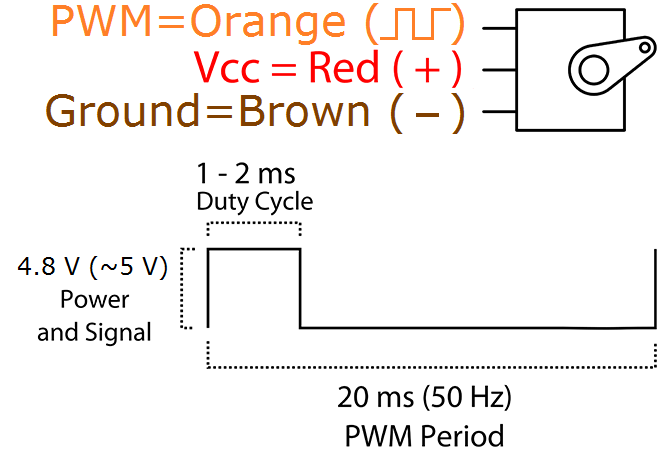

# Actuadores
Conceptos clave

- **Frecuencia (Hz)**: cuántas veces por segundo se repite el ciclo.
- **Ciclo de trabajo (duty, %)**: porcentaje del tiempo en ALTO dentro del periodo.
- **Resolución (bits)**: número de pasos posibles del duty: pasos = 2^bits.
- **Percepción**: el actuador ve un promedio de energía → brillo, velocidad, fuerza, etc.


| Actuador            | Frecuencia típica | Notas                                        |
| ------------------- | ----------------: | -------------------------------------------- |
| LED visible         |      500–2,000 Hz | Evita parpadeo y “banding” en video.         |
| Motor DC + puente H |         15–25 kHz | Fuera de lo audible; menor zumbido.          |
| Buzzer **pasivo**   |   Tonos musicales | Ajusta a la nota deseada (p. ej., 440 Hz).   |
| **Servo** RC        |             50 Hz | Pulsos de 1–2 ms dentro de 20 ms.            |
| Solenoide/Válvula   |      200 Hz–2 kHz | Revisa datasheet; siempre con diodo flyback. |


Seguridad eléctrica y protección (laboratorio)

- **GND común**: une la tierra del ESP32 con la de la fuente del actuador (motores/servos).
- **Diodo flyback** en cargas inductivas (relevadores, solenoides, motores con MOSFETs discretos).
- **Alimentación separada**: no alimentes motores desde 3V3 del ESP32.
- **Freno vs libre** (puente H): el freno disipa energía en el motor; cuidado con picos térmicos.
- **Cableado corto** y capacitores cerca de la carga para mitigar ruido (100 nF + 47–220 µF).

##  PWM


```cpp title="Direccion Basica"
/*Control de 1 solo motor*/
#define in1 27
#define in2 14

void setup() {
  /*Declarar Pines Como salida*/
  pinMode(in1, OUTPUT);
  pinMode(in2, OUTPUT);
}

void loop() {
  /*ADELANTE*/
  digitalWrite(in1, 0);
  digitalWrite(in2, 1);
  delay(1000);
  /*ALTO*/
  digitalWrite(in1, 0);
  digitalWrite(in2, 0);
  delay(1000);
  /*ATRAS*/
  digitalWrite(in1, 1);
  digitalWrite(in2, 0);
  delay(1000);
  /*ALTO*/
  digitalWrite(in1, 0);
  digitalWrite(in2, 0);
  delay(1000);
}

```


```cpp title="Control de Velocidad"
/*Control de 1 solo motor*/
#define in1 27
#define in2 14
#define pwm 12 //Definicion de pin de Velocidad

void setup() {
  /*Declarar Pines Como salida*/
  pinMode(in1, OUTPUT);
  pinMode(in2, OUTPUT);
  /*Configuracion de pin PWM 
    - Se conecta al pin 12(pwm)
    - Frecuencia de 1Khz
    - Resolucion de 8 bit (0-255)
    - Canal 0
  */
  ledcAttachChannel(pwm, 1000, 8, 0);
}

void loop() {
  /*ADELANTE*/
  digitalWrite(in1, 0);
  digitalWrite(in2, 1);
  ledcWrite(pwm, 0);//Velocidad al 0%
  delay(500);
  ledcWrite(pwm, 51);//Velocidad al 20%
  delay(500);
  ledcWrite(pwm, 102);//Velocidad al 40%
  delay(500);
  ledcWrite(pwm, 153);//Velocidad al 60%
  delay(500);
  ledcWrite(pwm, 204);//Velocidad al 80%
  delay(500);
  ledcWrite(pwm, 255);//Velocidad al 100%
  delay(500);
}
```





```cpp title="Control de Servo"
/*Control de 1 solo motor*/
#define pwm 12 //Definicion de pin de Velocidad
int duty = 0;
int grados = 0;
void setup() {
  /*Declarar Pines Como salida*/
  pinMode(in1, OUTPUT);
  pinMode(in2, OUTPUT);
  /*Configuracion de pin PWM 
    - Se conecta al pin 12(pwm)
    - Frecuencia de 50hz
    - Resolucion de 12 bit (0-4096)
    - Canal 0
  */
  ledcAttachChannel(pwm, 50, 12, 0);
  Serial.begin(115200);
}

void loop() { 
  /*
  Servo trabaja del ~5% al ~10% del total
  ~5% - 0°
  ~10% - 180°
  5% de 4096 = 204.8
  10% de 4096 = 409.6
  */
  grados=0;
  duty= map(grados, 0, 180, 205, 410);
  Serial.print("Pos: ");
  Serial.println(duty);
  ledcWrite(pwm, duty);
  delay(1000);
  grados=90;
  duty= map(grados, 0, 180, 205, 410);
  Serial.print("Pos: ");
  Serial.println(duty);
  ledcWrite(pwm, duty);
  delay(1000);
  grados=180;
  duty= map(grados, 0, 180, 205, 410);
  Serial.print("Pos: ");
  Serial.println(duty);
  ledcWrite(pwm, duty);
  delay(1000);
}
```


```cpp title="Imprimir valor analogo"
const int analogPin = 34; // O A0.

void setup() {

  Serial.begin(9600);
}

void loop() {
  int sensorValue = analogRead(analogPin);
  // Imprime el valor puro del Analogo
  Serial.print("Valor Analogo: ");
  Serial.print(sensorValue);

  // Convertir a valor de voltaje (0-3.3V)
  // El ESP32 tiene un convertidor ADC de 12 bit asi que el valor maximo es 4095 
  float voltaje = (float)sensorValue * (3.3 / 4095.0);

  // Imprime el Voltaje
  Serial.print("\t voltaje: ");
  Serial.print(voltaje);
  Serial.println(" V");

  delay(100);
}
```

**Resumen**
```cpp
// --- PWM con LEDC ---
ledcAttachChannel(pin, freq_Hz, resolution_bits, canal); 
// Configura canal PWM en un solo paso

ledcWrite(pin, duty);      
// Escribe el ciclo de trabajo (0 a 2^bits - 1)

// --- Pines digitales ---
pinMode(pin, OUTPUT);      
digitalWrite(pin, HIGH);   
digitalWrite(pin, LOW);    

// --- Lectura analógica ---
int valor = analogRead(pin);       

// Convertir a voltaje (ADC de 12 bits en ESP32, 0-4095)
float volt = valor * (3.3 / 4095.0);  

// --- Serial ---
Serial.begin(115200);      
Serial.print("Texto: ");   
Serial.println(valor);     

// --- Mapear rangos ---
int salida = map(entrada, inMin, inMax, outMin, outMax);  

// --- Delays ---
delay(ms);                 // Retraso en milisegundos
```

