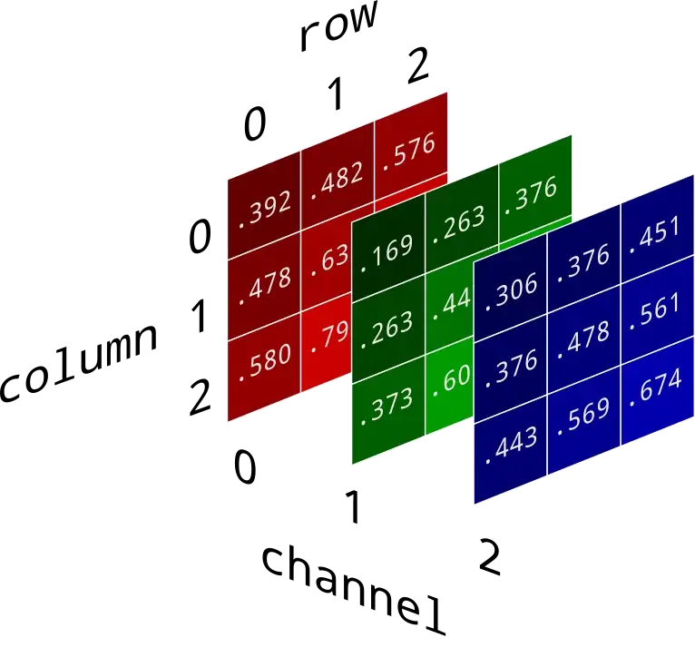
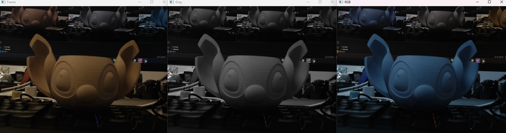
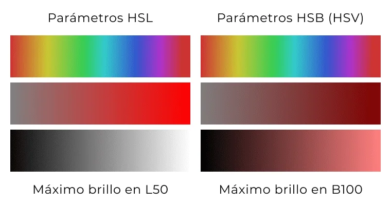
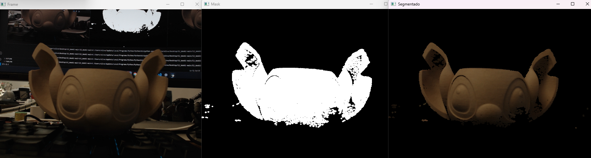
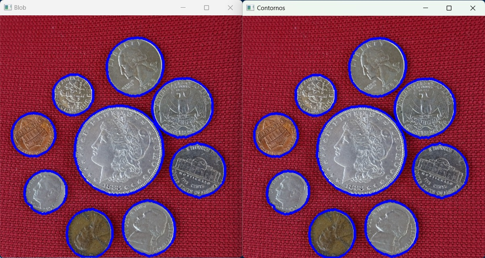
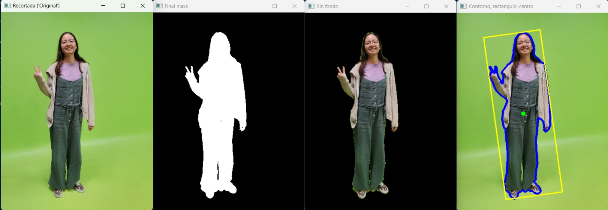

# Visión por Computadora 101

## Imágenes y procesamiento básico

Las imágenes digitales son matrices de píxeles. Cada píxel guarda intensidad y/o color. En el procesamiento de imágenes, estas matrices se manipulan para mejorar la calidad visual, extraer características o preparar datos para análisis posteriores.



Formato común de una imagen en memoria:
```
[Alto][Ancho][Canales]
```

- **Alto**: píxeles verticales  
- **Ancho**: píxeles horizontales  
- **Canales** (p. ej., 3 para color)
  - **RGB**: Rojo, Verde, Azul  
  - **BGR**: Azul, Verde, Rojo (OpenCV **usa BGR** por defecto)  
  - **Grayscale**: 1 canal (intensidad)  
  - **RGBA**: con alfa (transparencia)  
  - **HSV**: Matiz, Saturación, Valor (muy útil para segmentación por color)

### Glosario rápido
- **Frame**: imagen de un video/cámara.  
- **Máscara**: imagen binaria (0/255) que selecciona zonas.  
- **Kernel**: matriz pequeña usada por filtros/morfología.  
- **Contorno**: borde de una región blanca en una máscara.

### Recordatorio de funciones OpenCV
- `cv2.imread(path)`, `cv2.VideoCapture(idx|path)`, `cv2.imshow(título, img)`  
- `cv2.resize(img, (ancho, alto))`, `img.shape → (alto, ancho, canales)`  
- `img[y1:y2, x1:x2]` (recorte), `cv2.cvtColor(img, code)` (recolor)  
- Dibujo: `cv2.circle`, `cv2.rectangle`, `cv2.line`, `cv2.putText`

```python title="Ejemplo: shape"
alto, ancho, canales = imagen.shape
# o:
alto = imagen.shape[0]; ancho = imagen.shape[1]; canales = imagen.shape[2]
```

---

## Estructura base (cámara / video)

```python title="Loop de cámara robusto"
import cv2

cap = cv2.VideoCapture(0)  # prueba 0/1/2 si tienes varias cámaras
if not cap.isOpened():
    raise RuntimeError("No se pudo abrir la cámara")

# Opcional: fija resolución (si la cámara lo permite)
cap.set(cv2.CAP_PROP_FRAME_WIDTH, 1280)
cap.set(cv2.CAP_PROP_FRAME_HEIGHT, 720)

while True:
    ok, frame = cap.read()
    if not ok:
        break

    cv2.imshow("Frame", frame)
    if cv2.waitKey(1) & 0xFF == ord('q'):  # presiona 'q' para salir
        break

cap.release()
cv2.destroyAllWindows()
```

---

## Recolor (cambios de espacio de color)

```python title="BGR→Grayscale / BGR→RGB / BGR→HSV"
gray = cv2.cvtColor(frame, cv2.COLOR_BGR2GRAY)
rgb  = cv2.cvtColor(frame, cv2.COLOR_BGR2RGB)   # útil si muestras con matplotlib
hsv  = cv2.cvtColor(frame, cv2.COLOR_BGR2HSV)
```



**Segmentación por color (HSV + máscara):**



| Color        | H (min–max)        | S (min–max) | V (min–max) | Tips rápidos                             |
| ------------ | ------------------ | ----------- | ----------- | ---------------------------------------- |
| **Rojo**     | 0–10 **o** 170–179 | 120–255     | 70–255      | Combina dos máscaras por el wrap de Hue. |
| **Naranja**  | 10–20              | 120–255     | 80–255      | Sube V si está oscuro.                   |
| **Amarillo** | 20–35              | 120–255     | 120–255     | Baja S si se “lava”.                     |
| **Verde**    | 35–85              | 60–255      | 60–255      | Amplía S/V para telas mate/hojas.        |
| **Cian**     | 85–100             | 60–255      | 60–255      | —                                        |
| **Azul**     | 100–130            | 60–255      | 60–255      | Sube V_min si es muy oscuro.             |
| **Magenta**  | 140–170            | 60–255      | 60–255      | Puede solaparse con rojos fríos.         |
| **Blanco**   | 0–179              | **0–30**    | **200–255** | Bajo S, alto V (luces, brillos).         |
| **Gris**     | 0–179              | **0–50**    | **50–200**  | Bajo S, V medio.                         |
| **Negro**    | 0–179              | 0–255       | **0–50**    | V muy bajo.                              |

!!! info "Notas rápidas:"
    - En OpenCV, H (Matiz) va de 0–179, S (Saturación) y V (Valor) van de 0–255.
    - Los rangos son orientativos: ajusta según cámara, balance de blancos e iluminación.

```python title="Segmentar color en HSV"
import numpy as np
hsv = cv2.cvtColor(frame, cv2.COLOR_BGR2HSV)

# ejemplo: detectar verdes (ajusta a tu iluminación)
low  = np.array([35,  60,  60], dtype=np.uint8)
high = np.array([85, 255, 255], dtype=np.uint8)
mask = cv2.inRange(hsv, low, high)

seg = cv2.bitwise_and(frame, frame, mask=mask)
cv2.imshow("Mask", mask)
cv2.imshow("Segmentado", seg)
```




---

## Tamaño (redimensionar y escalar)

```python title="Resize y escalado manteniendo aspecto"
# Redimension exacto:
peque = cv2.resize(frame, (640, 360), interpolation=cv2.INTER_AREA)

# Escalar por factor:
factor = 0.5
esc = cv2.resize(frame, None, fx=factor, fy=factor, interpolation=cv2.INTER_AREA)

# Upscaling más suave:
grande = cv2.resize(frame, None, fx=2, fy=2, interpolation=cv2.INTER_CUBIC)
```

---

## Umbrales (binarización)

```python title="Umbral fijo, Otsu y adaptativo"
gray = cv2.cvtColor(frame, cv2.COLOR_BGR2GRAY)

# Umbral fijo (binario):
_, bin_fixed = cv2.threshold(gray, 120, 255, cv2.THRESH_BINARY)

# Otsu (elige umbral automático):
_, bin_otsu = cv2.threshold(gray, 0, 255, cv2.THRESH_BINARY + cv2.THRESH_OTSU)

# Umbral adaptativo (útil con iluminación desigual):
bin_adapt = cv2.adaptiveThreshold(
    gray, 255, cv2.ADAPTIVE_THRESH_GAUSSIAN_C, cv2.THRESH_BINARY,
    21, 5  # tamaño de bloque (impar) y constante de ajuste
)
```

---

## Limpieza morfológica (erosión, dilatación, apertura, cierre)

```python title="Erosión / dilatación / apertura / cierre"
import numpy as np

# parte de una máscara binaria (p. ej., bin_otsu o 'mask' en HSV)
mask = bin_otsu

kernel = cv2.getStructuringElement(cv2.MORPH_RECT, (5,5))

erosion = cv2.erode(mask, kernel, iterations=1)                # encoge blancos
dilat   = cv2.dilate(mask, kernel, iterations=1)               # expande blancos
opening = cv2.morphologyEx(mask, cv2.MORPH_OPEN,  kernel, 1)   # quita ruido pequeño
closing = cv2.morphologyEx(mask, cv2.MORPH_CLOSE, kernel, 1)   # cierra huecos
```

> **Tipos de Ruido**  
> - Ruido salpicado → **apertura**  
> - Huecos internos → **cierre**  
> - Bordes “comidos” → menos **erosión** o kernel más pequeño  
> - Objetos delgados rotos → menos **apertura** o kernel más chico

---

## Filtros (suavizado / reducción de ruido)

```python title="Filtros comunes"
# Desenfoque Gaussiano (ruido blanco, suaviza bordes):
gauss = cv2.GaussianBlur(frame, (5,5), sigmaX=0)

# Mediana (muy bueno para ruido sal y pimienta):
median = cv2.medianBlur(frame, 5)

# Bilateral (suaviza preservando bordes; costoso):
bilat = cv2.bilateralFilter(frame, d=9, sigmaColor=75, sigmaSpace=75)

# Promedio (box blur):
box = cv2.blur(frame, (5,5))
```

> **Sugerencias**  
> - Antes de **umbralizar**, aplica **GaussianBlur** o **medianBlur**.  
> - Para conservar bordes de color, prueba **bilateral**.

---

## Contornos y centros (centroides)

```python title="Encontrar contornos y centroides"
# 1) Asegúrate de tener una máscara binaria limpia
mask = opening  # por ejemplo, tras apertura

# 2) Buscar contornos (usa RETR_EXTERNAL para externos)
contours, _ = cv2.findContours(mask, cv2.RETR_EXTERNAL, cv2.CHAIN_APPROX_SIMPLE)

canvas = frame.copy()
for c in contours:
    area = cv2.contourArea(c)
    if area < 200:  # filtra ruido muy pequeño
        continue

    # Dibujo del contorno:
    cv2.drawContours(canvas, [c], -1, (0,255,0), 2)

    # Rectángulo axis-aligned:
    x, y, w, h = cv2.boundingRect(c)
    cv2.rectangle(canvas, (x,y), (x+w, y+h), (255,0,0), 2)

    # Círculo mínimo envolvente:
    (cx, cy), rad = cv2.minEnclosingCircle(c)
    cv2.circle(canvas, (int(cx), int(cy)), int(rad), (0,255,255), 2)

    # Centroides con momentos:
    M = cv2.moments(c)
    if M["m00"] != 0:
        cx_m = int(M["m10"] / M["m00"])
        cy_m = int(M["m01"] / M["m00"])
        cv2.circle(canvas, (cx_m, cy_m), 4, (0,0,255), -1)
        cv2.putText(canvas, f"({cx_m},{cy_m})", (cx_m+6, cy_m-6),
                    cv2.FONT_HERSHEY_SIMPLEX, 0.5, (0,0,255), 1)

# canvas ahora contiene contornos y centros dibujados
```



---

## Mini-pipeline integrado (color → limpieza → contornos → centro)

```python title="Ejemplo completo: detectar un color y obtener su centro"
import cv2, numpy as np

cap = cv2.VideoCapture(0)
if not cap.isOpened():
    raise RuntimeError("No se pudo abrir la cámara")

while True:
    ok, frame = cap.read()
    if not ok:
        break

    # 1) Color → HSV y máscara (rojo: dos rangos porque H envuelve 0/180)
    hsv  = cv2.cvtColor(frame, cv2.COLOR_BGR2HSV)
    low1, high1 = np.array([0,120,70]),   np.array([10,255,255])
    low2, high2 = np.array([170,120,70]), np.array([180,255,255])
    mask = cv2.inRange(hsv, low1, high1) | cv2.inRange(hsv, low2, high2)

    # 2) Limpieza morfológica
    kernel = cv2.getStructuringElement(cv2.MORPH_ELLIPSE, (7,7))
    mask = cv2.morphologyEx(mask, cv2.MORPH_OPEN,  kernel, iterations=1)
    mask = cv2.morphologyEx(mask, cv2.MORPH_CLOSE, kernel, iterations=1)

    # 3) Contornos
    cnts, _ = cv2.findContours(mask, cv2.RETR_EXTERNAL, cv2.CHAIN_APPROX_SIMPLE)
    out = frame.copy()
    for c in cnts:
        if cv2.contourArea(c) < 400:
            continue
        (cx, cy), r = cv2.minEnclosingCircle(c)
        cx, cy = int(cx), int(cy)
        cv2.circle(out, (cx, cy), int(r), (0,255,255), 2)
        cv2.circle(out, (cx, cy), 5, (0,0,255), -1)
        cv2.putText(out, f"Centro: {cx},{cy}", (cx+8, cy-8),
                    cv2.FONT_HERSHEY_SIMPLEX, 0.6, (0,0,255), 2)

    # 4) Mostrar
    cv2.imshow("Mask", mask)
    cv2.imshow("Detección", out)
    if cv2.waitKey(1) & 0xFF == ord('q'):
        break

cap.release()
cv2.destroyAllWindows()
```




---
