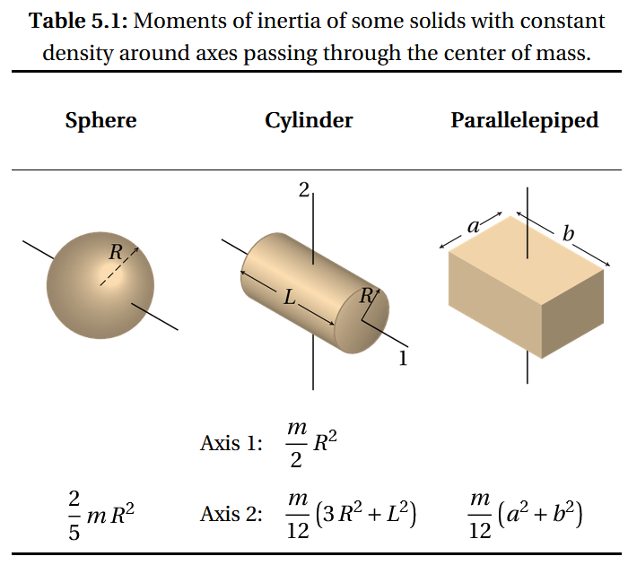

### Transmision e Inercia

## Inercia

{loading=lazy}

## Bloque de transmision

```xml
<transmission name="trans_<tu_junta>">
  <!-- A. Tipo de transmisión -->
  <type>transmission_interface/<NombreTipo></type>

  <!-- B. Sección de la junta URDF -->
  <joint name="<tu_junta>">
    <hardwareInterface><NombreInterfaz></hardwareInterface>
  </joint>

  <!-- C. Sección de actuador(es) -->
  <!-- Para Simple y Reduction: un solo actuador -->
  <actuator name="motor_<tu_junta>">
    <hardwareInterface><NombreInterfaz></hardwareInterface>
    <mechanicalReduction>1.0</mechanicalReduction>
  </actuator>

  <!-- Para Differential/FourWheel: varios actuadores -->
  <!--
  <actuator name="motor_izquierdo">
    ...
  </actuator>
  <actuator name="motor_derecho">
    ...
  </actuator>
  -->
</transmission>
```

- `<type>` selecciona el comportamiento de mapeo

- `<joint>` enlaza el nombre de la junta URDF con la interfaz de control

- `<actuator>` define cada motor, su interfaz y la relación de reducción mecánica


# Interfaces de Hardware

Cada sección <joint> y <actuator> debe declarar una de las siguientes interfaces:

- PositionJointInterface → comandos de posición (ángulo)
    * Qué hace: Permite enviar un objetivo de posición (ángulo) al controlador.
    * Usarla en:
        * Articulaciones de robot donde quieres especificar directamente la posición final.
        * Control de trayectoria
- VelocityJointInterface → comandos de velocidad
    * Qué hace: Permite enviar un objetivo de velocidad (rad/s o m/s).
    * Usarla en:
        * Sistemas de transmisión diferencial como las ruedas en un robot móvil.
- EffortJointInterface → comandos de esfuerzo/torque
    * Cuando el lazo de control se basa en torque.
    * Usarla en:
        * Cuando el lazo de control se basa en torque (manipuladores con control de fuerza como pulido, atornillado, etc).
        * Aplicaciones de interacción humano-robot.


# Descripción general de los tipos de transmisión

| Nombre del tipo                                            | Caso de uso                                                 |
| ---------------------------------------------------------- | ----------------------------------------------------------- |
| `transmission_interface/SimpleTransmission`                | Mapeo uno a uno entre junta ↔ motor                         |
| `transmission_interface/DifferentialTransmission`          | Dos actuadores que mueven una junta (ej. robot diferencial) |
| `transmission_interface/FourWheelDifferentialTransmission` | Cuatro actuadores, dos diferenciales virtuales              |
| `transmission_interface/JointReductionTransmission`        | Junta con reducción mecánica integrada                      |
| `transmission_interface/ActuatorTransmission`              | Sólo actuador (sin junta URDF asociada)                     |


# Ejemplos
Primero declaramos nuestro Joint

```xml
<joint name="joint1_base" type="revolute">
  <parent link="base_link"/>
  <child  link="link1"/>
  <origin xyz="0 0 0" rpy="0 0 0"/>
  <axis  xyz="0 0 1"/>
  <limit lower="-${pi}" upper="${pi}" effort="10" velocity="1"/>
</joint>
```
# Transmision Simple
Conducción directa, 1 junta ↔ 1 motor:
```xml
<transmission name="trans_joint1_base_simple">
  <type>transmission_interface/SimpleTransmission</type>
  <joint name="joint1_base">
    <hardwareInterface>PositionJointInterface</hardwareInterface>
  </joint>
  <actuator name="motor1_base">
    <hardwareInterface>PositionJointInterface</hardwareInterface>
    <mechanicalReduction>1.0</mechanicalReduction>
  </actuator>
</transmission>
```

# Transmision con reduccion
Si la junta ya incluye una caja de engranajes interna
```xml
<transmission name="trans_joint1_base_reduction">
  <type>transmission_interface/JointReductionTransmission</type>
  <joint name="joint1_base">
    <hardwareInterface>EffortJointInterface</hardwareInterface>
    <!-- reducción mecánica integrada en la junta -->
    <mechanicalReduction>5.0</mechanicalReduction>
  </joint>
  <actuator name="unused">
    <!-- opcional en este tipo -->
    <hardwareInterface>EffortJointInterface</hardwareInterface>
  </actuator>
</transmission>
```

# Transmision Diferencial

```xml
<transmission name="trans_diff_drive">
  <type>transmission_interface/DifferentialTransmission</type>
  <joint name="virtual_steer">
    <hardwareInterface>VelocityJointInterface</hardwareInterface>
  </joint>
  <!-- motor izquierdo -->
  <actuator name="left_wheel_motor">
    <hardwareInterface>VelocityJointInterface</hardwareInterface>
    <mechanicalReduction>1.0</mechanicalReduction>
  </actuator>
  <!-- motor derecho -->
  <actuator name="right_wheel_motor">
    <hardwareInterface>VelocityJointInterface</hardwareInterface>
    <mechanicalReduction>1.0</mechanicalReduction>
  </actuator>
</transmission>
```

# Transmision Diferencial 4 llantas
Cuatro motores en dos diferenciales
```xml
<transmission name="trans_4wd_diff">
  <type>transmission_interface/FourWheelDifferentialTransmission</type>
  <joint name="virtual_steer_front">
    <hardwareInterface>VelocityJointInterface</hardwareInterface>
  </joint>
  <joint name="virtual_steer_rear">
    <hardwareInterface>VelocityJointInterface</hardwareInterface>
  </joint>
  <actuator name="front_left_motor">
    <hardwareInterface>VelocityJointInterface</hardwareInterface>
    <mechanicalReduction>1.0</mechanicalReduction>
  </actuator>
  <actuator name="front_right_motor">
    <hardwareInterface>VelocityJointInterface</hardwareInterface>
    <mechanicalReduction>1.0</mechanicalReduction>
  </actuator>
  <actuator name="rear_left_motor">
    <hardwareInterface>VelocityJointInterface</hardwareInterface>
    <mechanicalReduction>1.0</mechanicalReduction>
  </actuator>
  <actuator name="rear_right_motor">
    <hardwareInterface>VelocityJointInterface</hardwareInterface>
    <mechanicalReduction>1.0</mechanicalReduction>
  </actuator>
</transmission>
```

# Actuador no ligado
Cuando modelas sólo el actuador sin una junta URDF asociada
```xml
<transmission name="trans_actuator_only">
  <type>transmission_interface/ActuatorTransmission</type>
  <actuator name="solo_actuador">
    <hardwareInterface>EffortJointInterface</hardwareInterface>
    <mechanicalReduction>1.0</mechanicalReduction>
  </actuator>
</transmission>
```
