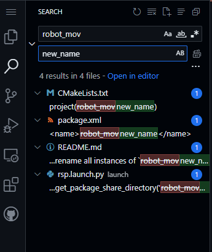

En ROS (Robot Operating System), la paquetería es el conjunto de convenciones y herramientas que te permiten organizar, construir y distribuir tu software robótico en unidades llamadas paquetes.

Los paquetes son la unidad mínima de código que agrupa todo lo necesario para una función concreta:

- Nodos (programas ejecutables)

- Librerías compartidas

- Definiciones de mensajes (.msg) y servicios (.srv)

- Archivos de configuración (por ejemplo, parámetros YAML, launch files)

- Recursos varios (imágenes, datos, scripts, etc.)

Cada paquete tiene su propia carpeta, con los siguientes dos archivos minimos:

- **package.xml**, que declara metadatos (nombre, versión, mantenedor, dependencias…)

- **CMakeLists.txt**, que indica cómo compilarlo (o instala sus componentes) usando CMake/Catkin (ROS 1) o ament (ROS 2).

Las herramientas basicas para trabajar los paquetes son:

- `colcon build` Detecta paquetes (CMake, Python, etc.) en src/ y compila en orden de dependencias.
- `--symlink-install` para enlace simbólico de paquetes Python
- `--packages-select` paquete para compilar sólo uno o varios paquetes concretos
- `rosdep install` Instala en el SO todas las dependencias listadas en los package.xml de tu workspace.
- `ros2 run <paquete> <nombre_de_nodo>` Ejecuta un nodo
- `ros2 launch <paquete> <archivo.launch.py>` Lanza Nodos


## 1. Clonar repositorio

La implementacion final de un robot se debe montar en un sistema de computo portatil, como lo puede ser una raspberry Pi, jetson Nano, etc. Por lo que vamos a desarrollar todo en un repositorio.

Vamos a ocupar una paqueteria base para no escribirla de cero. Para esto debemos tener una cuenta en github, y entrar al siguiente [repositorio](https://github.com/Gulden8ag/robot_mov)

{loading=lazy}

Dentro del repositorio seleccionaremos el boton verde de usar la plantilla y crear nuevo repositorio. El nuevo repositorio debera tener el nombre de su paquete, la convencion es usar letras minusculas, sin numeros, sin espacios. Aunque puede usarse el mismo nombre del repositorio base.

{ align=left loading=lazy} 

<br>
<br>

**Si no es el mismo nombre** En el repositorio utilizando la tecla ++period++ entraremos al editor de github, posteriormente utilizando ++ctrl+shift+f++ entraremos al buscador. 

Debemos reemplazar el nombre original con el nombre de tu repositorio. Se encuentra en 4 archivos mostrados en la imagen lateral.

Una vez realizado esto vamos a clonar el repositorio.


<br>
<br>
<br>

Dentro de la terminal de nuestro Ubuntu crearemos la carpeta de nuestro proyecto

```bash
mkdir dev_ws
cd dev_ws/
mkdir src
cd src/
```
dentro de nuestra carpeta src clonaremos nuestro repositorio.

```bash
git clone <repo_URL>
```
regresaremos a nuestra carpeta dev_ws utilizando `cd ..` y compilaremos nuestro paquete.

```bash
colcon build --symlink-install
```

De esta manera hemos construido nuestro primer paquete.

