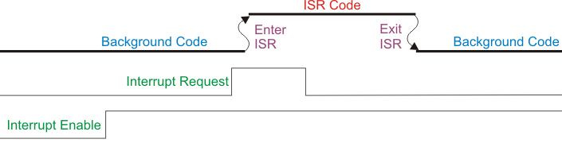

# Interrupciones

---

## ¿Qué es una interrupción? (definición + acrónimos)

Una **interrupción** es un evento asíncrono que **preempta** el flujo normal de ejecución para correr una rutina corta y de alta prioridad llamada **ISR**. Se usan para reaccionar **de inmediato** a eventos de hardware o software (timer, UART RX, DMA done, PIO, GPIO, etc.) sin *busy-waiting*.

**Acrónimos y conceptos:**
- **ISR** — *Interrupt Service Routine* — Rutina de Servicio de Interrupción.  
- **IRQ** — *Interrupt ReQuest* — Petición de Interrupción (la línea/evento).  
- **NVIC** — *Nested Vectored Interrupt Controller* — Controlador de Interrupciones Anidado y Vectorizado (prioridades, despacho, anidamiento).  
- **Vector table** — *Vector Table* — Tabla de vectores (arreglo de direcciones de ISR).  
- **Masking** — *Interrupt Masking* — Enmascaramiento de interrupciones (bloqueo temporal).  
- **Priority** — *Interrupt Priority* — Prioridad (número menor = mayor urgencia en Cortex-M).  
- **Edge vs Level** — *Edge-triggered vs Level-triggered* — Disparo por flanco vs por nivel.  
- **Polarity** — *Polarity* — Polaridad (Rising/Falling, Active-High/Active-Low).  
- **NMI** — *Non-Maskable Interrupt* — Interrupción No Enmascarable (prioridad máxima, no se puede bloquear).

---

## Flujo de control durante una interrupción (con diagrama)



**Lectura del diagrama (de abajo hacia arriba):**

1. **Interrupt Enable** (habilitación global/de línea)  
   Si está **LOW**, la CPU **ignora** la petición. Al pasar a **HIGH**, la CPU puede atender la **IRQ** (*Interrupt ReQuest* — Petición de Interrupción).

2. **Interrupt Request** (evento)  
   Es el **disparo** (edge o level). Con la línea habilitada, el **NVIC** marca la IRQ como **pendiente** y compara **prioridades**.

3. **Background Code → Enter ISR**  
   La CPU interrumpe el hilo de fondo y **auto-apila** registros (R0–R3, R12, LR, PC, xPSR).  
   Carga la dirección de la **ISR** desde la **Vector Table**.  
   **Latencia de interrupción** = tiempo desde que la IRQ es válida hasta la **primera instrucción** de la ISR.

4. **ISR Code**  
   **Regla de oro**: **ack/clear temprano** (limpiar la fuente) y trabajo **mínimo**.  
   **Tiempo de servicio** = duración dentro de la ISR (perfílalo con un pin de traza).

5. **Exit ISR → Background Code**  
   **Exception return**: la CPU **desapila** el contexto y reanuda en el punto exacto donde se interrumpió.  
   **Overhead de retorno**: costo fijo del desenlace.

**Detalles (Cortex-M33):**  
- **Preemption**: una IRQ de **mayor prioridad** (número menor) puede interrumpir una ISR en curso.  
- **Tail-chaining**: si termina una ISR y hay otra pendiente con prioridad válida, el core **encadena** sin restaurar/guardar todo de nuevo → menos overhead.  
- **Late arrival**: si llega una IRQ más prioritaria **durante** la entrada a otra, el NVIC puede redirigir a la más alta antes de ejecutar la primera.

**Medición práctica (traza):** sube un **GPIO** al entrar a la ISR y bájalo al salir.  
- **Ancho del pulso** = tiempo de servicio.  
- **Distancia** entre el evento y el flanco de subida = **latencia**.

---

## Tipos de interrupciones comunes (no solo GPIO)

| Clase | Motivo típico | Líneas IRQ (ejemplos) | Patrón de limpieza (*ack/clear*) |
|---|---|---|---|
| **Timer/Alarm** | tick periódico, *scheduling* | `TIMER_IRQ_0..3` | W1C en `timer_hw->intr`; programar el próximo `alarm[i]` |
| **UART** | RX llegó dato; TX tiene espacio | `UART0_IRQ`, `UART1_IRQ` | Drenar FIFO / leer estado (al desaparecer la condición baja la IRQ) |
| **DMA** | transferencia completa / error | `DMA_IRQ_0`, `DMA_IRQ_1` | W1C en estado/IRQ del canal |
| **PIO** | IRQ de SM, umbrales de FIFO | `PIO0_IRQ_0/1`, `PIO1_IRQ_0/1` | Leer/limpiar flags o drenar FIFO |
| **PWM** | *wrap*, compare | `PWM_IRQ_WRAP` | W1C en bit de IRQ de PWM |
| **I²C/SPI** | fin de transferencia, FIFOs, errores | `I2C0_IRQ/I2C1_IRQ`, `SPI0_IRQ/SPI1_IRQ` | Leer estado/limpiar flags |
| **SysTick** (núcleo) | *timebase* del core | Excepción SysTick | Gestionado por registros de SysTick |

---

## Edge-triggered vs Level-triggered y polaridad

- **Edge-triggered**: dispara en una transición (p. ej., flanco interno de timer o GPIO rising/falling).  
  **Pro**: no re-dispara mientras se mantenga el nivel; ideal para eventos discretos.  
  **Contra**: si se pierde el flanco, se pierde el evento.

- **Level-triggered**: permanece pendiente mientras la **condición** siga activa (p. ej., RX FIFO no vacía).  
  **Pro**: difícil “perder” eventos sostenidos.  
  **Contra**: **debes** remover la causa (leer FIFO, limpiar flag) o re-entrará.

**Polarity (polaridad):**  
- En GPIO: flancos `Rising/Falling` o niveles `Active-High/Active-Low`.  
- En periféricos: piensa **“¿qué condición la activa y cómo la elimino?”**.

---

## Vectores de ISR y **Prioridades NVIC en Cortex-M33 (16 niveles)**

**Idea clave:** en Cortex-M, un **número de prioridad más bajo significa mayor prioridad** 

En M33, el número de niveles efectivos es `2^(__NVIC_PRIO_BITS)`. En muchos M33 hay **4 bits → 16 niveles (0–15)**.

<!-- ```c
// Macro útil para programar prioridades correctamente (escala a 8 bits de registro)
#define NVIC_PRIO(level) ((uint8_t)((level) << (8 - __NVIC_PRIO_BITS)))
``` -->


**Asignación sugerida:**

| Nivel (0 = altísima) | Uso típico | Motivo |
|---|---|---|
| 0–1 | Captura/tiempos ultra críticos, hard-deadline | Preemption garantizada |
| 2–3 | **DMA done** que alimenta pipelines | Minimiza latencia de reabastecimiento |
| 4–5 | **Timer/Alarm** base de tiempo/planificador | Jitter bajo razonable |
| 6–7 | **UART RX** con tráfico alto | Evitar overflow de FIFO |
| 8–10 | **PIO/PWM/I²C/SPI** según caso | Trabajo regular |
| 11–13 | GPIO y tareas no críticas |  |
| 14–15 | Telemetría/depuración | Menor prioridad |

**Timers (2 instancias × 4 alarmas)**

- `TIMER0_IRQ_0..3`, `TIMER1_IRQ_0..3`.


**PWM**

- `PWM_IRQ_WRAP_0`, `PWM_IRQ_WRAP_1`.


**DMA**

- `DMA_IRQ_0`, `DMA_IRQ_1`, `DMA_IRQ_2`, `DMA_IRQ_3`.


**USB**

- `USBCTRL_IRQ`.    

**PIO (3 bloques, 2 IRQ c/u)**

- `PIO0_IRQ_0`, `PIO0_IRQ_1`, `PIO1_IRQ_0`, `PIO1_IRQ_1`, `PIO2_IRQ_0`, `PIO2_IRQ_1`.


**GPIO / IO Banks**

- `IO_IRQ_BANK0` (GPIO “normales”)

- `IO_IRQ_BANK0_NS` (versión Non-Secure para TrustZone)

- `IO_IRQ_QSPI` (Banco 1: QSPI/USB)

- `IO_IRQ_QSPI_NS` (Non-Secure)


**SIO (core-local)**

- `SIO_IRQ_FIFO`, `SIO_IRQ_BELL`, `SIO_IRQ_FIFO_NS`, `SIO_IRQ_BELL_NS`, `SIO_IRQ_MTIMECMP`. 


**Relojes / buses / periféricos**

- `CLOCKS_IRQ`, `SPI0_IRQ`, `SPI1_IRQ`, `UART0_IRQ`, `UART1_IRQ`, `ADC_IRQ_FIFO`, `I2C0_IRQ`, `I2C1_IRQ`, `OTP_IRQ`, `TRNG_IRQ`, `PROC0_IRQ_CTI`, `PROC1_IRQ_CTI`, `PLL_SYS_IRQ`, `PLL_USB_IRQ`, `POWMAN_IRQ_POW`, `POWMAN_IRQ_TIMER`.


??? Note "Tips de Interrupciones"
    - Una ISR solo puede ser preemptada por otra con número de prioridad menor (más urgente).
    - Misma prioridad ≠ preempción. Se encolan; el NVIC optimiza con tail-chaining (salir de una ISR y entrar a la siguiente sin pasar por el hilo).
    - Si mientras ejecutas una ISR llega una más urgente, puede aplicarse late arrival: el NVIC salta directamente a la más urgente.


**Máscaras de interrupción en Cortex-M33:**  

Son **registros globales** dentro del núcleo que controlan qué interrupciones pueden activarse:

- PRIMASK: 1 = bloquea todas las IRQ configurables (las “normales”). No bloquea NMI ni HardFault.
- BASEPRI: valor ≠ 0 = bloquea las IRQ con prioridad numérica ≥ umbral; deja pasar las más urgentes (con número menor).
- FAULTMASK: 1 = bloquea todo excepto NMI. Incluso mantiene en pausa HardFault. Es la más “dura”.

No son máscaras “por bit” de cada IRQ. Son puertas globales: PRIMASK y FAULTMASK apagan “todo” (con excepciones), y BASEPRI pone un umbral de prioridad.

```c title="Glosario de máscaras"
// PRIMASK: todo OFF (menos NMI/HardFault) → Úsalo muy poco y muy corto.
__disable_irq();         // PRIMASK = 1
// ... sección ultracorta ...
__enable_irq();          // PRIMASK = 0

// BASEPRI: umbral (recomendado para secciones críticas “RTOS-friendly”)
uint32_t old = __get_BASEPRI();
__set_BASEPRI(NVIC_PRIO(8));  // bloquea 8..15; deja pasar 0..7
__DSB(); __ISB();              // garantizar efecto inmediato
// ... sección crítica con urgentes habilitadas ...
__set_BASEPRI(old);

// Levantar solo el umbral (nunca bajarlo accidentalmente)
__set_BASEPRI_MAX(NVIC_PRIO(6));

// FAULTMASK: extremo; casi nunca en app normal
__set_FAULTMASK(1);     // bloquea todo excepto NMI
// ... código de emergencia ...
__set_FAULTMASK(0);
```


## Programacion de IRQ

**Comandos Basicos**

- `gpio_set_irq_enabled_with_callback(gpio, events, enabled, callback)`
    - Habilita/deshabilita IRQ en un pin y registra un callback 
    - Eventos:
        - `GPIO_IRQ_EDGE_FALL`
        - `GPIO_IRQ_EDGE_RISE`
        - `GPIO_IRQ_LEVEL_HIGH`
        - `GPIO_IRQ_LEVEL_LOW`
    - Un callback es una función que se llama cuando ocurre el evento de interrupción.
    - Ejemplo de uso:
    ```c
    gpio_set_irq_enabled_with_callback(16, GPIO_IRQ_EDGE_FALL, true, &isr);
    ```
- `gpio_set_irq_enabled(gpio, events, enabled)`
    - Habilita/deshabilita IRQ en un pin sin callback
    - Ejemplo de uso:
    ```c
    gpio_set_irq_enabled(16, GPIO_IRQ_EDGE_FALL, true);
    ```
- `gpio_acknowledge_irq(gpio, event_mask)`
    - Limpia el flag latcheado del evento en la ISR (si no, sigue disparando).
    - Ejemplo de uso:
    ```c
    void isr(uint gpio, uint32_t events) {
        if (events & GPIO_IRQ_EDGE_FALL) { /* ... */ }
        gpio_acknowledge_irq(gpio, events);
    }
    ```
- `gpio_get_irq_event_mask(gpio)`
    - Lee qué evento(s) activaron la IRQ (útil para decidir lógica).
    - Ejemplo de uso:
    ```c
    if (gpio_get_irq_event_mask(16) & GPIO_IRQ_EDGE_FALL) { /* ... */ }
    ```

```c title="Ejemplo de uso Basico"
#include "pico/stdlib.h"
#include "hardware/gpio.h"

#define LED_PIN 25   // LED onboard (Pico 2)
#define BTN_PIN 16   // botón con pull-up externo a 3V3, pulsador a GND

static void button_isr(uint gpio, uint32_t events) {
    if (gpio == BTN_PIN && (events & GPIO_IRQ_EDGE_RISE)) {
        gpio_xor_mask(1u << LED_PIN);   
    }
    gpio_acknowledge_irq(gpio, events);  // limpia el flag de la IRQ
}

int main(void) {
    stdio_init_all();

    // LED
    gpio_init(LED_PIN);
    gpio_set_dir(LED_PIN, GPIO_OUT);
    gpio_put(LED_PIN, 0);

    // Botón: entrada sin pulls internos (usas el pull-up externo del hardware)
    gpio_init(BTN_PIN);
    gpio_set_dir(BTN_PIN, GPIO_IN);
    gpio_disable_pulls(BTN_PIN);   // importante: no mezclar con pull interno

    // Interrupción por flanco de bajada (alto -> bajo al presionar)
    gpio_set_irq_enabled_with_callback(BTN_PIN,
                                       GPIO_IRQ_EDGE_RISE,
                                       true,
                                       &button_isr);

    while (true) {
        tight_loop_contents();
    }
}

```

``` c title="Ejemplo de uso Encadenado"
#include "pico/stdlib.h"
#include "hardware/gpio.h"
#include "hardware/irq.h"

#define LED_A_PIN   0    // LED para botón A (externo)
#define LED_B_PIN   25   // LED para botón B (onboard Pico 2)

#define BTN_A_PIN   16   // Botón A con pull-up externo, a GND (FALL al presionar)
#define BTN_B_PIN   17   // Botón B con pull-up externo, a GND (FALL al presionar)

// Prototipo del callback global de GPIO (unico por core)
static void gpio_isr(uint pin, uint32_t event_mask);

// Parpadeo bloqueante (SOLO para demostración en ISR; en producción, evitar)
static void blink_blocking(uint led_pin, int times, int ms_delay) {
    for (int i = 0; i < times; ++i) {
        gpio_xor_mask(1u << led_pin);
        busy_wait_ms(ms_delay);   // bloqueo intencional para notar la “ocupación”
        gpio_xor_mask(1u << led_pin);
        busy_wait_ms(ms_delay);
    }
}

int main(void) {
    stdio_init_all();

    // LEDs
    gpio_init(LED_A_PIN);
    gpio_set_dir(LED_A_PIN, GPIO_OUT);
    gpio_put(LED_A_PIN, 0);

    gpio_init(LED_B_PIN);
    gpio_set_dir(LED_B_PIN, GPIO_OUT);
    gpio_put(LED_B_PIN, 0);

    gpio_init(BTN_A_PIN);
    gpio_set_dir(BTN_A_PIN, GPIO_IN);
    gpio_disable_pulls(BTN_A_PIN);

    gpio_init(BTN_B_PIN);
    gpio_set_dir(BTN_B_PIN, GPIO_IN);
    gpio_disable_pulls(BTN_B_PIN);

    // Habilitar IRQ por flanco de BAJADA en ambos pines
    gpio_set_irq_enabled_with_callback(BTN_A_PIN,
                                       GPIO_IRQ_EDGE_FALL,
                                       true,
                                       &gpio_isr);
    // El segundo pin usa el MISMO callback:
    gpio_set_irq_enabled(BTN_B_PIN, GPIO_IRQ_EDGE_FALL, true);

    irq_set_priority(IO_IRQ_BANK0, 0x80);   // cualquier valor (no hay otra línea para competir)
    irq_set_enabled(IO_IRQ_BANK0, true);

    while (true) {
        tight_loop_contents();
    }
}

// Callback 
static void gpio_isr(uint pin, uint32_t event_mask) {
    if (event_mask & GPIO_IRQ_EDGE_FALL) {
        if (pin == BTN_A_PIN) {
            // Cada botón tiene SU propio “blink_blocking”
            blink_blocking(LED_A_PIN, 4, 1000);  // 4 veces, 1 s
        } else if (pin == BTN_B_PIN) {
            blink_blocking(LED_B_PIN, 4, 1000);  // 4 veces, 1 s
        }
    }
    gpio_acknowledge_irq(pin, event_mask);
}
```
