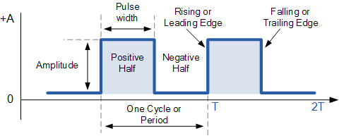

# Temporizadores

**Terminología**

{ style="display:block; margin:auto;" width="80%"}

- **Período (T)**: tiempo entre eventos repetitivos (segundos).
- **Frecuencia (f)**: eventos por segundo (Hz). Relación: $$ f = \frac{1}{T} $$.
- **Tick**: unidad discreta de tiempo del temporizador $$ \Delta t = \frac{1}{f_{\text{timer}}} $$.
- **Resolución**: el paso temporal mínimo que puedes representar $$ \text{Resolucion} \approx \frac{1}{f_{\text{timer}}} $$.
- **Jitter**: variación no deseada del instante real respecto al ideal.
- **Prescaler**: divisor del reloj que alimenta al temporizador (reduce f_timer). Nota: el timer de sistema del RP2350 no usa prescaler clásico; selecciona la fuente de tick (µs o ciclos de clk_sys).
- **Overflow / wrap**: cuando el contador alcanza su límite y “se da la vuelta”.
- **One-shot vs periódico**: dispara una vez vs se rearma automáticamente.

**Relojes del sistema y dominios**

- **Reloj de CPU (f_core/f_sys)**: ejecuta instrucciones.
- **Reloj de periféricos (f_periph)**: algunos periféricos usan reloj propio.
- **PLL/DFS**: multiplicadores/divisores que alteran f_core y f_periph.
- **Estabilidad**: si cambias clocks en runtime, recalcula configuraciones temporales.

**Modos de Timer**

- **Temporizador**: avanza con un reloj conocido (mide tiempo).
- **Contador**: avanza con eventos externos (mide sucesos).
- **Modos comunes**: up, down, up/down, one-shot, periódico, compare, capture.
- **Salidas**: flags, interrupciones, compare-match, toggles de pin, DMA trigger.

**Cálculo de Tiempo**

- **f_clk**: reloj de entrada del timer (core o periférico).
- **P**: valor de preescalador (según proveedor puede ser N, N-1, o potencias de 2).
- **f_timer** = f_clk / (P_efectivo)
- **Reload**: valor de recarga (ancho N bits)

$$
T \approx \frac{\mathrm{Reload}+1}{f_{\mathrm{timer}}}
$$

$$
\Delta t = \frac{1}{f_{\mathrm{timer}}} = \frac{P_{\mathrm{efectivo}}}{f_{\mathrm{clk}}}
$$

$$
T_{\max} \approx \frac{2^{N}}{f_{\mathrm{timer}}}
$$

**RP2350**

**Contador de 64 bits** que avanza con un **tick** seleccionado:

- **Modo µs:** \(\Delta t = 1~\mu s\).
- **Modo ciclos:** \(\Delta t = \frac{1}{f_{\text{sys}}}\) *(p. ej., \(1/150~\text{MHz} \approx 6.67~\text{ns}\)).*

**Alarmas por comparación** con el contador (varias alarmas disponibles).

Las alarmas comparan **32 bits bajos** del contador ⇒ el **máximo tiempo programable** hacia el futuro es:

\[
T_{\max}^{\text{alarma}} \approx 2^{32} \cdot \Delta t
\]

- Ej.: en **1 µs/tick** → \(\approx 71.6~\text{min}\)  
- En **ciclos @ 150 MHz** → \(\approx 28.6~\text{s}\)

Usar **deadlines absolutos** y **rearme acumulativo**:

\[
\text{intervalo\_ticks}=\frac{T_{\text{deseado}}}{\Delta t},
\qquad
\text{next} \leftarrow \text{now} + \text{intervalo_ticks}
\]

En la ISR:

\[
\text{next} \leftarrow \text{next} + \text{intervalo_ticks}
\]

*(Así evitas que la latencia de la ISR acumule error de fase).*

---

**Calculos de ejemplos:**

**Periodo 10 µs (100 kHz)**  
- **Modo µs:** \(\text{intervalo\_ticks}=10\)  
- **Modo ciclos @ 150 MHz:** \(\text{intervalo\_ticks}=1500\)

**Periodo 3.3 µs**  
- **Modo µs:** no exacto (solo enteros de µs).  
- **Modo ciclos @ 150 MHz:** \(3.3 \cdot 150 = 495\) ciclos → **exacto**.


## Funciones

```c
static inline bool add_repeating_timer_ms(int32_t delay_ms, repeating_timer_callback_t callback, void *user_data, repeating_timer_t *out) {
    return alarm_pool_add_repeating_timer_us(alarm_pool_get_default(), delay_ms * (int64_t)1000, callback, user_data, out);
}
```

- `int32_t delay_ms` : el retardo de repetición en milisegundos; si es > 0, este es el tiempo entre que termina un callback (función de devolución de llamada) y comienza el siguiente; si es < 0, entonces es el negativo del tiempo entre los inicios de los callbacks. El valor 0 se trata como 1 microsegundo.
- `repeating_timer_callback_t callback` : La funcion callback del temporizador repetible
- `void *user_data` : datos del usuario que se pasarán y almacenarán en la estructura `repeating_timer` para ser utilizados por el callback.
- `repeating_timer_t *out` : el puntero a la estructura propiedad del usuario donde se almacenará la información del temporizador repetitivo.

`irq_set_exclusive_handler(ALARM_IRQ, on_alarm_irq);`

- **Qué hace:** registra tu función `on_alarm_irq` como **único** manejador para la línea de interrupción `ALARM_IRQ` en el NVIC (vector de interrupciones del M33).

`hw_set_bits(&timer_hw->inte, 1u << ALARM_NUM);`

- **Qué hace:** habilita **dentro del periférico TIMER** la **fuente** de interrupción para la alarma `ALARM_NUM`.
- **Otros Params**
    - `intr` = estado bruto de flags (quién pidió interrupción).
    - `inte` = enables (quién tiene permiso de pedir).
    - `ints` = estado enmascarado (intr & inte).

`irq_set_enabled(ALARM_IRQ, true);`

- **Qué hace:** habilita la línea de interrupción `ALARM_IRQ` en el NVIC (controlador de interrupciones del núcleo).
- **Opcional:** puedes ajustar la prioridad:
`irq_set_priority(ALARM_IRQ, priority); // 0 = más alta, 255 = más baja`

## Ejemplos

**Blink Basico sin delay**

```c
// Blink con timer (SDK alto nivel): cambia BLINK_MS para ajustar
#include "pico/stdlib.h"
#include "pico/time.h"

#define LED_PIN PICO_DEFAULT_LED_PIN
static const int BLINK_MS = 250;  // <-- ajusta tu periodo aquí

bool blink_cb(repeating_timer_t *t) {
    static bool on = false;
    gpio_put(LED_PIN, on = !on);
    return true; // seguir repitiendo la alarma
}

int main() {
    stdio_init_all();

    gpio_init(LED_PIN);
    gpio_set_dir(LED_PIN, true);

    repeating_timer_t timer;
    // Programa una interrupción periódica cada BLINK_MS:
    add_repeating_timer_ms(BLINK_MS, blink_cb, NULL, &timer);

    while (true) {
        // El trabajo "pesado" debería ir aquí (no en la ISR).
        tight_loop_contents();
    }
}
```

**Blink con alarma configurable**

```c
// Blink con timer de sistema (bajo nivel): programando ALARM0 e IRQ
#include "pico/stdlib.h"
#include "hardware/irq.h"
#include "hardware/structs/timer.h"

#define LED_PIN       PICO_DEFAULT_LED_PIN
#define ALARM_NUM     0  // usaremos la alarma 0

// Calcula el número de IRQ para esa alarma 
#define ALARM_IRQ     timer_hardware_alarm_get_irq_num(timer_hw, ALARM_NUM)

static volatile uint32_t next_deadline;   // próximo instante (en us) en 32 bits bajos
// Por defecto el timer cuenta µs (no cambiamos la fuente).
static volatile uint32_t intervalo_us = 1000000u;    // periodo en microsegundos

void on_alarm_irq(void) {
    // 1) Limpiar el flag de la alarma
    hw_clear_bits(&timer_hw->intr, 1u << ALARM_NUM);

    // 2) Hacer el trabajo toggle LED
    sio_hw->gpio_togl = 1u << LED_PIN;

    // 3) Rearmar la siguiente alarma con "deadline acumulativo"
    next_deadline += intervalo_us;
    timer_hw->alarm[ALARM_NUM] = next_deadline;
}

int main() {
    stdio_init_all();

    // Configura el LED
    gpio_init(LED_PIN);
    gpio_set_dir(LED_PIN, true);

    // "now" = 32 bits bajos del contador (tiempo en µs)
    uint32_t now_us = timer_hw->timerawl;          // lectura 32b (low) del contador
    next_deadline = now_us + intervalo_us;         // primer deadline

    // Programa la alarma
    timer_hw->alarm[ALARM_NUM] = next_deadline;

    // Crea un handler exclusivo para ligar el callback a la IRQ de la alarma
    irq_set_exclusive_handler(ALARM_IRQ, on_alarm_irq);
    // Habilita dentro del periférico TIMER la fuente de interrupción para la alarma ALARM_NUM inte = interrupt enable
    hw_set_bits(&timer_hw->inte, 1u << ALARM_NUM);
    //Habilita la IRQ en el NVIC (controlador de interrupciones del núcleo)
    irq_set_enabled(ALARM_IRQ, true);

    while (true) {
        // Mantén el bucle principal libre; lo pesado va aquí, no en la ISR
        tight_loop_contents();
    }
}
```

**Blink Multiples**

```c
// Dos LEDs con múltiples alarmas del timer de sistema (RP2350 / Pico 2) en modo µs
// - ALARM0 controla el LED "default" (PICO_DEFAULT_LED_PIN).
// - ALARM1 controla un LED externo en GPIO 0.
// Cambia LED0_MS y LED1_MS para ajustar la velocidad de parpadeo de cada LED.

#include "pico/stdlib.h"
#include "hardware/irq.h"
#include "hardware/structs/timer.h"
#include "hardware/gpio.h"

#define LED0_PIN     PICO_DEFAULT_LED_PIN   // LED integrado
#define LED1_PIN     0                      // LED externo en GPIO 0

#define ALARM0_NUM   0
#define ALARM1_NUM   1

#define ALARM0_IRQ   timer_hardware_alarm_get_irq_num(timer_hw, ALARM0_NUM)
#define ALARM1_IRQ   timer_hardware_alarm_get_irq_num(timer_hw, ALARM1_NUM)


// Próximos "deadlines" (32 bits bajos en µs) y sus intervalos en µs
static volatile uint32_t next0_us, next1_us;
static const uint32_t INTERVALO0_US = 250000u;
static const uint32_t INTERVALO1_US = 400000u;

// ISR para ALARM0
static void on_alarm0_irq(void) {
    hw_clear_bits(&timer_hw->intr, 1u << ALARM0_NUM);
    sio_hw->gpio_togl = 1u << LED0_PIN;
    next0_us += INTERVALO0_US;
    timer_hw->alarm[ALARM0_NUM] = next0_us;
}

// ISR para ALARM1
static void on_alarm1_irq(void) {
    hw_clear_bits(&timer_hw->intr, 1u << ALARM1_NUM);
    sio_hw->gpio_togl = 1u << LED1_PIN;
    next1_us += INTERVALO1_US;
    timer_hw->alarm[ALARM1_NUM] = next1_us;
}

int main() {

    gpio_init(LED0_PIN);
    gpio_set_dir(LED0_PIN, GPIO_OUT);
    gpio_put(LED0_PIN, 0);

    gpio_init(LED1_PIN);
    gpio_set_dir(LED1_PIN, GPIO_OUT);
    gpio_put(LED1_PIN, 0);

    // Timer de sistema en microsegundos (por defecto source = 0)
    timer_hw->source = 0u;
    
    uint32_t now_us = timer_hw->timerawl;

    // Primeros deadlines
    next0_us = now_us + INTERVALO0_US;
    next1_us = now_us + INTERVALO1_US;

    // Programa ambas alarmas
    timer_hw->alarm[ALARM0_NUM] = next0_us;
    timer_hw->alarm[ALARM1_NUM] = next1_us;

    // Limpia flags pendientes antes de habilitar
    hw_clear_bits(&timer_hw->intr, (1u << ALARM0_NUM) | (1u << ALARM1_NUM));

    // Registra handlers exclusivos para cada alarma
    irq_set_exclusive_handler(ALARM0_IRQ, on_alarm0_irq);
    irq_set_exclusive_handler(ALARM1_IRQ, on_alarm1_irq);

    // Habilita fuentes de interrupción en el periférico TIMER
    hw_set_bits(&timer_hw->inte, (1u << ALARM0_NUM) | (1u << ALARM1_NUM));

    // Habilita ambas IRQ en el NVIC
    irq_set_enabled(ALARM0_IRQ, true);
    irq_set_enabled(ALARM1_IRQ, true);

    // Bucle principal: todo el parpadeo ocurre en las ISRs
    while (true) {
        tight_loop_contents();
    }
}
```

