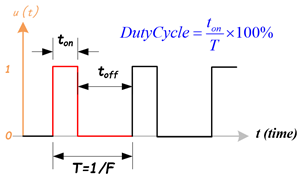
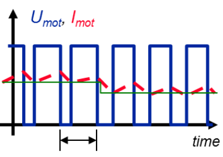
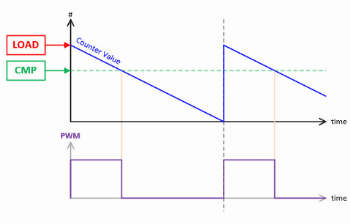
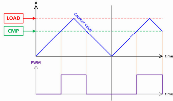
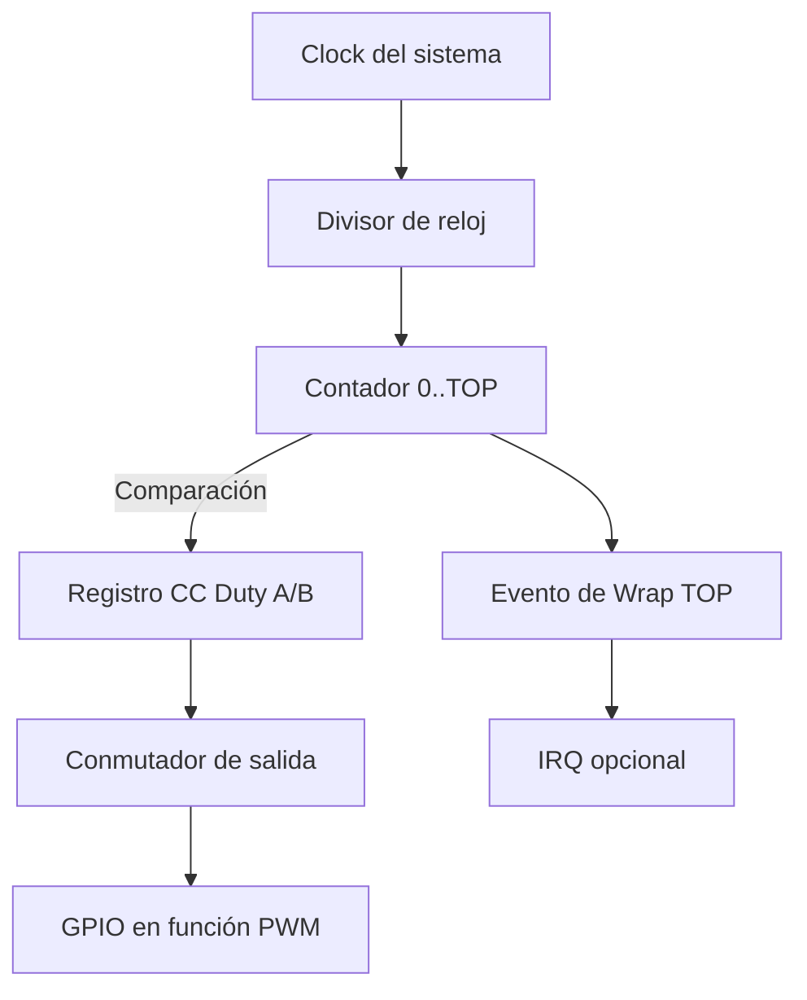

# PWM — Modulación por Ancho de Pulso

## 1) Introducción

La **Modulación por Ancho de Pulso (PWM)** es una técnica digital que permite controlar la **potencia promedio** aplicada a una carga alternando rápidamente entre ON y OFF.  
Ajustando la **relación cíclica (duty cycle)** se logra un efecto análogo a variar la tensión.

{loading=lazy}

**Aplicaciones:** control de brillo en LEDs, motores DC (puente H), servos RC, generación de tonos (buzzer), conversión DAC con filtro RC, etc.

---

## 2) Conceptos Fundamentales del PWM

### Valor Promedio y RMS
Una señal PWM de amplitud \( V_{high} \) y duty \( D \) tiene un valor promedio:

\[
V_{avg} = V_{high} \cdot D
\]

En cargas resistivas, el parámetro relevante para la disipación de potencia es el **valor RMS**:

\[
V_{rms} = V_{high} \cdot \sqrt{D}
\]

La potencia en una carga \( R \) se calcula como:

\[
P = \frac{V_{rms}^2}{R}
\]

⚠️ Nota: La fórmula \( V_{avg} = D \cdot V_{cc} \) es válida cuando el nivel bajo = 0V y el nivel alto = \( V_{cc} \).

---

### Rizado (Ripple)

El **rizado (ripple)** es la variación periódica alrededor del valor promedio debido a que la señal real conmuta ON/OFF.  
En un filtro RC, la salida no es perfectamente plana: oscila un poco por cada ciclo PWM.

- Menos rizado ⇢ mayor frecuencia PWM o filtros con constante de tiempo mayor que el período de conmutación.  
- Más rizado ⇢ frecuencia baja o carga sensible.

{loading=lazy}

---

### Cómo elegir la frecuencia

1. **LEDs:** ≥ 1 kHz para el ojo humano, 10–20 kHz si se usan cámaras para evitar *banding*.  
2. **Motores DC:** 15–25 kHz para salir del rango audible humano.  
3. **Servos RC:** 50 Hz con pulsos de 1–2 ms (protocolo especial).  
4. **DAC por PWM:** mientras más alta \( f_{PWM} \) frente al filtro, menor rizado.

---

## 3) Parámetros prácticos

### TOP y Resolución
- **TOP:** valor máximo que alcanza el contador antes de reiniciarse.  
- Define la **resolución** del PWM:

\[
Resolución\ (bits) = \log_2(TOP+1)
\]

O de forma más intuitiva:

\[
2^{Resolución} = TOP+1
\]

- Ejemplo: TOP=255 → 8 bits, TOP=1023 → 10 bits, TOP=4095 → 12 bits.

### Relación Duty vs Level
El duty cycle se obtiene de la comparación entre el contador y el registro CC (level):

\[
Duty\ Cycle = \frac{level}{TOP+1} \cdot 100\%
\]

---

### Armónicos

Un **armónico** es un componente de frecuencia que aparece en una señal periódica y cuya frecuencia es un **múltiplo entero** de la fundamental. 
  - Fundamental: f1 (ej. 2 kHz).  
  - Armónicos: 2f1 (4 kHz), 3f1 (6 kHz), etc.  

**Efectos de los armónicos:**
- Ruido audible: si un armónico cae en 20 Hz–20 kHz, se percibe como zumbido.  
- Interferencia electromagnética (EMI): armónicos altos se irradian en cables/pistas.  
- Calentamiento adicional: excitación de transistores y bobinas a altas frecuencias.  
- Distorsión visual: en LEDs/pantallas, los armónicos pueden generar parpadeo o banding en cámaras.

**Alineación de bordes:**
- **Edge-aligned:** refuerza armónicos pares → más ruido EMI.  
- **Center-aligned:** cancela armónicos pares → menos ruido audible/EMI.  

{loading=lazy}  
{loading=lazy}

---

## 4) Arquitectura del PWM en microcontroladores



1. **Clock del sistema (A):** define la base temporal del PWM.  
2. **Divisor de reloj (B):** ajusta el rango de frecuencias útiles.  
3. **Contador 0..TOP (C):** corazón del PWM, define la resolución.  
4. **Comparación (C→D):** si contador < CC ⇒ salida HIGH; si ≥ CC ⇒ LOW.  
5. **Conmutador de salida (E):** puede incluir polaridad normal/invertida y estado inactivo (LOW, HIGH, Hi-Z).  
6. **GPIO en modo PWM (F):** el pin físico emite la señal PWM.  
7. **Evento de Wrap (C→G):** útil para sincronizar procesos.  
8. **IRQ opcional (H):** permite ejecutar código en cada ciclo PWM.

---

## 5) PWM en Raspberry Pi Pico 2

- **Slices:** 8 bloques PWM con 2 canales (A y B) ⇒ 16 salidas.  
- **TOP ajustable:** hasta 16 bits.  
- **Divisor de reloj:** entero/fraccional.  

### Relación frecuencia–divisor–TOP

\[
f_{PWM} = \frac{f_{clk}}{div \cdot (TOP+1)}
\]

donde:
- \( f_{clk} \) = frecuencia de reloj del sistema (125 MHz en Pico).  
- \( div \) = divisor (1–255, fraccional).  
- \( TOP \) = valor de recuento máximo.  

---

### Funciones útiles (SDK)

| API | ¿Qué hace? | Notas |
|---|---|---|
| `gpio_set_function(pin, GPIO_FUNC_PWM)` | Pone el pin en modo PWM. | `GPIO_FUNC_PWM` conecta el pin al generador PWM interno. |
| `pwm_gpio_to_slice_num(pin)` | Obtiene el slice asociado. | Cada slice maneja 2 canales. |
| `pwm_gpio_to_channel(pin)` | Retorna A o B. | Necesario para fijar duty. |
| `pwm_set_wrap(slice, top)` | Define `TOP`. | Determina resolución. |
| `pwm_set_clkdiv(slice, div)` | Define divisor. | Ajusta frecuencia. |
| `pwm_set_chan_level(slice, chan, level)` | Ajusta duty. | Relación con duty: \( \frac{level}{TOP+1} \). |
| `pwm_set_enabled(slice, bool)` | Activa/desactiva slice. | Inicia PWM. |

---

### Ejemplo en C (SDK)

```c
// pwm_led.c — Atenuar LED con PWM en GPIO 2
#include "pico/stdlib.h"
#include "hardware/pwm.h"

#define LED_PIN 2
#define F_PWM_HZ 2000   // 2 kHz: fuera del rango visible
#define TOP 1023        // 10 bits de resolución

int main() {
    stdio_init_all();

    gpio_set_function(LED_PIN, GPIO_FUNC_PWM);
    uint slice = pwm_gpio_to_slice_num(LED_PIN);
    uint chan  = pwm_gpio_to_channel(LED_PIN);

    // Calcular divisor
    float f_clk = 125000000.0f; // 125 MHz
    float div = f_clk / (F_PWM_HZ * (TOP + 1));
    pwm_set_clkdiv(slice, div);
    pwm_set_wrap(slice, TOP);

    pwm_set_chan_level(slice, chan, 0);
    pwm_set_enabled(slice, true);

    // Fade
    int level = 0, step = 8, dir = +step;
    while (true) {
        pwm_set_chan_level(slice, chan, level);
        sleep_ms(5);
        level += dir;
        if (level >= TOP || level <= 0) dir = -dir;
    }
}
```

---
