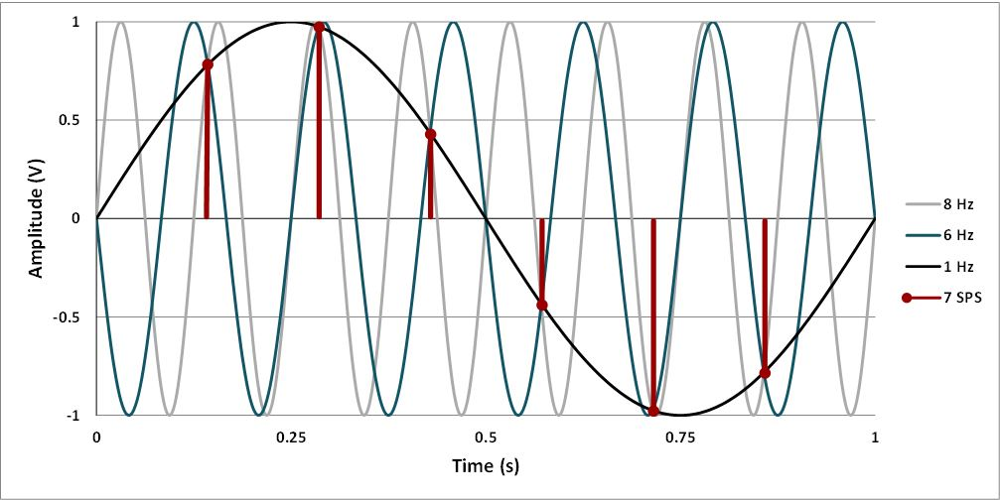
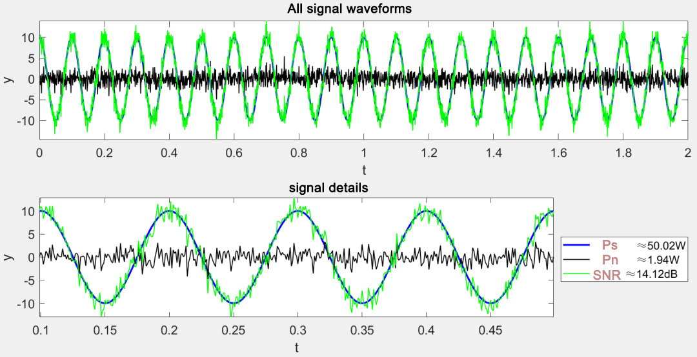
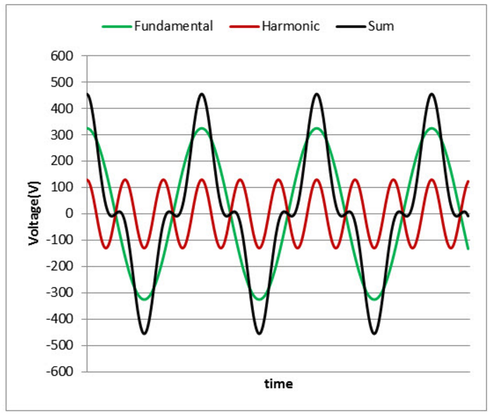
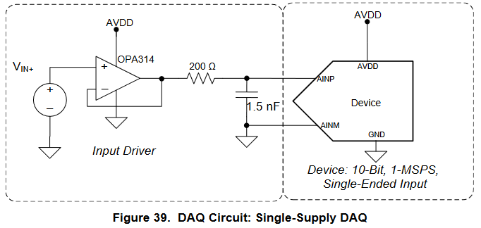

# ADC Convertidor Analógico a Digital

## 1. Introducción

El conversor analógico a digital permite leer voltajes como números. En sistemas embebidos se usa para sensado de temperatura, corriente, posición o audio básico. Este tema combina teoría de muestreo y cuantización con el uso práctico del ADC integrado del RP2350 en el Pico 2.

## 2. Conceptos fundamentales

### 2.1 Resolución, LSB, rango y VREF

{width="60%" align="center"}

* Resolución: número de bits N del ADC. Para 12 bits hay \(2^{12}\) niveles. 
* Vref: referencia contra la cual el ADC compara la entrada. Puede ser interna o externa según placa.
* LSB: tamaño del paso de cuantización.
    $$
    \mathrm{LSB}=\frac{V_{\mathrm{ref}}}{2^{N}}
    $$
    Por ejemplo, para un ADC de 12 bits con Vref = 3.3 V:
    $$
    \mathrm{LSB}=\frac{3.3 V}{2^{12}}= 0.806 mV
    $$


* Rango: 0 a Vref para entradas single-ended (como el RP2350) y Vref1 a Vref2 para diferenciales.


### 2.2 Muestreo y Nyquist

* Frecuencia de muestreo Fs. Es el número de muestras por segundo que toma el ADC sobre una señal continua. Se expresa en Hz o muestras/s.
* Aliasing: Es el fenómeno por el cual componentes de frecuencia mayores que Fn se “plegan” hacia bajas frecuencias en el espectro muestreado, apareciendo como señales falsas.

{width="80%" align="center"}

* Teorema de Nyquist. Para evitar aliasing, Fs debe ser al menos 2 veces la máxima frecuencia útil de la señal.
    $$
    F_{s} \geq 2 \cdot F_{max}
    $$
    donde \(F_{max}\) es la máxima frecuencia presente en la señal analógica.
* Tiempo de adquisición. Es el tiempo durante el cual el circuito de sample and hold del ADC está conectado a la entrada para cargar su capacitancia interna hasta un error máximo permitido antes de iniciar la conversión.

### 2.3 Cuantización, ruido y ENOB

* Cuantización, Cuando un ADC mide una señal continua, solo puede reportar valores en una rejilla de pasos iguales. A este proceso de “ajustar” la señal al escalón más cercano se le llama cuantización.
* Ruido de cuantización, Es el error que aparece por redondear a la rejilla. Si la señal es suficientemente “rica” y el ADC funciona bien, ese error se puede modelar como un ruido pequeño que varía entre −LSB/2 y +LSB/2. Cuanto menor sea el LSB, menor será este ruido.
* SNR(Signal to Noise Ratio), Es la relación entre la potencia de la señal y la potencia del ruido. Se expresa en decibelios. Un SNR grande indica que la señal sobresale claramente sobre el ruido.

{width="60%" align="center"}

* THD(Harmonic Distortion), Mide cuánta energía aparece en armónicos de la señal fundamental debido a no linealidades. Un THD bajo significa poca distorsión.

{width="60%" align="center"}

* SINAD(Signal to Noise And Distortion), Es como el SNR, pero cuenta tanto el ruido como la distorsión. Por eso, el SINAD suele ser menor que el SNR real de cuantización. Se usa mucho para caracterizar la calidad total de un ADC.
* ENOB, (Effective Number Of Bits). Es una manera de decir “cuántos bits útiles” obtienes considerando ruido y distorsión reales. Se calcula a partir del SINAD:
$$
ENOB = (SINAD − 1.76) / 6.02.
$$
Ejemplo
Si mides SINAD = 62 dB, entonces ENOB ≈ (62 − 1.76) / 6.02 ≈ 10 bits.

## 3. Arquitecturas de ADC

### 3.1 SAR

{width="60%" align="center"}

**Funcionamiento**

1. Muestreo. Un circuito sample and hold captura la tensión de entrada durante una ventana breve y la mantiene constante.
1. Aproximaciones sucesivas. Un registro SAR controla un DAC interno. Empezando por el bit más significativo, el DAC genera un valor de prueba y un comparador decide si la entrada es mayor o menor.
1. Búsqueda binaria. En cada ciclo se fija un bit según el resultado del comparador y se actualiza el DAC. Tras N ciclos en un ADC de N bits, se obtiene el código final.
1. Temporización. La conversión requiere un tiempo de adquisición más N ciclos de comparación. Muchos SAR en MCUs permiten ajustar el tiempo de adquisición para asegurar que el sample and hold se cargue adecuadamente cuando la fuente tiene alta impedancia.
1. Múltiples canales. Un multiplexor selecciona el canal antes del muestreo. Al cambiar de canal, la capacitancia interna debe asentarse de nuevo, por lo que el tiempo de adquisición es crítico.

**Uso típico**
Sensores generales en MCUs, medición de corriente con shunt, control y automatización donde la latencia baja y el consumo moderado son importantes.

### 3.2 Sigma-Delta

**Funcionamiento**

1. Modulador de lazo cerrado. La entrada pasa por un integrador y un cuantizador de 1 bit o pocos bits. La salida digital se alimenta a un DAC interno que cierra el lazo con realimentación.
1. Modelado de ruido. El lazo empuja el ruido de cuantización hacia altas frecuencias fuera de la banda de interés.
1. Sobremuestreo. El modulador opera a una frecuencia muy superior a la banda útil. El flujo de 1 bit contiene la señal más ruido modelado.
1. Filtro y decimación digital. Un filtro digital de baja pasa (CIC y FIR en cascada en muchos casos) elimina el ruido fuera de banda y reduce la tasa de datos hasta la frecuencia de salida deseada.
1. Orden y ganancia en SNR. Un modulador de primer orden mejora el SNR aproximadamente 9 dB por cada duplicación del ratio de sobremuestreo. De segundo orden, alrededor de 15 dB por duplicación.
1. Latencia. La salida sufre el retardo de grupo del filtro digital, por lo que la latencia es mayor que en SAR.

***Uso típico***
Básculas de precisión, instrumentación lenta, audio de alta fidelidad, mediciones de temperatura y presión de alta resolución.

### 3.3 Flash y Pipeline

{width="60%" align="center"}

**Funcionamiento**

1. Etapas en cascada. Cada etapa realiza una conversión gruesa de m bits usando un sub-ADC rápido.
1. Sub-DAC y residuo. La etapa reconstruye con un sub-DAC el valor de esos m bits y lo resta de la señal de entrada para generar un residuo.
1. Amplificación del residuo. El residuo se amplifica típicamente por 2^m y se pasa a la siguiente etapa donde se repite el proceso.
1. Alineación y corrección digital. Los bits de todas las etapas se alinean temporalmente y se corrigen errores pequeños mediante lógica digital redundante.
1. Latencia. La latencia total es el número de etapas medido en ciclos de reloj. A cambio se obtiene alta velocidad con resoluciones medias a altas.

**Uso típico**
Sistemas de radio definidos por software, digitalizadores de banda intermedia, adquisición de datos de medio a alto ancho de banda y visión embebida.

### 3.4 Selección de arquitectura

* Señales lentas y precisas. Sigma-Delta.
* Sensores generales en MCU. SAR.
* Altas velocidades. Pipeline o Flash.

| ADC Type                       | Pros                                                        | Cons                                   | Max Resolution | Max Sample Rate | Main Applications                              |
| ------------------------------ | ----------------------------------------------------------- | -------------------------------------- | -------------- | --------------- | ---------------------------------------------- |
| Successive Approximation (SAR) | Buena relación velocidad/resolución                         | Sin protección antialiasing intrínseca | 18 bits        | 10 MHz          | Adquisición de datos                           |
| Delta-sigma (ΔΣ)               | Alto desempeño dinámico, protección antialiasing intrínseca | Histéresis en señales no naturales     | 32 bits        | 1 MHz           | Adquisición de datos, ruido y vibración, audio |
| Dual Slope                     | Preciso, económico                                          | Baja velocidad                         | 20 bits        | 100 Hz          | Voltímetros                                    |
| Pipelined                      | Muy rápido                                                  | Resolución limitada                    | 16 bits        | 1 GHz           | Osciloscopios                                  |
| Flash                          | El más rápido                                               | Baja resolución en bits                | 12 bits        | 10 GHz          | Osciloscopios                                  |


#### 3.5 Topologías de entrada

No es una arquitectura de conversión. Describe cómo se aplica la señal al ADC.

**Single-ended**
Mide la tensión de un pin respecto a una referencia común. Es simple y usa menos pines. Requiere retornos limpios y buen layout para evitar que el ruido de tierra degrade la medición.

**Diferencial**
Mide la diferencia entre dos nodos que comparten un modo común. Internamente el ADC samplea ambas entradas y las resta, lo que mejora el rechazo de ruido de modo común. Requiere front-end y ADC compatibles, y respetar el rango permitido de modo común.

| Topología | Cómo mide | Ventajas | Precauciones | Usos típicos |
|---|---|---|---|---|
| Single-ended | Contra referencia común | Simplicidad, menos pines | Sensible a ruido de tierra y lazos de retorno | MCUs, sensores generales, potenciómetros |
| Diferencial | Diferencia entre dos nodos | Alto rechazo de modo común, mejor inmunidad a ruido | Requiere ADC y front-end diferenciales, respetar modo común | Sensores puente, audio pro, RF, instrumentación |

## 4. Front-end mínimo y anti-alias

### 4.1 Filtro RC de entrada

Es un circuito con una resistencia (R) y un condensador (C) que actúa como filtro paso bajo, permitiendo el paso de señales de baja frecuencia y atenuando las de alta frecuencia, como el ruido.

{width="40%" align="center"}

$$ f_c = \frac{1}{2\pi RC} $$

Frecuencia de corte sugerida para señales lentas: fc ≈ 0.4 a 0.5 de Fs útil o definida por los requisitos de banda.


### 4.2 Buffer con op-amp

{width="40%" align="center"}

* Un seguidor de voltaje de baja impedancia ayuda a cargar la capacitancia de muestreo.
* Usar op-amp rail to rail con GBW adecuado y buen PSRR a 3.3 V.

### 4.3 Protección

* Resistencia serie pequeña para limitar corrientes de entrada.
* Diodos de clamping o protección ESD según el entorno.

## 5. ADC en RP2350

**Resumen de características**

* ADC de 12 bits tipo SAR.
* Velocidad representativa del orden de cientos de kSps según reloj y configuración.
* Canales single-ended multiplexados. Cantidad de entradas externas depende del paquete de silicio y la placa.
    * ADC0 –  GPIO26
    * ADC1 –  GPIO27
    * ADC2 –  GPIO28
* Vref se toma de la red de 3.3 V o del pin VREF si está disponible en la placa.
* No hay modo diferencial expuesto. Evitar compartir líneas analógicas con cargas digitales ruidosas. Separar rutas de retorno cuando sea posible.

### 5.1 Glosario de funciones (SDK Pico)

| Función                                      | Descripción                                   | Ejemplo                                             |
| -------------------------------------------- | --------------------------------------------- | --------------------------------------------------- |
| `adc_init()`                                 | Habilita el periférico ADC                    | `adc_init();`                                       |
| `adc_gpio_init(pin)`                         | Configura el GPIO como entrada ADC            | `adc_gpio_init(26);`                                |
| `adc_select_input(n)`                        | Selecciona el canal ADC n                     | `adc_select_input(0);`                              |
| `adc_read()`                                 | Realiza una conversión y devuelve 12 bits     | `uint16_t v = adc_read();`                          |
| `adc_set_clkdiv(div)`                        | Ajusta el divisor del reloj del ADC           | `adc_set_clkdiv(479.0f);`                           |
| `adc_fifo_setup(en, dreq, thr, err, shift)`  | Configura FIFO, DREQ para DMA y umbral        | `adc_fifo_setup(true, true, 1, false, false);`      |
| `adc_run(run)`                               | Inicia o detiene conversiones en free-running | `adc_run(true);`                                    |
| `adc_set_round_robin(mask)`                  | Habilita escaneo automático de canales        | `adc_set_round_robin(0b00001111);`                  |
| `adc_set_temp_sensor_enabled(en)`            | Activa el sensor de temperatura interno       | `adc_set_temp_sensor_enabled(true);`                |
| `adc_fifo_drain()`                           | Vacía la FIFO del ADC antes de iniciar        | `adc_fifo_drain();`                                 |
| `adc_fifo_get_level()`                       | Lee cuántos datos hay en FIFO                 | `uint lvl = adc_fifo_get_level();`                  |
| `irq_set_exclusive_handler(ADC_IRQ_FIFO, h)` | Registra ISR para IRQ del ADC                 | `irq_set_exclusive_handler(ADC_IRQ_FIFO, adc_isr);` |
| `irq_set_enabled(ADC_IRQ_FIFO, en)`          | Habilita o deshabilita la IRQ del ADC         | `irq_set_enabled(ADC_IRQ_FIFO, true);`              |
| `adc_irq_set_enabled(en)`                    | Activa la generación de IRQ por FIFO          | `adc_irq_set_enabled(true);`                        |
| `DREQ_ADC`                                   | Selección DREQ para DMA desde FIFO del ADC    | `channel_config_set_dreq(&cfg, DREQ_ADC);`          |

### 5.2 Ejemplos ADC básica

1. Inicializar el subsistema ADC.
2. Configurar el pin como entrada ADC.
3. Seleccionar el canal.
4. Leer por conversión única y guarda el valor.

```c title="Ejemplo básico de lectura ADC"
#include <stdio.h>
#include "pico/stdlib.h"
#include "hardware/adc.h"

// Configurar el canal ADC a usar
#define ADC_INPUT 0 // canal 0

int main() {
    stdio_init_all();
    adc_init();
    // Configura el pin GPIO correspondiente como entrada ADC
    adc_gpio_init(26); // GPIO26 suele mapear a ADC0 en Pico 2
    // Seleccionar canal
    adc_select_input(ADC_INPUT);

    // Opcional: ajustar división de reloj si necesitas limitar Fs
    // adc_set_clkdiv(div);

    while (true) {
        uint16_t adc = adc_read(); // 12 bits alineados a 0..4095
        // float v = (adc * VREF) / 4095.0f;
        printf("%u\n", adc);
        sleep_ms(10);
    }
}
```

## 8. Mejora de mediciones por software

### 8.1 Promediado y mediana

* Media móvil, media exponencial para rechazar picos.

```c title="Ejemplo de Media Movil"
#include <stdio.h>
#include "pico/stdlib.h"
#include "hardware/adc.h"

// Configurar el canal ADC a usar
#define ADC_INPUT 0 // canal 0
// número de muestras para promediar
#define N_muestras 16 

int main() {
    stdio_init_all();
    adc_init();
    // Configura el pin GPIO correspondiente como entrada ADC
    adc_gpio_init(26); // GPIO26 suele mapear a ADC0 en Pico 2
    // Seleccionar canal
    adc_select_input(ADC_INPUT);

    // -- Variables --
    uint16_t buffer[N_muestras];
    uint32_t sum = 0; 
    uint8_t  indice = 0;              // proxima posicion a sobrescribir
    uint8_t  cuenta = 0;            // numero de muestras llenas hasta N_muestras

    while (true) {
        uint16_t adc = adc_read(); // 12 bits alineados a 0..4095
        if (cuenta < N_muestras) {
            // llenar buffer inicialmente
            buffer[indice] = adc;
            sum += adc;
            cuenta++;
            indice++;
        } else {
            // buffer lleno, proceder con media movil
            sum -= buffer[indice];         // restar valor viejo
            buffer[indice] = adc;          // agregar nuevo valor al buffer
            sum += adc;                 // sumar nuevo valor al total
            // Avance en el buffer circular
            indice++;
            if (indice >= N_muestras) indice = 0;
            // calcular promedio
            uint16_t promedio = sum / N_muestras; 
                    
            printf("%u\n", promedio);
            sleep_ms(10);
        }

    }
}
```

* Media exponencial para suavizado rápido con menor retardo, usa una formiula recursiva para suavizar el ruido. Formula:
  $$
  y(n) = alpha \cdot x(n) + (1 - alpha) \cdot y(n-1)
  $$
  donde:
  y(n) es la salida suavizada en la muestra n,
  x(n) es la entrada actual en la muestra n,
  y(n-1) es la salida suavizada en la muestra anterior,
  alpha es el factor de suavizado (0 < alpha ≤ 1).

```c title="Ejemplo de Media Exponencial"
#include <stdio.h>
#include "pico/stdlib.h"
#include "hardware/adc.h"

#define ADC_INPUT 0          // canal 0 -> GPIO26
const float alpha = 0.0625f; // 0<alpha<=1 (0.0625 = 1/16)

int main() {
    stdio_init_all();
    adc_init();
    adc_gpio_init(26);        // GPIO26 = ADC0
    adc_select_input(ADC_INPUT);

    bool   y_init = false;
    float  y = 0.0f;

    while (true) {
        uint16_t x = adc_read();   // 0..4095 (12 bits)

        if (!y_init) {
            y = (float)x;          // inicializamos con la primera lectura
            y_init = true;
        } else {
            y = alpha * (float)x + (1.0f - alpha) * y;  // y(n) = αx + (1-α)y
        }

        // Si prefieres entero para imprimir/salidas:
        uint16_t y_u16 = (uint16_t)(y + 0.5f);

        printf("raw=%u ema=%u\n", x, y_u16);
        sleep_ms(10);
    }
}

```

### 8.2 Sobremuestreo y decimación

* Aumentar la tasa de muestreo M veces y promediar para ganar bits efectivos. Regla aproximada: cada 4 veces de sobremuestreo aumenta 1 bit si el ruido es suficiente para dither.

### 8.3 Filtros IIR y FIR

* IIR de primer orden para suavizado rápido. FIR para fases lineales.

### 8.4 Linealización y calibración de dos puntos

* Medir salida con 0 V y con un punto de referencia conocido cercano a Vref. Calcular offset y ganancia y corregir en software.
