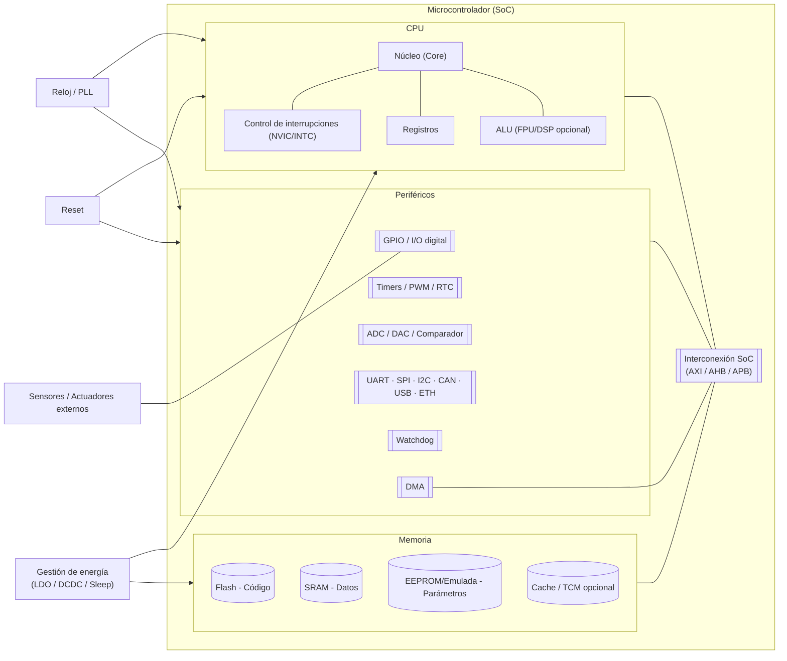
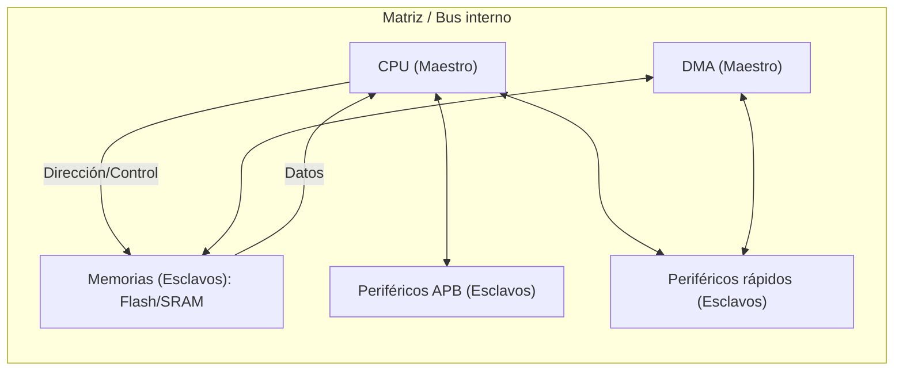
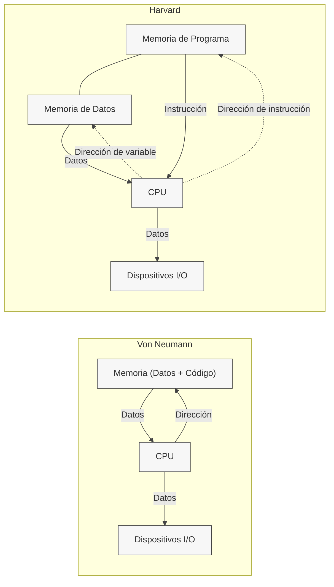

# ¿Qué es un sistema embebido?

## Definicion

Un **sistema embebido** es un sistema de cómputo **diseñado para realizar funciones específicas** dentro de un producto mayor, que interactúa con el mundo físico mediante sensores y actuadores.

!!! Importante 
    Debe ser un producto final, no una PC independiente.

### Rasgos característicos

- **Propósito específico**: realiza una tarea o conjunto acotado de tareas.
- **Interacción físico-digital**: adquisición de variables (sensores) y acción (actuadores).
- **Restricciones duras**: consumo energético, memoria, procesamiento, costo, tamaño.
- **Confiabilidad y disponibilidad**: ciclos de vida largos, operación continua.
- **Tiempo real (frecuente)**: respuestas dentro de límites temporales definidos.
- **Co-diseño HW/SW**: decisión conjunta de electrónica, firmware y software.
- **Seguridad y ciberseguridad**: protección del usuario y del entorno (funcional y digital).

### Comparativa PC vs Sistema Embebido

| Criterio                    | PC propósito general              | Sistema embebido                                   |
| --------------------------- | --------------------------------- | -------------------------------------------------- |
| Alcance funcional           | Amplio, multitarea                | Específico a la aplicación                         |
| Interfaz con usuario        | Teclado, mouse, pantalla          | Puede carecer de UI; LEDs, botones, HMI dedicada   |
| Recursos (CPU/RAM/almacen.) | Abundantes                        | Limitados por costo/energía/espacio                |
| SO                          | Windows/macOS/Linux de escritorio | Bare-metal/RTOS/Linux embebido                     |
| Tiempo real                 | No determinista                   | Frecuentemente determinista                        |
| Energía                     | Red eléctrica                     | Batería/ultrabajo de potencia                      |
| Robustez/ambiental          | Moderada                          | Alta (temperatura, vibración, EMI)                 |
| Ciclo de vida               | Corto/mediano                     | Largo (años o décadas)                             |
| Ciberseguridad funcional    | Importante                        | Crítica (seguridad física + seguridad informática) |

### Casos de uso

| Dominio      | Producto/Función          | Requisito clave                   | Tiempo real |
| ------------ | ------------------------- | --------------------------------- | ----------- |
| Automotriz   | ECU de frenos (ABS/ESP)   | Latencia y seguridad funcional    | Duro        |
| Médico       | Marcapasos                | Confiabilidad y biocompatibilidad | Duro        |
| Industrial   | Control de motor en línea | Determinismo y robustez           | Duro        |
| Consumo      | Termostato inteligente    | Conectividad y eficiencia         | Blando      |
| IoT portátil | Wearable (smartwatch)     | Bajo consumo y UX                 | Blando      |
| Domótica     | Cerradura inteligente     | Seguridad/cifrado                 | Variable    |

---

## Estructura típica de un sistema embebido

- **MCU Microcontrolador**: CPU + memoria + periféricos en un mismo chip, optimizado para control de E/S en tiempo real.

- **MPU MicroProcesador**: CPU “sola” (memoria y periféricos externos). SoC: término paraguas que puede incluir GPU, radios, etc.

### Componentes Clave:


***Diagrama 1 — Visión de alto nivel***



| Componente            | Función principal                          | Puntos de diseño / riesgo típico                                           |
|-----------------------|---------------------------------------------|----------------------------------------------------------------------------|
| ALU / FPU / DSP       | Cálculo entero, flotante, señal             | Latencia, precisión, consumo; ¿se justifica FPU?                           |
| Unidad de Control     | Secuenciar instrucciones                    | Soporte ISA, manejo de excepciones/interrupciones                          |
| Registros/PC/SP       | Estado interno y flujo                      | Tamaño de banco, llamadas/ISR anidadas                                     |
| NVIC/INTC             | Gestión de interrupciones                   | Prioridades, latencias, determinismo                                       |
| DMA                   | Transferencia sin CPU                       | Configuración correcta, coherencia de caché                                |
| Flash                 | Almacenar firmware                          | Endurance, tiempos de programación/lectura                                 |
| SRAM                  | Datos en ejecución                          | Tamaño/costos, inicialización y protección                                 |
| EEPROM                | Parámetros persistentes                     | Ciclos de escritura, wear leveling                                         |
| GPIO                  | I/O digital                                 | Pull-ups, debounce, protección ESD                                         |
| Timers/PWM/RTC        | Tiempo, captura/compare, control            | Resolución, jitter, sincronización con ADC                                 |
| ADC/DAC/Comp.         | Interfaces analógicas                       | Ruido, referencia, tasa de muestreo, linealidad                            |
| UART/SPI/I²C/CAN…     | Comunicaciones                              | Velocidad, errores, EMC, protocolos superiores                             |
| Reloj/PLL             | Base de tiempo                              | Estabilidad, arranque, consumo                                             |
| Reset/Watchdog        | Recuperación de fallos                      | Ventanas, falsas activaciones, cobertura de fallos                         |
| Power Mgmt            | Modos sleep/standby                         | Latencias de wake-up, retención de estado                                  |


### Buses de interconexión

Dentro de un sistema embebido, los bloques funcionales se comunican entre sí a través de buses de interconexión. Estos buses permiten la transferencia de datos, direcciones y señales de control entre los diferentes componentes del sistema. Existen varios tipos de buses, cada uno con sus propias características y propósitos:

1. **Bus de datos**: Transporta la información entre los componentes.
2. **Bus de direcciones**: Lleva las direcciones de memoria a las que se accede.
3. **Bus de control**: Transmite señales de control que coordinan las operaciones del sistema.

Así mismo podemos denominar:

- **Maestros**: Dispositivos que inician las transferencias de datos (p. ej., CPU, DMA).
- **Esclavos**: Dispositivos que responden a las solicitudes de los maestros (p. ej., memoria, periféricos).





## Modelos de memoria

Los sistemas embebidos utilizan diferentes modelos de memoria para gestionar el almacenamiento y acceso a datos. 

Esto lo hace a través de instrucciones y datos que se almacenan en diferentes tipos de memoria.

- Instrucciones: Son las operaciones que la CPU debe realizar y se almacenan en la memoria de programa.
- Datos: Son la información sobre la que opera la CPU y se almacenan en la memoria de datos.

Algunos de los modelos más comunes son:

1. **Modelo de memoria von Neumann**: La CPU usa una sola memoria para instrucciones y datos, lo que simplifica el diseño, pero limita el rendimiento porque no puede acceder a ambos al mismo tiempo.

2. **Modelo de memoria Harvard**: Este modelo utiliza memorias separadas para instrucciones y datos, lo que permite accesos simultáneos y mejora el rendimiento. Sin embargo, es más complejo de implementar.



### "Tamano de la arquitectura"

El “tamaño de la arquitectura” suele referirse al ancho de palabra de la CPU (número de bits de sus registros generales y de la ALU: 8, 16, 32, 64 bits). Sin embargo, para decidir hardware también interesan:

- **Ancho del bus de direcciones** (cuántas direcciones distintas puede emitir la CPU/DMA).
- **Ancho del bus de datos** (cuántos bits se pueden transferir en paralelo).
- **Tamaño de punteros** (cuántos bits se utilizan para representar una dirección de memoria).

!!! Nota
    Puede haber combinaciones, es decir CPU de 32 bits con 24 bits de direcciones, o buses de datos hacia perifericos de 8/16 bits.

#### Efectos  del tamano:

1. El ancho de direcciones limita la memoria maxima
2. Mas bits permiten operaciones aritmeticas y de memoria en menos ciclos
3. Las arquitecturas pequenas pueden ahorrar energia y precio.

| **Ancho de direcciones** | **Máximo direccionable** |
| -----------------------: | -----------------------: |
|                    8 bit |                    256 B |
|                   16 bit |                   64 KiB |
|                   24 bit |                   16 MiB |
|                   32 bit |                    4 GiB |
|                   40 bit |                    1 TiB |
|                   48 bit |                  256 TiB |
|                   64 bit |         16 EiB (teórico) |


#### Comparacion entre tamanos

| Criterio                                | **8/16 bits**                                                                            | **32 bits (MCU/MPU)**                                                                                                                                          | **64 bits (SoC)**                                                                                                                                                            |
| --------------------------------------- | ---------------------------------------------------------------------------------------- | -------------------------------------------------------------------------------------------------------------------------------------------------------------- | ---------------------------------------------------------------------------------------------------------------------------------------------------------------------------- |
| **Complejidad / costo HW**              | Muy bajo                                                                                 | Bajo–medio                                                                                                                                | Medio–alto                                                                                                                                                                   |
| **Consumo energético**                  | Muy bajo (frecuencias modestas)                                                          | Bajo con buen rendimiento/Hz                                                                                                                                   | Mayor en promedio                                                                                                                                                            |
| **Espacio direccionable (orientativo)** | 8–16 b: 256 B–64 KiB                                                                     | Hasta 4 GiB (teórico)                                                                                                                                          | Hasta 16 EiB (teórico)                                                                                                                                                       |
| **Tamaño de puntero típico (C/C++)**    | 16 b                                                                                     | 32 b                                                                                                                                                           | 64 b                                                                                                                                                                         |
| **Desempeño en enteros/32 b**           | Limitado (multi-ciclo)                                                                   | Muy bueno (nativo)                                                                                                                                             | Excelente                                                                                                                                                                    |
| **FPU/DSP / Criptografía**              | Raro / externo                                                                           | Frecuente (M4/M7/RV32-F/D; aceleradores AES/SHA)                                                                                                               | Frecuente / avanzado (SIMD, AES-NI, etc.)                                                                                                                                    |
| **RTOS / Tiempo real**                  | Posible, con límites                                                                     | Muy bueno (determinismo + periféricos modernos)                                                                                                                | Menos determinista en SoC complejos                                                                                                                                          |
| **SO viable**                           | Bare-metal/RTOS                                                                          | Bare-metal/RTOS; Linux en 32 b con **MMU** (Cortex-A, etc.)                                                                                                    | Linux/Unix de pleno derecho                                                                                                                                                  |
| **Conectividad moderna (TLS/OTA)**      | Limitada                                                                                 | Sólida (Wi-Fi/BLE/Cell + TLS)                                                                                                                                  | Completa (redes, contenedores, etc.)                                                                                                                                         |
| **Temporizadores (resolución/rango)**   | Resolución buena, rango corto                                                            | Excelente equilibrio (timers 32 b)                                                                                                                             | Depende del SoC; no foco principal                                                                                                                                           |
| **Time-to-market (ecosistema)**         | Menor oferta actual                                                                      | Muy alto (toolchains, HAL, stacks, RTOS)                                                                                                                       | Alto, pero mayor complejidad                                                                                                                                                 |
| **Casos típicos**                       | Control simple, legacy, ultra-bajo costo                                                 | IoT, control de motor, audio básico, gateways ligeros, HMI simple                                                                                              | Linux, UI compleja, visión/ML ligero, RAM > 1–2 GiB                                                                                                                          |
| **Riesgos**                             | Tope de memoria, software limitado                                                       | Elegir de más/menos (over/under-spec)                                                                                                                          | Consumo, costo, integración compleja                                                                                                                                         |
| **Ejemplos comerciales**                | *Microchip PIC16/PIC18*, *AVR ATmega328P/ATmega32U4*, *TI MSP430* (16 b), *Renesas RL78* | *ST STM32* (F0/G0/F4/H7…), *NXP LPC55Sxx / Kinetis*, *Microchip SAMD21/SAMC21/SAME5x*, *Nordic nRF52/nRF53*, *Espressif ESP32/ESP32-C3*, *Raspberry Pi RP2040* | *Broadcom BCM2711 (Raspberry Pi 4, Cortex-A72)*, *NXP i.MX 8M (Cortex-A53)*, *TI Sitara AM64x (Cortex-A53)*, *Rockchip RK3566/68 (Cortex-A55)*, *Allwinner A64 (Cortex-A53)* |


## Ejemplos de aplicaciones

### Misma palabra (32 bits), Von Neumann vs. Harvard

Asumamos la siguiente operacion de programacion

```c
uint32_t sum = 0;
for (size_t i = 0; i < N; i++) {
    sum += A[i];
}
```

Para este codigo tendremos los siguientes supuestos:

- Carga de 32 bits = 1 acceso de datos.
- ADD = 1 ciclo de ALU.
- Bifurcación/final de bucle = 1 instrucción (se cuenta su fetch).
- Sin caché, sin esperas de memoria, pipeline simple.
- En Von Neumann hay un bus único (instrucciones y datos compiten).
- En Harvard hay dos buses (instrucciones y datos en paralelo).

| Concepto                       | Von Neumann (bus único) |              Harvard (buses I/D) |
| ------------------------------ | ----------------------: | -------------------------------: |
| Fetch `LDR` (leer instrucción) |                 1 ciclo |                  1 ciclo (I-bus) |
| Lectura `A[i]` (dato 32b)      |                 1 ciclo | 1 ciclo (D-bus, **en paralelo**) |
| Fetch `ADD`                    |                 1 ciclo |                  1 ciclo (I-bus) |
| Fetch `BNE`/fin de bucle       |                 1 ciclo |                  1 ciclo (I-bus) |
| **Total por iteración**        |          **≈ 4 ciclos** |                   **≈ 3 ciclos** |

```mermaid
%%{init: {'gantt': {'axisFormat': '%Q'}} }%%
gantt
  dateFormat  x
  title Von Neumann 32 bits (ciclos por iteración)
  section Bus único
  Fetch LDR             :a1, 0, 1
  Fetch de datos (A[i]) :a2, 1, 1
  Fetch ADD             :a3, 2, 1
  Fetch BNE/loop        :a4, 3, 1

```

```mermaid
%%{init: {'gantt': {'axisFormat': '%Q'}} }%%
gantt
  dateFormat  x
  title Harvard 32 bits (ciclos por iteración)
  section I-bus (instrucciones)
  Fetch LDR        :i1, 0, 1
  Fetch ADD        :i2, 1, 1
  Fetch BNE/loop   :i3, 2, 1
  section D-bus (datos)
  Read A[i]        :d1, 0, 1

```





### Misma arquitectura (Harvard), distinto tamaño de palabra

```c
uint32_t sum = 0;
for (size_t i = 0; i < N; i++) {
    sum += A[i];
}
```

Tomaremos los siguientes supuestos donde w es el tamaño de palabra:

- Cargas: 32 / w accesos de datos
- Suma: 32 / w operaciones de ALU
- Bifurcación: ≈ 1 instrucción
Ciclos ≈ 2·(32/w) + 1

| Tamaño de palabra **w** | Cargas (32/w) | Sumas (32/w) | Branch | **Total aprox.** |
| ----------------------: | ------------: | -----------: | -----: | ---------------: |
|              **8 bits** |             4 |            4 |      1 |          **≈ 9** |
|             **16 bits** |             2 |            2 |      1 |          **≈ 5** |
|             **32 bits** |             1 |            1 |      1 |          **≈ 3** |

