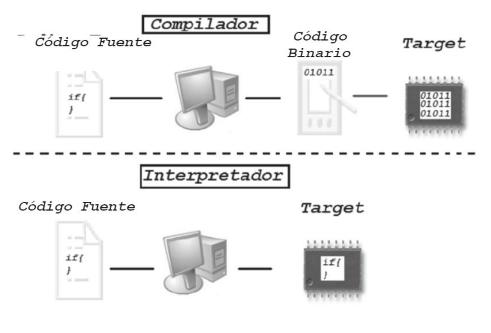
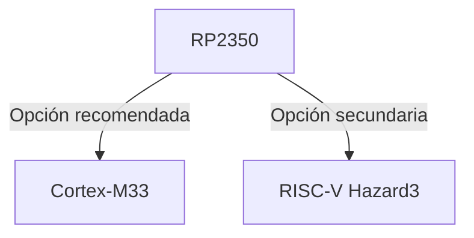
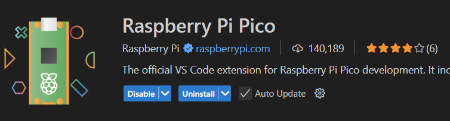
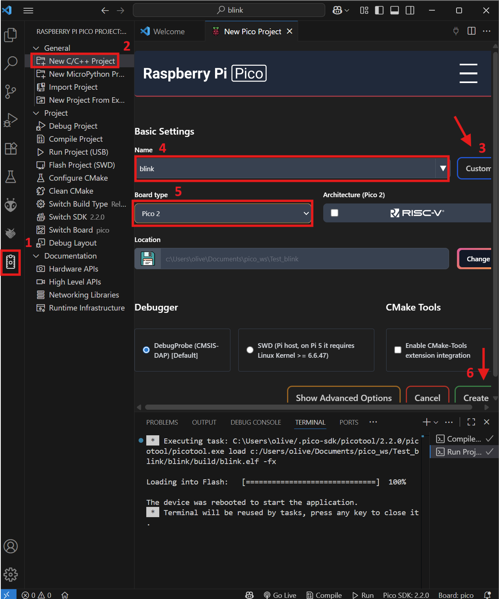
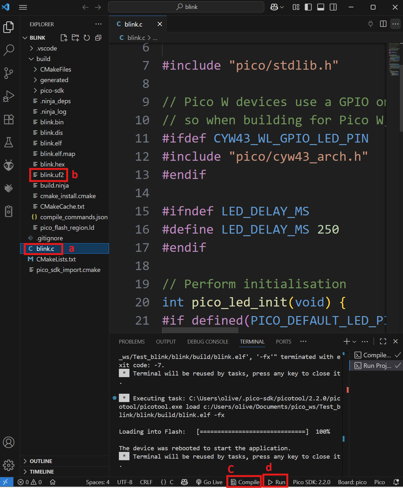
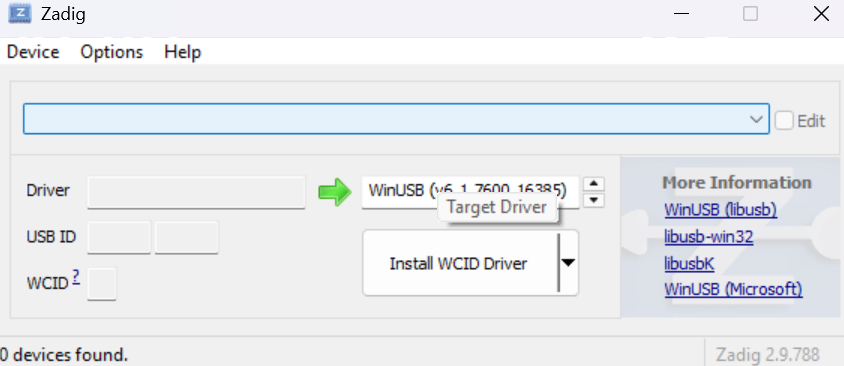

# Entorno y Toolchain

## Conceptos base

### Lenguajes de alto, bajo y nivel intermedio

- **Bajo nivel**: cercanos al hardware, poca abstracción. Ej.: ensamblador. Control fino de registros y memoria; máxima dependencia de la arquitectura.
- **Alto nivel**: mucha abstracción (tipos complejos, manejo automático de memoria, librerías ricas). Ej.: Python, Java, C#.
- **Nivel intermedio** (también llamado nivel medio): balance entre control de hardware y abstracción. Tradicionalmente se ubica aquí C (permite acceso directo a memoria y, a la vez, estructuras y funciones portables).

### Compilar e Interpretar

- Compilar: traducir el código fuente a código máquina nativo (o a ensamblador/objeto intermedio) antes de ejecutar. El resultado es un binario para una arquitectura/ABI específicas. Puede incluir enlazado, optimización y símbolos de depuración.
- Interpretar: ejecutar el programa leyendo instrucciones del código fuente (o de un bytecode) y realizando acciones durante la ejecución, sin producir un binario nativo completo por adelantado.
- JIT (Just-In-Time): punto medio. El intérprete compila en tiempo de ejecución los fragmentos “calientes” a nativo para acelerar.

{loading=lazy}

| Aspecto               | Compilado (Ahead of Time AOT)          | Interpretado                        | JIT                            |
| --------------------- | ------------------------ | ----------------------------------- | ------------------------------ |
| Momento de traducción | Antes de correr          | Durante la ejecución                | Durante, por partes            |
| Binario nativo        | Sí                       | No (o parcial)                      | Parcial/temporal               |
| Rendimiento típico    | Alto y estable           | Menor, depende del intérprete       | Sube con el calentamiento      |
| Portabilidad          | Menor (por arquitectura) | Alta (un intérprete por plataforma) | Alta, con coste de complejidad |
| Tiempo de arranque    | Rápido                   | Rápido (si no compila)              | Puede tardar en “calentar”     |
| Depuración            | Con símbolos y GDB/LLDB  | A menudo con REPL y trazas          | Mezcla: profiler + depurador   |

### De codigo a silicio

***Compilado (Ahead of Time AOT)***

1. **Preprocesado**: expandir #include y macros, quitar comentarios/condicionales, para obtener un código limpio.
1. **Análisis y parseo**: leer tokens, validar sintaxis y construir una representación interna AST/IR (árbol o representación intermedia).
1. **Optimizacion**: aplicar mejoras independientes de la arquitectura (inlining, eliminar código muerto, etc.).
1. **Seleccion de instrucciones y registros**: traducir el IR a código para la ISA destino y asignar registros/pila. Obteniendo un ensamblador o codigo máquina.
1. **Ensamblado**: Convierte el ensamblador a objeto relocable (.o).
1. **Enlazado**: Combina objetos/bibliotecas, resuelve símbolos y genera el binario final.
1. **Carga (loader/bootloader)**: colocar el binario en memoria y saltar al punto de entrada, para ejecutar.

***Interpretado***

1. **Análisis y parseo del fuente**: leer tokens, validar sintaxis y preparar una forma interna navegable.
2. **Inicialización del entorno de ejecución**: preparar espacios de nombres, stack de llamadas, heap y cargar bibliotecas estándar del lenguaje.
3. **Bucle del intérprete (evaluación)**: recorrer el AST (o estructura equivalente) nodo por nodo y ejecutar sus acciones (expresiones, sentencias, control de flujo).
4. **Gestión de funciones y llamadas externas (FFI)** — opcional: permitir que el código interpretado invoque primitivas nativas (E/S, tiempo, sockets) a través del runtime. 
5. **Depuración y trazas**: instrumentar la ejecución con REPL, tracebacks, logging y puntos de interrupción a nivel fuente.
6. **Finalización**: liberar recursos del runtime y reportar estado de salida. 

### Términos Comunes

- **IR / AST***: representaciones internas del programa que facilitan análisis y optimización.
- **Enlazador (linker)**: une objetos/bibliotecas y resuelve símbolos → binario final.
- **Loader/bootloader**: coloca el binario en memoria y transfiere el control al programa.
- **ISA**: conjunto de instrucciones de la CPU (define cómo debe generarse el código).
- **ABI**: reglas binarias (llamadas, registros, layout) para que objetos/bibliotecas encajen.
- **Objeto relocable (.o)**: código ya ensamblado pero sin direcciones finales (previo al enlazado).
- **Símbolos de depuración**: metadatos que relacionan direcciones con líneas/variables (clave para depurar).
- **Toolchain**: conjunto de herramientas (compilador, enlazador, etc.) para construir el software.

## Plataforma y entorno con VS Code

### Arquitectura objetivo

La Pico 2 monta el RP2350, que permite elegir una de estas rutas de compilación:

!!! note "Nota"
    La opción recomendada (Cortex-M33) ofrece un mejor rendimiento y soporte, mientras que la opción secundaria (RISC-V Hazard3) puede ser útil para experimentación o compatibilidad con otros proyectos.

### Instalacion y Configuracion

1. Instala [VS Code](https://code.visualstudio.com/)

2. Abre VS Code, ve a extensiones y busca e instala "Raspberry Pi Pico".
{loading=lazy}
3. Crea un proyecto base.
    1. En la Barra lateral seleccion el simbolo de "Raspberry pi pico project"
    2. Selecciona nuevo proyecto C/C++
    3. Da clic en el boton para cambiar a plantillas ejemplo
    4. Selecciona la Plantilla "Blink" 
    5. Selecciona el tipo de placa que tienes
    6. Da clic en "Crear Proyecto"
{loading=lazy}
4. Compila y carga el programa en la placa.
    1. En la barra lateral izquierda selecciona el archivo principal blink.c.
    2. Haz clic en el botón de "Compilar" .
    3. Espera a que la compilación termine sin errores, y verifica que se haya creado un target file UF2.
    4. Conecta tu placa verificando que aparezca como dispositivo USB RPI-RP2. Para programarlo arrastra el UF2 a la unidad correspondiente o haz clic en el botón de "Cargar" .
{loading=lazy}

??? warning "Error de carga"
    En caso de que aparezca el error  `No accessible RP2040/RP2350 devices in BOOTSEL mode were found.` acompañado de  `Device at bus 1, address 7 appears to be a RP2040 device in BOOTSEL mode, but picotool was unable to connect` descarga y corre [zadig](https://zadig.akeo.ie/), selecciona `RP2 Boot (Interface 1)` y selecciona `WinUSB` y dale clic a instalar driver.
    {loading=lazy}
