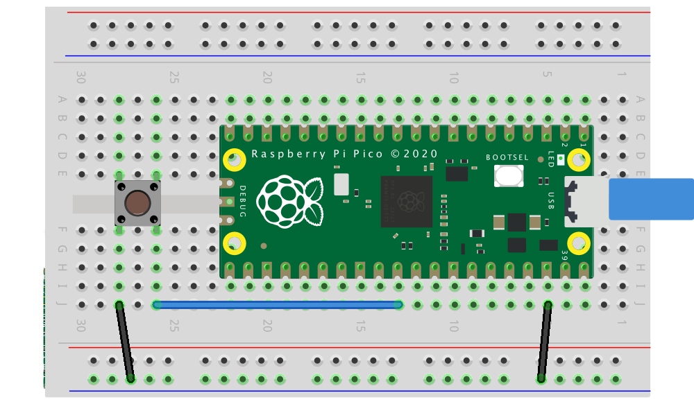

# Control de GPIO

Este tutorial guía desde la manipulación de registros hasta el uso de abstracciones modernas (SDKs, HALs) para controlar GPIO en microcontroladores.

---

## 1. ¿Qué es el control de registros?

Un registro es una pequeña memoria interna del microcontrolador, normalmente de 8, 16 o 32 bits. Cada bit de un registro controla o refleja el estado de alguna función del hardware: habilitar una salida, indicar una entrada, seleccionar un modo, etc.

Cuando se programa a nivel de registro, se leen y escriben directamente las direcciones de memoria donde residen esos registros, sin funciones de librerías de alto nivel. Periféricos (GPIO, UART, Timers…) exponen campos de bits para dirección, datos, pulls, etc.

Muchos MCUs ofrecen escrituras atómicas “Write-1-to-Set/Clear/XOR” (SET/CLR/XOR) para afectar solo los bits indicados, evitando condiciones de carrera.

Ejemplos de familias:

* ATmega328P (Arduino Uno):

  * `DDRB` → dirección de datos (input/output)
  * `PORTB` → valores de salida
  * `PINB` → lectura de entradas
* RP2040 (Pico 2):

  * `SIO->gpio_oe` → configuración de pines como salida
  * `SIO->gpio_out` → valores de salida
  * `SIO->gpio_in` → lectura de entradas

La idea transversal es la misma: leer y escribir bits en registros.

---

## 2. GPIO por dentro

{loading=lazy}

Ideas clave :

- "IOMUX/AF": selecciona la función del pin (GPIO, UART, SPI…).
- "DIR/OE": habilita el driver de salida del pin.
- "OUT/DATA": fija el nivel lógico.
- "IN": lee el estado del pin.
- "PULL-UP/DOWN": resistencias internas para fijar nivel cuando está en entrada.

## 3. Representacion Numerica

| Expresión |      Binario |    Hex | Decimal |
| --------- | -----------: | -----: | ------: |
| `1u << 0` | `0b00000001` | `0x01` |       1 |
| `1u << 2` | `0b00000100` | `0x04` |       4 |
| `1u << 5` | `0b00100000` | `0x20` |      32 |
| `1u << 7` | `0b10000000` | `0x80` |     128 |

!!! note "Nota"
    Por qué usar desplazamientos (<<): es una forma compacta de “poner a 1 el bit n” sin escribir literales binarios/hex largos. Puedes usar indistintamente binario, hex o decimal (son equivalentes).

## 4. Operadores bit a bit (bitwise) en C

Para manipular registros se usan operadores bitwise:

| Operador           | Uso                    | Ejemplo             | Explicación                                |                                                   |
| ------------------ | ---------------------- | ------------------- | ------------------------------------------ | ------------------------------------------------- |
| ` | ` (OR)      | Poner bits en 1        | \`reg               | = (1u << n);\`                             | Fuerza el bit *n* a 1 sin afectar otros bits en 0 |
| `&` (AND)          | Conservar ciertos bits | `reg &= mask;`      | Mantiene 1 **solo** donde `mask` tiene 1   |                                                   |
| `~` (NOT)          | Invertir bits          | `~(1u << n)`        | Máscara con todos 1 **excepto** el bit *n* |                                                   |
| `^` (XOR)          | Alternar (toggle)      | `reg ^= (1u << n);` | Cambia el bit *n* de 0↔1                   |                                                   |
| `<<`, `>>` (shift) | Desplazar              | `(1u << 5)`         | Genera un valor con el bit 5 en 1          |                                                   |

Ejemplos por operador

**AND &**:

`0b11001010 & 0b11110000 = 0b11000000`

`0x5A & 0x0F = 0x0A (90 & 15 = 10)`

**OR |**:

`0b01010000 | 0b00000110 = 0b01010110`

`0x20 | 0x04 = 0x24`

**XOR ^**:

`0b00001111 ^ 0b00000101 = 0b00001010`

`0xAA ^ 0xFF = 0x55`

**NOT ~**:

`~0b00001111 = 0b11110000` (en 8 bits)

`~0x00 = 0xFF`

**Shifts**:

`1u << 2 = 0b00000100 = 0x04`

`0b10000000 >> 3 = 0b00010000 = 0x10`

---

## 5. El bloque SIO (Single-Cycle I/O) en RP2040

SIO es la unidad del RP2040 para acceso rápido a GPIO. Proporciona registros de lectura/escritura directa con operaciones atómicas por bits.

### Registros principales de SIO

* `gpio_oe` → estado de dirección (1 = salida, 0 = entrada)
* `gpio_oe_set` → pone bits a 1 (salida)
* `gpio_oe_clr` → pone bits a 0 (entrada)
* `gpio_oe_togl` → invierte bits (entrada ↔ salida)
* `gpio_out` → estado actual de salidas
* `gpio_set` → pone pines en alto (1) de forma atómica multipin
* `gpio_clr` → pone pines en bajo (0) de forma atómica multipin
* `gpio_togl` → invierte pines de forma atómica multipin
* `gpio_in` → lectura de entradas

Cada bit corresponde a un GPIO (bit 2 controla GPIO2, etc.).

---
### De registros a SDKs y HALs (catálogo de comandos)

***Pico SDK (C, equilibrio control/portabilidad)***

- Inicialización: `gpio_init(pin)`, `gpio_init_mask(mask)`
- Dirección: `gpio_set_dir(pin, bool)`, `gpio_set_dir_out_masked(mask)`, `gpio_set_dir_in_masked(mask)`
- Escritura por pin: `gpio_put(pin, 0/1)`
- Escritura multipin atómica: `gpio_set_mask(mask)`, `gpio_clr_mask(mask)`, `gpio_xor_mask(mask)`, `gpio_put_masked(mask, value)`
- Lectura y pulls: `gpio_get(pin)`, `gpio_pull_up(pin)`, `gpio_pull_down(pin)`, `gpio_disable_pulls(pin)`

***Arduino (muy portable, más alto nivel)***

- Dirección: `pinMode(pin, INPUT/OUTPUT/INPUT_PULLUP/INPUT_PULLDOWN)`
- I/O digital: `digitalWrite(pin, HIGH/LOW), digitalRead(pin)`

***MicroPython/CircuitPython (prototipado rápido)***

- `from machine import Pin`
- `Pin(n, Pin.OUT/Pin.IN, pull=Pin.PULL_UP/PULL_DOWN)`
- `p.on()`, `p.off()`, `p.value()`

## 9. Primer Codigo Blink


```c title="sio_blink.c"
#include "pico/stdlib.h"
#include "hardware/structs/sio.h"

int main() {
    const uint32_t bit = 1u << PICO_DEFAULT_LED_PIN;

    gpio_init(PICO_DEFAULT_LED_PIN);           // pone función SIO y habilita I/O
    sio_hw->gpio_oe_set = bit;    // salida (OE=1) atómico

    while (true) {
        sio_hw->gpio_set = bit;   // alto (usa campo del SDK)
        sleep_ms(500);
        sio_hw->gpio_clr = bit;   // bajo
        sleep_ms(500);
    }
}
```

```c title="sdk_blink.c"
// Archivo: sdk_blink.c
#include "pico/stdlib.h"
#include "hardware/gpio.h"


int main() {
    // stdio_init_all(); // OPCIONAL: solo para printf

    gpio_init(PICO_DEFAULT_LED_PIN);            // enruta el pin a GPIO/SIO
    gpio_set_dir(PICO_DEFAULT_LED_PIN, true);   // salida

    while (true) {
        gpio_put(PICO_DEFAULT_LED_PIN, 1);      // ON
        sleep_ms(500);
        gpio_put(PICO_DEFAULT_LED_PIN, 0);      // OFF
        sleep_ms(500);
    }
}
```

---

```c title="sio_toggle_xor.c"
#include "pico/stdlib.h"
#include "hardware/structs/sio.h"

int main() {
    const uint32_t bit = 1u << PICO_DEFAULT_LED_PIN;

    gpio_init(PICO_DEFAULT_LED_PIN);            // asegura función SIO
    sio_hw->gpio_oe_set = bit;     // salida

    while (true) {
        sio_hw->gpio_togl = bit;   // toggle atómico (no gpio_out_xor)
        sleep_ms(500);
    }
}
```

```c title="sdk_toggle_xor.c"
#include "pico/stdlib.h"
#include "hardware/gpio.h"


int main() {
    gpio_init(PICO_DEFAULT_LED_PIN);
    gpio_set_dir(PICO_DEFAULT_LED_PIN, true);

    const uint32_t bit = (1u << PICO_DEFAULT_LED_PIN);
    while (true) {
        gpio_xor_mask(bit); // alternar SOLO ese pin
        sleep_ms(500);
    }
}
```

---

## Máscaras

 Una máscara es un patrón de bits utilizado para seleccionar, modificar o verificar bits específicos dentro de un registro o un conjunto de datos. Las máscaras se utilizan comúnmente en operaciones de manipulación de bits, como la configuración de pines GPIO, donde se puede utilizar una máscara para afectar solo a un subconjunto de pines en lugar de a todos ellos.

```yaml
 ... 0000 0000 0000 0000 0000 0101 0100
                              ^ ^  ^
                              | |  └─ selecciona GPIO 2
                              | └─── selecciona GPIO 4
                              └───── selecciona GPIO 6
```
Si esa máscara es `MASK = (1u<<2) | (1u<<4) | (1u<<6)`, entonces una sola escritura a los registros SET/CLR/XOR del SIO puede encender, apagar o alternar todos esos pines a la vez.

### Construccion de Mascaras

- Un solo pin: `1u << PIN`
- Varios pines: `((1u << PIN1) | (1u << PIN2) | (1u << PIN3))`
- Rango contiguo("bus"): `MASK_N_BITS = ((1u << N) - 1u) << SHIFT`
        - para 3 bits en GPIO de 10..12 -> `MASK = ((1u << 3) - 1u) << 10`

### Ejemplos de mascara aplicada

```c title="SIO-atomico"
#include "pico/stdlib.h"
#include "hardware/structs/sio.h"

#define PIN_A 2
#define PIN_B 4
#define PIN_C 6

int main() {
    // 1) Máscara con varios pines
    const uint32_t MASK = (1u<<PIN_A) | (1u<<PIN_B) | (1u<<PIN_C);

    // 2) Asegura función SIO en cada pin (necesario una sola vez)
    gpio_init(PIN_A);
    gpio_init(PIN_B);
    gpio_init(PIN_C);

    // 3) Dirección: salida (OE=1) para TODOS los pines con UNA sola instrucción
    sio_hw->gpio_oe_set = MASK;

    while (true) {
        // 4) SET: pone en alto TODOS los pines de la máscara en una sola operación
        sio_hw->gpio_set = MASK;
        sleep_ms(500);

        // 5) CLR: pone en bajo TODOS los pines de la máscara en una sola operación
        sio_hw->gpio_clr = MASK;
        sleep_ms(500);

        // 6) TOGL (XOR): alterna TODOS los pines de la máscara en una sola operación
        sio_hw->gpio_togl = MASK;
        sleep_ms(500);
    }
}
```

En el SDK los comandos tipicos son:

- `gpio_set_mask(MASK);` → pone en alto los pines de MASK
- `gpio_clr_mask(MASK);` → pone en bajo los pines de MASK
- `gpio_xor_mask(MASK);` → alterna los pines de MASK
- `gpio_put_masked(MASK, VALUE);` → pone en alto/bajo los pines de MASK según el valor de VALUE

Ejemplo
```c title="SDK"

#include "pico/stdlib.h"
#include "hardware/structs/sio.h"

#define PIN_A 2
#define PIN_B 4
#define PIN_C 6

int main() {
    // 1) Máscara con varios pines
    const uint32_t MASK = (1u<<2) | (1u<<4) | (1u<<6);

    // 2) Asegura función SIO en cada pin (necesario una sola vez)
    gpio_init(2);
    gpio_init(4);
    gpio_init(6);

    // 3) Dirección: salida (OE=1) para TODOS los pines con UNA sola instrucción
    sio_hw->gpio_oe_set = MASK;

    while (true) {
        gpio_set_mask(MASK);            // alto en 2,4,6
        sleep_ms(200);
        gpio_clr_mask(MASK);            // bajo en 2,4,6
        sleep_ms(200);
        gpio_xor_mask(MASK);            // toggle en 2,4,6
    }
}
```

```c title="EJEMPLO1"
#include "pico/stdlib.h"
#include "hardware/gpio.h"

#define A   0
#define B   1
#define C   2

int main() {
    const uint32_t MASK = (1u<<A) | (1u<<B) | (1u<<C);
    const uint32_t PATRON = (1u<<C) | (1u<<A);

    gpio_init_mask(MASK);
    gpio_put_masked(MASK, PATRON);
    gpio_set_dir_masked(MASK, MASK);   

    while (true) {
        sleep_ms(500);
        gpio_xor_mask(MASK);
    }
}
```

```c title="EJEMPLO2"
#include "pico/stdlib.h"
#include "hardware/gpio.h"

#define A   0
#define B   1
#define C   2

int main() {
    const uint32_t MASK = (1u<<0) | (1u<<1) | (1u<<2);
    gpio_init(0); gpio_init(1); gpio_init(2);
    sio_hw->gpio_oe_set = MASK;                 // outputs
    sio_hw->gpio_clr    = MASK;                 // clear first
    sio_hw->gpio_set    = (1u<<2) | (1u<<0);    // load 101

    while (true) {
        sleep_ms(500);
        sio_hw->gpio_togl = MASK; 
    }
}
```


## Referencias

### Pinout Pico 2


### Reset Cableado



### ATOMICO un ciclo

!!! note "Necesario para usarlo"
        `#include "hardware/structs/sio.h"`
        Antes conecta cada pin a SIO con `gpio_init(pin);`


| Propósito                 | Registro / Campo               | Qué hace                                                                   |
| ------------------------- | ------------------------------ | -------------------------------------------------------------------------- |
| Leer entradas (todos)     | `sio_hw->gpio_in`              | Lee niveles de todos los GPIO; enmascara para quedarte con los de interés. |
| Salida: **SET**           | `sio_hw->gpio_set = mask;`     | Pone en **alto** los pines de `mask` (atómico).                            |
| Salida: **CLR**           | `sio_hw->gpio_clr = mask;`     | Pone en **bajo** los pines de `mask` (atómico).                            |
| Salida: **TOGGLE**        | `sio_hw->gpio_togl = mask;`    | Alterna los pines de `mask` (XOR atómico).                                 |
| Salida: escritura directa | `sio_hw->gpio_out = value;`    | Sobrescribe todo el registro de salida (no atómico).                       |
| Dirección: **OUT**        | `sio_hw->gpio_oe_set = mask;`  | Pasa a **salida** los pines de `mask` (atómico).                           |
| Dirección: **IN**         | `sio_hw->gpio_oe_clr = mask;`  | Pasa a **entrada** los pines de `mask` (atómico).                          |
| Dirección: alternar       | `sio_hw->gpio_oe_togl = mask;` | Alterna IN/OUT (atómico).                                                  |

### SDK - alto nivel

!!! note "Necesario para usarlo"
        `#include "hardware/gpio.h"`
        Antes conecta cada pin a SIO con `gpio_init(pin);`

| Propósito           | Llamada                            | Qué hace                                                 |
| ------------------- | ---------------------------------- | -------------------------------------------------------- |
| Enrutar a SIO       | `gpio_init(pin);`                  | Selecciona `GPIO_FUNC_SIO` y habilita buffer de entrada. |
| Init varios pines   | `gpio_init_mask(mask);`            | Igual, pero para múltiples pines.                        |
| Habilitar entrada   | `gpio_set_input_enabled(pin, en);` | Controla el buffer de entrada.                           |
| Fijar dirección (uno) | `gpio_set_dir(pin, out);`           | `true`=salida, `false`=entrada.     |
| Dir. enmascarada      | `gpio_set_dir_masked(mask, value);` | En `mask`: 1→salida, 0→entrada.     |
| Todos salida          | `gpio_set_dir_out_masked(mask);`    | Pasa a salida los pines de `mask`.  |
| Todos entrada         | `gpio_set_dir_in_masked(mask);`     | Pasa a entrada los pines de `mask`. |
| Escribir un pin             | `gpio_put(pin, value);`         | Alto/Bajo en un pin.                   |
| Escribir patrón enmascarado | `gpio_put_masked(mask, value);` | Actualiza **sólo** los bits de `mask`. |
| SET en máscara              | `gpio_set_mask(mask);`          | Pone en alto todos los bits de `mask`. |
| CLR en máscara              | `gpio_clr_mask(mask);`          | Pone en bajo todos los bits de `mask`. |
| TOGGLE en máscara           | `gpio_xor_mask(mask);`          | Alterna todos los bits de `mask`.      |

