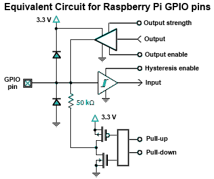

# Control de GPIO

Este tutorial guía desde la manipulación de registros hasta el uso de abstracciones modernas (SDKs, HALs) para controlar GPIO en microcontroladores.

---

## 1. ¿Qué es el control de registros?

Un registro es una pequeña memoria interna del microcontrolador, normalmente de 8, 16 o 32 bits. Cada bit de un registro controla o refleja el estado de alguna función del hardware: habilitar una salida, indicar una entrada, seleccionar un modo, etc.

Cuando se programa a nivel de registro, se leen y escriben directamente las direcciones de memoria donde residen esos registros, sin funciones de librerías de alto nivel. Periféricos (GPIO, UART, Timers…) exponen campos de bits para dirección, datos, pulls, etc.

Muchos MCUs ofrecen escrituras atómicas “Write-1-to-Set/Clear/XOR” (SET/CLR/XOR) para afectar solo los bits indicados, evitando condiciones de carrera.

Ejemplos de familias:

* ATmega328P (Arduino Uno):

  * `DDRB` → dirección de datos (input/output)
  * `PORTB` → valores de salida
  * `PINB` → lectura de entradas
* RP2040 (Pico 2):

  * `SIO->gpio_oe` → configuración de pines como salida
  * `SIO->gpio_out` → valores de salida
  * `SIO->gpio_in` → lectura de entradas

La idea transversal es la misma: leer y escribir bits en registros.

---

## 2. GPIO por dentro

{loading=lazy}

Ideas clave :

- "IOMUX/AF": selecciona la función del pin (GPIO, UART, SPI…).
- "DIR/OE": habilita el driver de salida del pin.
- "OUT/DATA": fija el nivel lógico.
- "IN": lee el estado del pin.
- "PULL-UP/DOWN": resistencias internas para fijar nivel cuando está en entrada.

## 3. Representacion Numerica

| Expresión |      Binario |    Hex | Decimal |
| --------- | -----------: | -----: | ------: |
| `1u << 0` | `0b00000001` | `0x01` |       1 |
| `1u << 2` | `0b00000100` | `0x04` |       4 |
| `1u << 5` | `0b00100000` | `0x20` |      32 |
| `1u << 7` | `0b10000000` | `0x80` |     128 |

!!! note "Nota"
    Por qué usar desplazamientos (<<): es una forma compacta de “poner a 1 el bit n” sin escribir literales binarios/hex largos. Puedes usar indistintamente binario, hex o decimal (son equivalentes).

## 4. Operadores bit a bit (bitwise) en C

Para manipular registros se usan operadores bitwise:

| Operador           | Uso                    | Ejemplo             | Explicación                                |                                                   |
| ------------------ | ---------------------- | ------------------- | ------------------------------------------ | ------------------------------------------------- |
| ` | ` (OR)      | Poner bits en 1        | \`reg               | = (1u << n);\`                             | Fuerza el bit *n* a 1 sin afectar otros bits en 0 |
| `&` (AND)          | Conservar ciertos bits | `reg &= mask;`      | Mantiene 1 **solo** donde `mask` tiene 1   |                                                   |
| `~` (NOT)          | Invertir bits          | `~(1u << n)`        | Máscara con todos 1 **excepto** el bit *n* |                                                   |
| `^` (XOR)          | Alternar (toggle)      | `reg ^= (1u << n);` | Cambia el bit *n* de 0↔1                   |                                                   |
| `<<`, `>>` (shift) | Desplazar              | `(1u << 5)`         | Genera un valor con el bit 5 en 1          |                                                   |

Ejemplos por operador

**AND &**:

`0b11001010 & 0b11110000 = 0b11000000`

`0x5A & 0x0F = 0x0A (90 & 15 = 10)`

**OR |**:

`0b01010000 | 0b00000110 = 0b01010110`

`0x20 | 0x04 = 0x24`

**XOR ^**:

`0b00001111 ^ 0b00000101 = 0b00001010`

`0xAA ^ 0xFF = 0x55`

**NOT ~**:

`~0b00001111 = 0b11110000` (en 8 bits)

`~0x00 = 0xFF`

**Shifts**:

`1u << 2 = 0b00000100 = 0x04`

`0b10000000 >> 3 = 0b00010000 = 0x10`

---

## 5. El bloque SIO (Single-Cycle I/O) en RP2040

SIO es la unidad del RP2040 para acceso rápido a GPIO. Proporciona registros de lectura/escritura directa con operaciones atómicas por bits.

### Registros principales de SIO

* `gpio_oe` → estado de dirección (1 = salida, 0 = entrada)
* `gpio_oe_set` → pone bits a 1 (salida)
* `gpio_oe_clr` → pone bits a 0 (entrada)
* `gpio_out` → estado actual de salidas
* `gpio_out_set` → pone pines en alto (1) de forma atómica multipin
* `gpio_out_clr` → pone pines en bajo (0) de forma atómica multipin
* `gpio_out_xor` → invierte pines de forma atómica multipin
* `gpio_in` → lectura de entradas

Cada bit corresponde a un GPIO (bit 2 controla GPIO2, etc.).

---
### De registros a SDKs y HALs (catálogo de comandos)

***Pico SDK (C, equilibrio control/portabilidad)***

- Inicialización: `gpio_init(pin)`, `gpio_init_mask(mask)`
- Dirección: `gpio_set_dir(pin, bool)`, `gpio_set_dir_out_masked(mask)`, `gpio_set_dir_in_masked(mask)`
- Escritura por pin: `gpio_put(pin, 0/1)`
- Escritura multipin atómica: `gpio_set_mask(mask)`, `gpio_clr_mask(mask)`, `gpio_xor_mask(mask)`, `gpio_put_masked(mask, value)`
- Lectura y pulls: `gpio_get(pin)`, `gpio_pull_up(pin)`, `gpio_pull_down(pin)`, `gpio_disable_pulls(pin)`

***Arduino (muy portable, más alto nivel)***

- Dirección: `pinMode(pin, INPUT/OUTPUT/INPUT_PULLUP/INPUT_PULLDOWN)`
- I/O digital: `digitalWrite(pin, HIGH/LOW), digitalRead(pin)`

***MicroPython/CircuitPython (prototipado rápido)***

- `from machine import Pin`
- `Pin(n, Pin.OUT/Pin.IN, pull=Pin.PULL_UP/PULL_DOWN)`
- `p.on()`, `p.off()`, `p.value()`

## 9. Primer Codigo Blink


```c title="sio_blink.c"
#include "pico/stdlib.h"
#include "hardware/structs/sio.h"

#define LED_PIN 25


int main() {
    // 1) Máscara del pin
    const uint32_t bit = (1u << LED_PIN);
    gpio_init(LED_PIN);  
    // 2) Dirección: salida (OE = 1) de forma atómica
    sio_hw->gpio_oe_set = bit;

    // 3) Escribe SET/CLR (atómico) y alterna nivel con retraso simple
    while (true) {
        sio_hw->gpio_out_set = bit;  // OUT |= bit
        sleep_ms(500);
        sio_hw->gpio_out_clr = bit;  // OUT &= ~bit
        sleep_ms(500);
    }
}
```

```c title="sdk_blink.c"

// Archivo: sdk_blink.c
#include "pico/stdlib.h"
#include "hardware/gpio.h"

#define LED_PIN 2

int main() {
    // stdio_init_all(); // OPCIONAL: solo para printf

    gpio_init(LED_PIN);            // enruta el pin a GPIO/SIO
    gpio_set_dir(LED_PIN, true);   // salida

    while (true) {
        gpio_put(LED_PIN, 1);      // ON
        sleep_ms(500);
        gpio_put(LED_PIN, 0);      // OFF
        sleep_ms(500);
    }
}
```

```c title="sio_toggle_xor.c"

#include "pico/stdlib.h"
#include "hardware/structs/sio.h"

#define LED_PIN 2
static inline void busy_cycles(uint32_t n) { while (n--) { __asm volatile ("nop"); } }

int main() {
    const uint32_t bit = (1u << LED_PIN);
    sio_hw->gpio_oe_set = bit;        // salida

    while (true) {
        sio_hw->gpio_out_xor = bit;   // OUT ^= bit (toggle atómico)
        busy_cycles(500000);
    }
}
```

```c title="sdk_toggle_xor.c"
#include "pico/stdlib.h"
#include "hardware/gpio.h"

#define LED_PIN 2

int main() {
    gpio_init(LED_PIN);
    gpio_set_dir(LED_PIN, true);

    const uint32_t bit = (1u << LED_PIN);
    while (true) {
        gpio_xor_mask(bit); // alternar SOLO ese pin
        sleep_ms(500);
    }
}
```

## Máscaras

