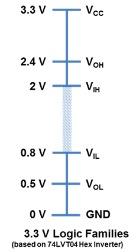
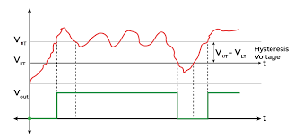
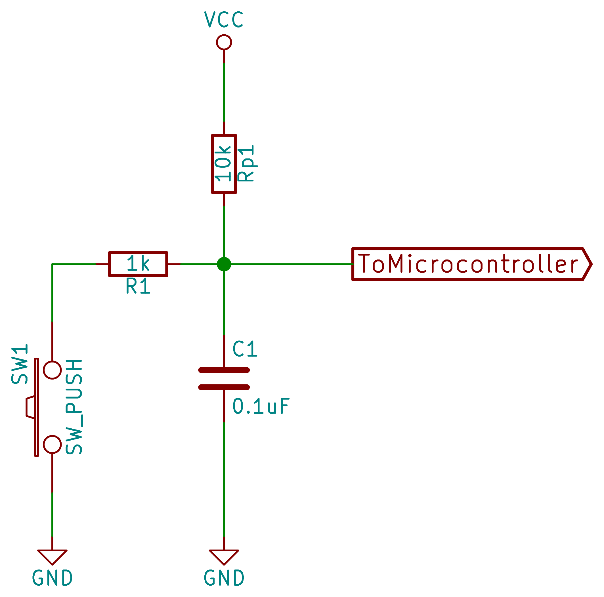

# Entradas digitales

## Qué es una entrada digital

Una **entrada digital** es un GPIO configurado para **leer** un nivel lógico: **alto (1)** o **bajo (0)**. A diferencia de una salida, **no impone** voltaje; solo observa el que llega desde un botón, sensor digital o lógica externa.

### Estados posibles

* **Alto (1):** voltaje considerado como “1”.
* **Bajo (0):** voltaje considerado como “0”.
* **Flotante (Z):** sin referencia; puede leer valores aleatorios (evítalo).

### Niveles lógicos y umbrales

En la práctica, el comparador interno decide 1/0 por **umbrales**:

* **1** típico: ≥ \~2.0–2.4 VDD
* **0** típico: ≤ \~0.5–0.8 VDD
  Entre ambos hay **zona incierta** → evita operar ahí.



---

## Pull-ups / Pull-downs (evitar “flotante”)

Los **pulls** son resistencias hacia **VDD** (pull-up) o **GND** (pull-down) que fijan un estado por defecto cuando la línea puede quedar flotante.
En el Pi pico2 puedes usar **pulls internos** o **externos**.

**Pulls internos (≈ 50–80 kΩ, típ. \~50 kΩ)**

* **Útiles:** prototipos rápidos, botones cercanos (cables cortos), señales lentas/limpias.
* **Limitaciones:** son **débiles**; con cables largos o capacitancia elevada los flancos suben lento y entra ruido. No aptos para buses como **I²C/1-Wire**.

**Pulls externos (1 kΩ–100 kΩ)**

* **Útiles:** buses abiertos (I²C), cables largos/ambientes ruidosos, control preciso de **RC** (debounce), o para ajustar **consumo/tiempos de subida**.
* **Trade-off:** R baja → más corriente y flancos rápidos; R alta → menos corriente y flancos lentos/sensibles a ruido.

**Guía rápida de elección**

* **Botón local:** interno o 10 kΩ externo.
* **Cable largo/ruidoso:** 4.7–10 kΩ externo (+ Schmitt).
* **I²C (open-drain):** 4.7–10 kΩ y ajustar según capacitancia/frecuencia.

---

## Problemas típicos y mitigación

### Rebote (“bounce”)

Un botón mecánico genera múltiples conmutaciones en 1–20 ms al presionar/soltar.
**Mitiga** con **debounce** en **hardware (RC + Schmitt)**, en **software**, o ambos.

### Ruido (EMI, cables, Z)

Las entradas flotantes o cables largos capturan interferencia.
**Mitiga** con:

* Pull-ups/downs adecuados.
* **RC** + **Schmitt trigger**.
* Resistencia **serie 100–330 Ω** para limitar picos.
* **TVS** si el entorno es hostil (industrial/automotriz).



---

## Dimensionamiento práctico

**Consumo al presionar** (activo-bajo con pull-up): $I \approx \dfrac{V}{R}$

* 3.3 V / 10 kΩ ≈ **0.33 mA**
* 3.3 V / 4.7 kΩ ≈ **0.7 mA**

**RC para debounce (hardware):** $\tau = R \cdot C$

* Punto de partida: **2–10 ms** (p. ej., 10 kΩ + 220 nF → 2.2 ms).

**Buses abiertos (I²C):**

* Comienza con **4.7–10 kΩ** y ajusta según **capacitancia** y **frecuencia**.

> **Nota RP2350 – corrientes de E/S:** las cifras de **corriente por pin (2/4/8/12 mA)** y **límite total \~50 mA** aplican a **salidas**. En **entradas**, la corriente la dominan las resistencias de pull y fugas del pad.

---

## Implementación

### Bajo nivel (PADS/SIO)

```c
#include "pico/stdlib.h"
#include "hardware/structs/sio.h"

#define button_pin 16

int main(void) {
    const uint32_t LED_BIT = 1u << PICO_DEFAULT_LED_PIN; // LED (p. ej. 25 en Pico/Pico2)
    const uint32_t BTN_BIT = 1u << button_pin;                    // Botón en GPIO1

    // Asegura función GPIO
    gpio_init(PICO_DEFAULT_LED_PIN);
    gpio_init(button_pin);

    // LED como salida; botón como entrada
    sio_hw->gpio_oe_set = LED_BIT; // salida
    sio_hw->gpio_oe_clr = BTN_BIT; // entrada

    // IMPORTANTE: pull-up externo -> desactivar pulls internos
    gpio_disable_pulls(button_pin);

    while (true) {
        // Con pull-up (externo), presionado = 0 (nivel bajo)
        if ((sio_hw->gpio_in & BTN_BIT)) {
            sio_hw->gpio_set = LED_BIT;   // LED ON
        } else {
            sio_hw->gpio_clr = LED_BIT;   // LED OFF
        }

        // Breve descanso / anti-rebote mínimo
        sleep_ms(1);
    }
}
```

### Alto nivel (Pico SDK)

```c
#include "pico/stdlib.h"

int main(void) {
    const uint LED = PICO_DEFAULT_LED_PIN; // En Pico/Pico 2 suele ser 25
    const uint BTN = 16;

    // LED salida
    gpio_init(LED);
    gpio_set_dir(LED, 1);

    // Botón entrada con pull-up (presionado = 0)
    gpio_init(BTN);
    gpio_set_dir(BTN, 0);

    while (true) {
        if (gpio_get(BTN) == 0) {
            gpio_put(LED, 1);   // ON
        } else {
            gpio_put(LED, 0);   // OFF
        }
        sleep_ms(1); // anti-rebote mínimo / descanso
    }
}
```

---

## Debounce (hardware y software)

### Hardware (RC + Schmitt)



* Filtra rebotes con una constante de tiempo **2–10 ms**.
* Habilita **Schmitt** para histéresis.

### Software (tres patrones)

1. **Retardo fijo (bloqueante)**
   Tras detectar cambio, espera **10–20 ms** y vuelve a leer. Simple, pero bloquea (usa `sleep_ms`).

2. **Integrador / ventana deslizante (no bloqueante)**
   Muestrea a intervalos regulares; acepta el cambio cuando acumulas **N lecturas coherentes**. Útil con varios botones.

3. **Máquina de estados**
   Estados: `estable_0 → posible_1 → estable_1 → posible_0 → ...`
   Solo confirmas transición si se mantiene el nuevo valor por un tiempo/lecturas.
