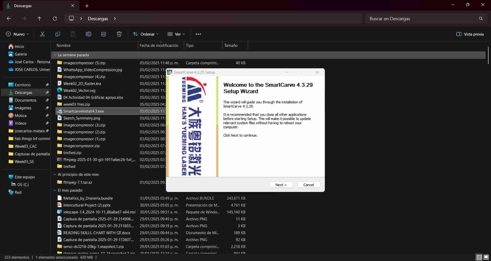
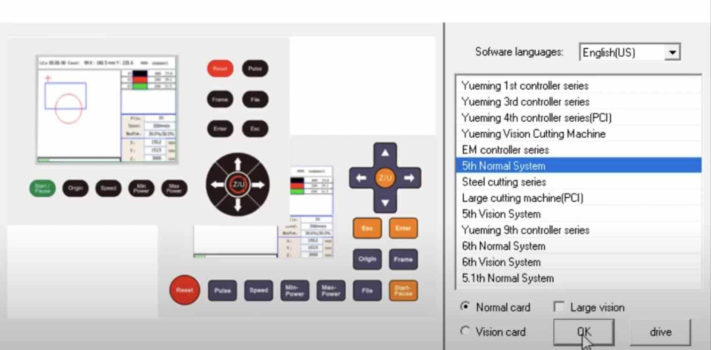
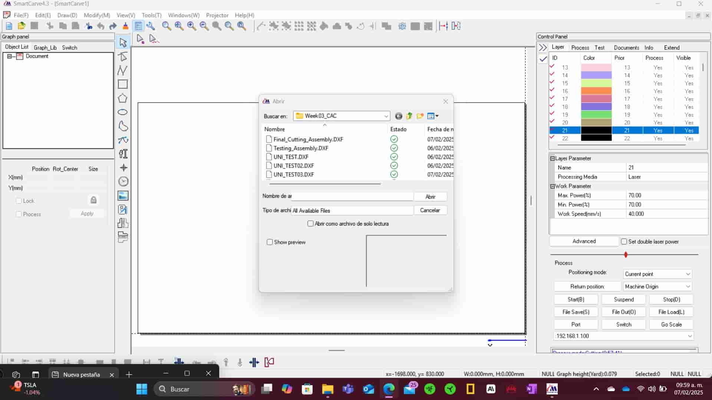
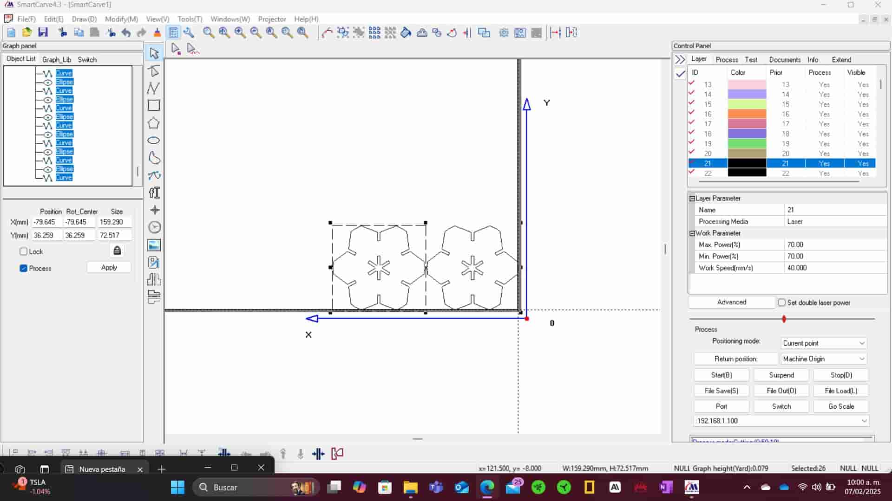
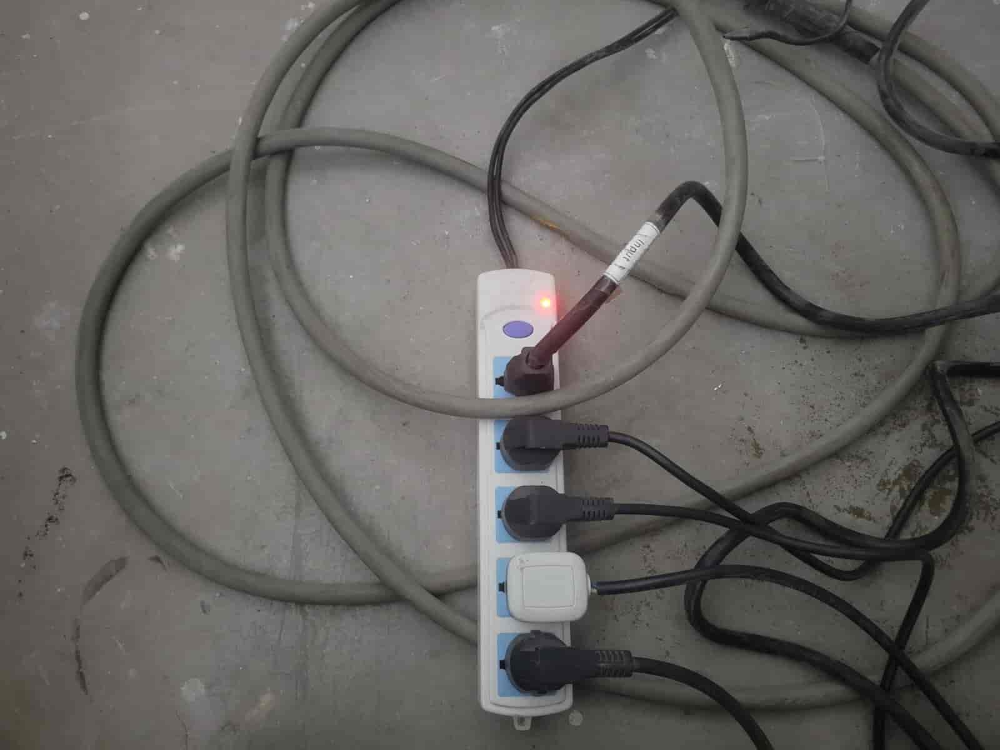
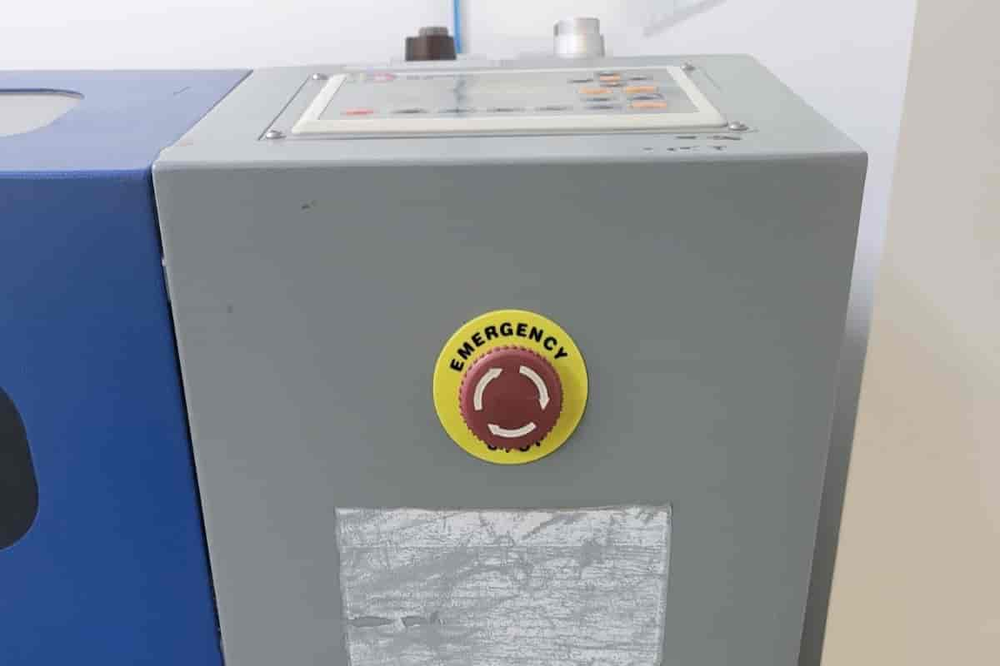
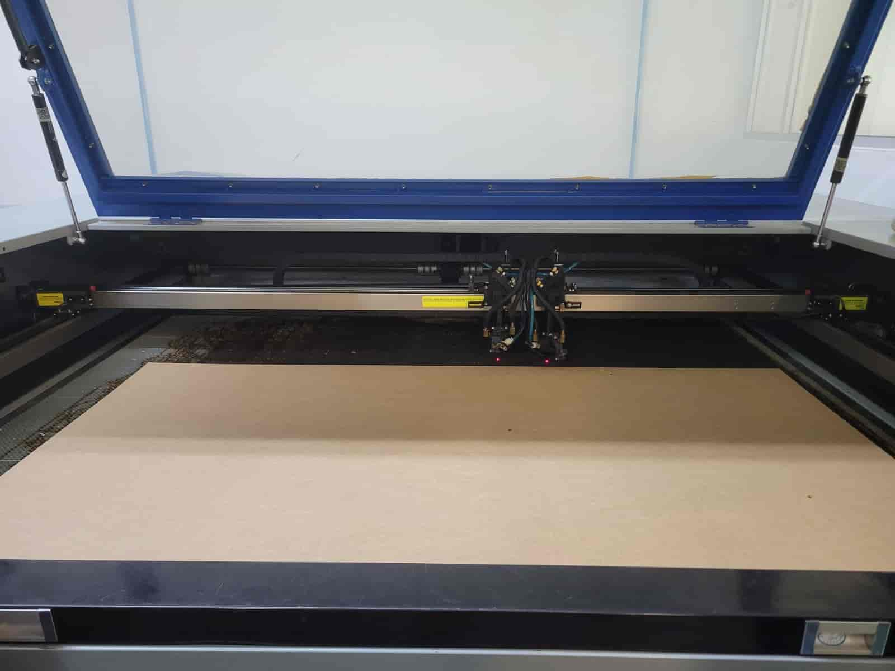
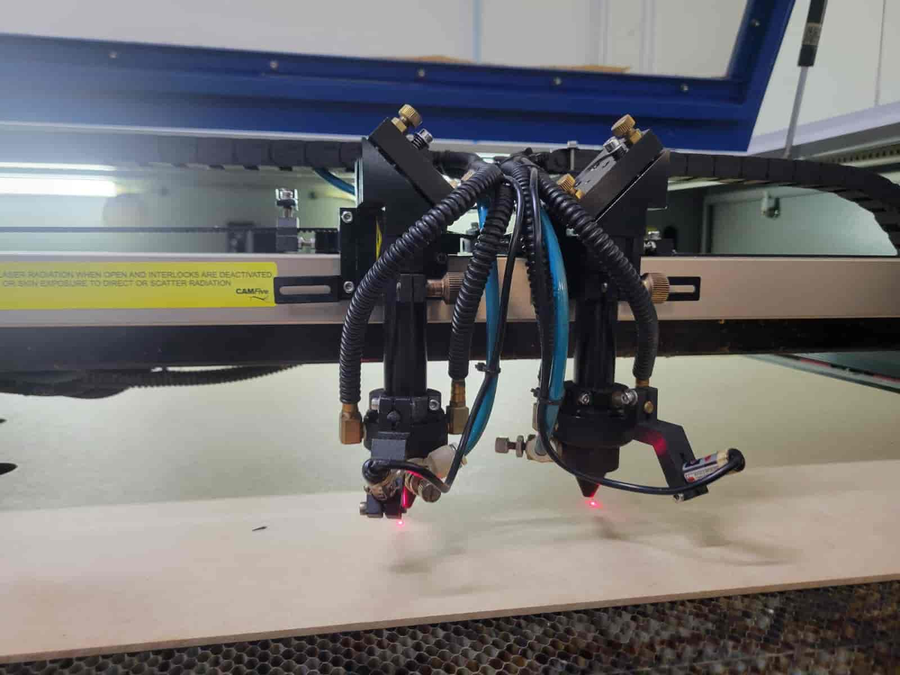
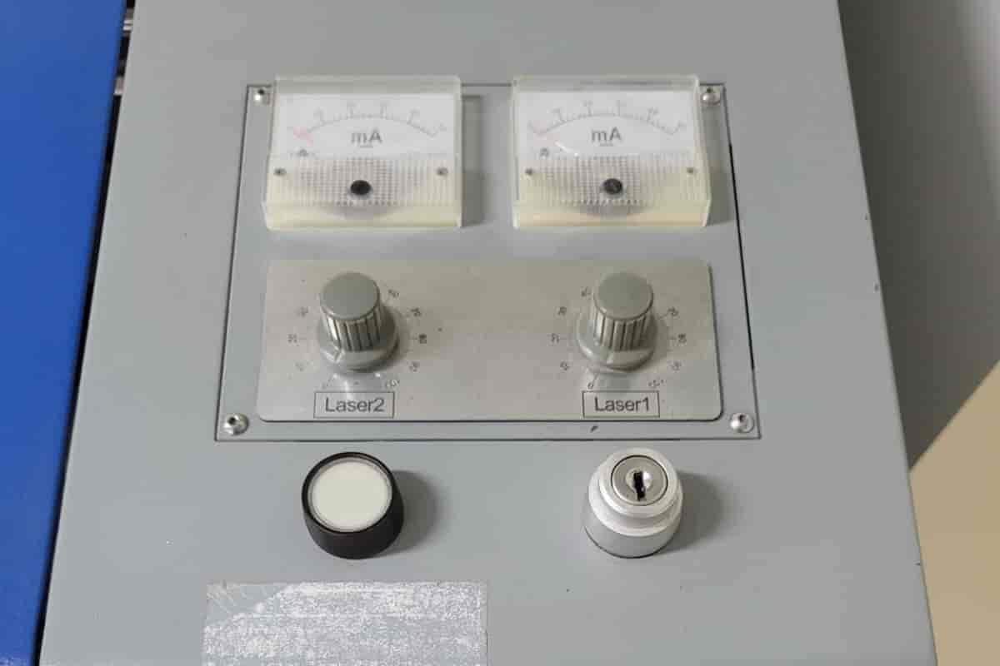
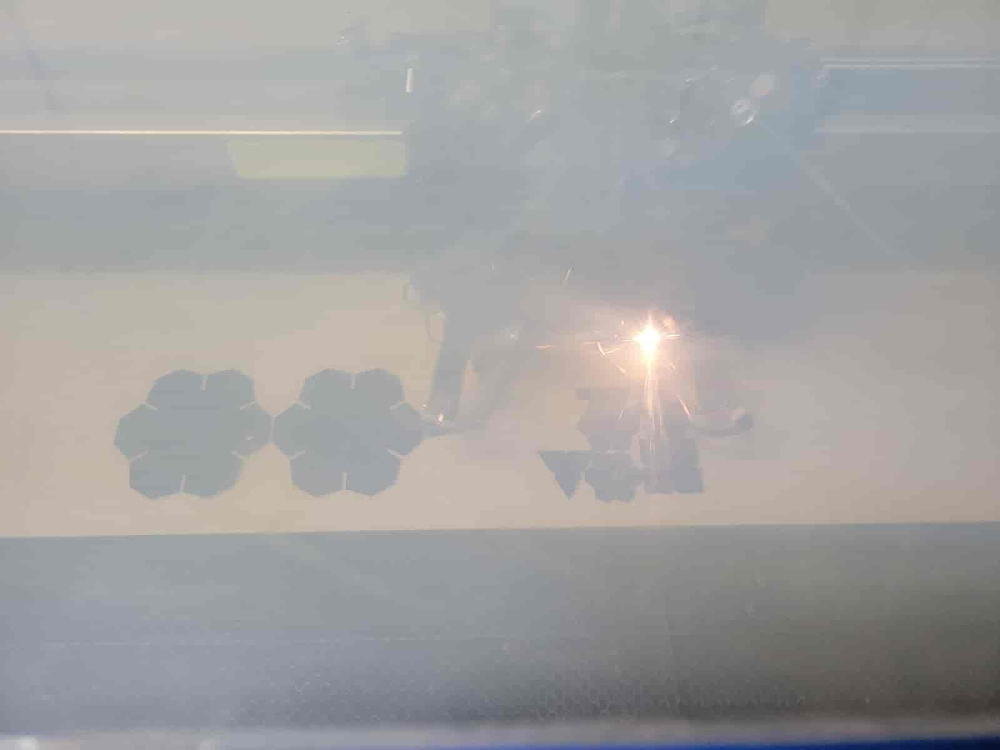

# Cortadora Laser

## Software

### Descargar y operar el instalador

El software deberá pedirlo a un instructor local, quien nos proporcionará el enlace para descargar el instalador.  
Es fundamental seguir sus instrucciones al utilizarlo, ya que tiene algunas secciones escritas completamente en chino.

{loading=lazy}

Uno de los pasos más importantes de la instalación es seleccionar el idioma y el tipo de sistema correctos.  
Nuestra cortadora láser es del quinto sistema normal, como se muestra en esta imagen:

{loading=lazy}

Una vez instalado correctamente, necesitaremos la clave de licencia USB.  
Solicítela a su instructor y cuídela bien; puede parecer modesta, pero es un equipo importante y costoso. Al conectarla a su ordenador, podrá iniciar el software.

### Importar archivo

Al iniciar el programa, veremos la opción **Archivo** en la esquina superior izquierda de la pantalla. Al seleccionarla, se abrirá el menú **Archivo**, donde haremos clic en **Importar**.  
Importaremos el archivo `.dxf` que creamos a partir de nuestro dibujo.

{loading=lazy}

Una vez importado, el dibujo se alineará con el punto de origen predeterminado en el programa, que en nuestro caso es la esquina inferior derecha.

### Parámetros de entrada del láser

Seleccione todos los elementos del dibujo; a la derecha de la pantalla verá el panel de control. Aquí seleccionaremos el mismo color que el del dibujo, en este caso el negro.  
Una vez seleccionado el color, introduzca la potencia máxima y mínima del láser, así como su velocidad de trabajo. Obtuvimos estos valores en las pruebas realizadas en grupo para determinar el equilibrio correcto entre potencia y velocidad que nos permita obtener los cortes más rápidos y limpios posibles, minimizando las ranuras.  

En nuestras pruebas, determinamos que la combinación óptima de valores oscila entre el **60 %** y el **80 %** de potencia y una velocidad de **40 a 60 mm/s**.  
Decidí optar por un **70 %** de potencia y una velocidad de **40 mm/s**, con la que, tras las pruebas, quedé satisfecho. Tras configurar los parámetros, hago clic en el botón **Aplicar** en la parte inferior del panel gráfico, a la izquierda de la pantalla.

{loading=lazy}

Una vez terminado, guarde el archivo en una USB para utilizarlo en la computadora de la láser.

---

## Encendido de Máquina

Fab Lab Puebla cuenta con tres cortadoras láser de CO₂ de la marca **CAMFive**. Estas máquinas pueden cortar y grabar diversos materiales, como tableros de fibra de densidad media (MDF), acrílico y cartón.  
La máquina utilizada para clases es la **CFL-CMA1390T**, con un área de trabajo de 1300 x 900 mm, una potencia de 100 vatios y un sistema de cabezal láser dual.  
Para más detalles, puede consultar nuestra tarea grupal aquí: **LINK PÁGINA PUEBLA**.

Para usar esta máquina, debemos seguir este proceso:

### 1. Registro

Al recibir la licencia, también obtenemos la llave de la máquina. Usaremos esta última para operar la cortadora láser.  
Antes de comenzar a trabajar, debemos registrar la hora de inicio de uso en el registro del Fab Lab con **Andrés López** o **Zeus Zapotl**, junto con nuestro nombre, número de identificación de estudiante, el departamento o curso para el que la usamos y el nombre del responsable. *(Es muy importante que haya sido autorizado previamente por tu coordinador).*  

### 2. Ventilación

Para empezar a trabajar, el primer paso es activar el sistema de ventilación. Para ello, encendemos el contacto múltiple en la parte trasera de la máquina.  
Una vez activado, comprobamos que no haya obstrucciones y que el depósito de agua esté lleno.

{loading=lazy}

{loading=lazy}

### 3. Energía

En el lado izquierdo de la máquina, veremos un interruptor azul en posición de apagado. Lo accionamos para darle energía a los sistemas principales.

{loading=lazy}

### 4. Paro de emergencia

En la parte frontal derecha se encuentra el botón de parada de emergencia, que siempre está activado cuando la máquina no está en uso.  
Para desactivarlo, hay que girarlo en sentido horario hasta que salte.

{loading=lazy}

### 5. Llave

El último paso es insertar y girar la llave en la cerradura situada en la parte superior derecha, detrás de la consola. Con esto, la máquina está lista para cortar.

---

## Proceso de corte por láser

Una vez finalizada la activación y la máquina se encuentra en pleno estado operativo, tenemos que seguir estos pasos para comenzar nuestro proceso de corte:

### 1. Abrir Archivo en la computadora

### 2. Cargar Material

Para cargar el material, en mi caso una lámina de MDF de 1,5 x 1 metro y 2,5 mm de grosor, primero debemos despejar el área de trabajo del cabezal láser. Podemos controlar su posición con las flechas. Esto se puede hacer desde el menú principal o tras seleccionar nuestro archivo.  
Pulsamos la flecha hacia arriba hasta que el cabezal láser esté lo suficientemente atrás, donde podamos asegurarnos de no golpearlo al cargar el material. También revisamos el área de trabajo para detectar cualquier residuo que pueda alterar la elevación del material.  
Una vez despejada el área de trabajo, simplemente colocamos el material dentro; podemos ayudarnos con los bordes del área de trabajo para mantener el material en una posición óptima.

{loading=lazy}

### 4. Calibrar altura láser

Para asegurar un corte preciso con una ranura mínima, debemos ajustar la elevación del cabezal láser en relación con el material, siendo la distancia óptima entre ellos de 5 mm.  
Debemos ser extremadamente cuidadosos durante este paso para evitar dañarlo.  
Primero, colocamos el cabezal láser sobre un borde del material donde podamos observarlo y manipularlo fácilmente. Procedemos a verificar la distancia entre el cabezal láser y el material. Podemos hacer esto con cualquier objeto de 5 mm de altura, que, casualmente, es la altura aproximada de un conector USB, por lo que puede usar el mismo USB que usó para cargar sus archivos.  
Si la distancia es demasiado corta o demasiado larga, podemos ajustarla aflojando el tornillo grande del cabezal láser y moviéndolo hacia arriba o hacia abajo.  
Tenga mucho cuidado, sujete el cabezal firmemente para evitar que se caiga y asegúrese de no desconectar ningún componente.  
Una vez en la posición correcta, vuelva a apretar el tornillo.

{loading=lazy}

### 5. Activar Láser

El último paso antes de comenzar el corte es activar el láser. Dado que el láser es invisible al ojo humano y está expuesto sobre el eje del cabezal, debemos cerrar la puerta de la máquina como medida de seguridad para evitar el contacto accidental con el láser.  
Una vez cerrada la puerta, giramos el potenciómetro del láser elegido en sentido horario hasta el máximo, o ambos potenciómetros si queremos cortar el mismo diseño dos veces al mismo tiempo.  
Al usar ambos láseres, ajuste correctamente las dimensiones de sus diseños y la distancia entre los cabezales, que puede cambiar manualmente.  
Usaré solo el cabezal láser derecho, así que giro el potenciómetro derecho a su posición máxima.  
Cuando la potencia del láser esté al máximo, presionamos el botón de activación del láser junto al puerto de la llave; esto encenderá el láser.  
**Recuerde:** una vez que el láser esté encendido, no abra la puerta.

{loading=lazy}

### 6. Corte

Realizamos una comprobación final: lima, origen, marco y salida láser. Ahora podemos pulsar el botón de inicio y el corte comenzará de inmediato.

Ahora solo queda supervisar la máquina hasta que finalice el proceso. Debemos estar preparados para activar el tope de seguridad en cualquier momento si observamos alguna anomalía, especialmente incendios.

{loading=lazy}

### 7. Desactivación de Láser

1. Presione el botón de encendido del láser para apagarlo y devuelva el potenciómetro a su posición cero.  
2. Traslade el cabezal láser a la parte trasera para retirar la lámina sin riesgo de colisión accidental con las lentes. Abra la puerta y retire la lámina.  
3. Retire el producto final y cualquier residuo en el área de trabajo.  
4. Desactive la máquina repitiendo la secuencia de activación, pero en orden inverso: retire la llave, active el tope de seguridad, apague el interruptor de corriente y, por último, apague el sistema de ventilación.  
5. Retire todo el material sobrante de las instalaciones, no olvide el USB y devuelva la clave de licencia del software y la llave de la máquina a su instructor.  
6. Registre la hora en que terminó de trabajar en el log del Fab Lab.
